# Software Architecture

This document describes the software architecture of the `autoware-carla-scenario` package, with a focus on the **scenario execution system** and the **result viewer**.

## System Overview

The package consists of four major subsystems:

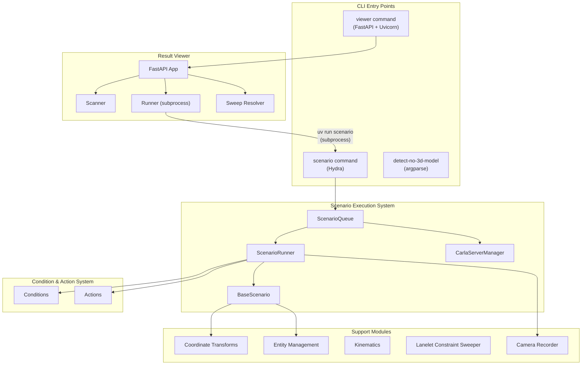

---

## Scenario Execution System

The scenario execution system is responsible for the full lifecycle of a CARLA scenario test: server management, map loading, actor spawning, tick-loop execution, condition evaluation, recording, and cleanup.

### Architecture Diagram

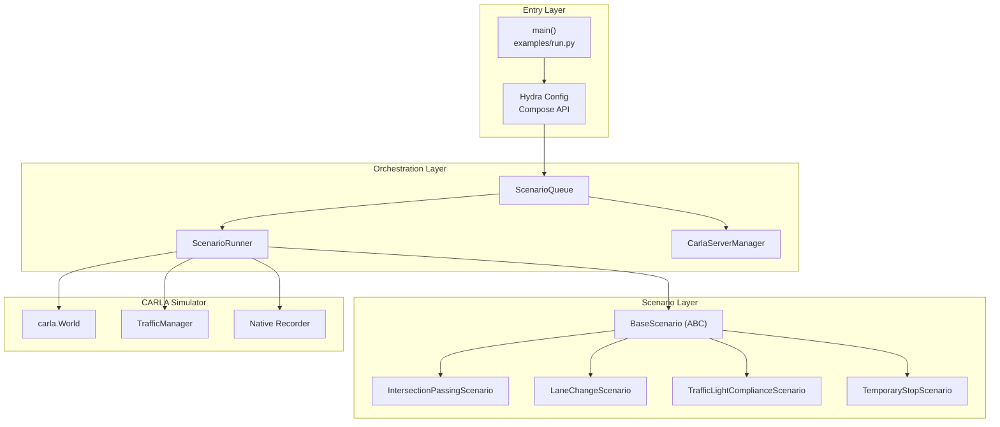

### Component Responsibilities

| Component | File | Responsibility |
|-----------|------|----------------|
| **`CarlaServerManager`** | `server.py` | Start/stop/reuse the CARLA UE5 process. Manages lifecycle via process groups. |
| **`ScenarioQueue`** | `scenario_queue.py` | Batch execution of multiple scenarios. Owns server and runner lifecycle. Context manager. |
| **`ScenarioRunner`** | `scenario_runner.py` | Single-scenario execution: sync mode, tick loop, condition evaluation, recording, cleanup. |
| **`BaseScenario`** | `scenario_base.py` | Abstract base. Subclasses implement `setup()` and `is_done()`. Registers conditions, actions, entities. |

### Execution Lifecycle

The following sequence diagram shows the complete lifecycle of a single scenario execution:

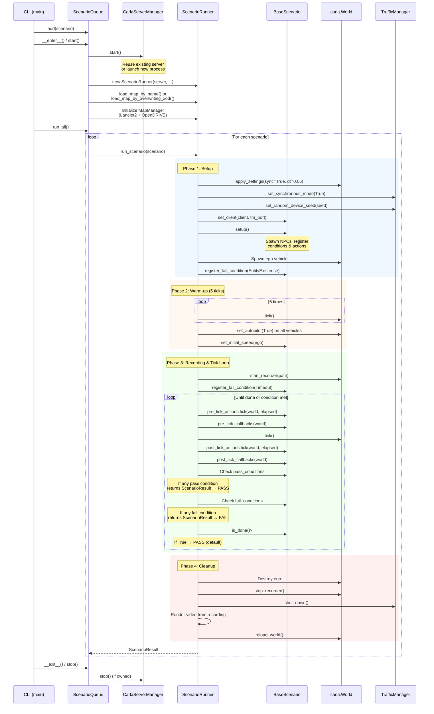

### Tick Loop Detail

The tick loop runs at a fixed 20 Hz (0.05 s per tick) in CARLA synchronous mode. Each tick follows a strict evaluation order:

```
┌─────────────────────────────────────────────────────────┐
│                    Single Tick Cycle                     │
├─────────────────────────────────────────────────────────┤
│  1. Pre-tick actions   → action.tick(world, elapsed)    │
│  2. Pre-tick callbacks → callback(world)                │
│  3. world.tick()       → advance simulation by 0.05 s   │
│  4. Post-tick actions  → action.tick(world, elapsed)    │
│  5. Post-tick callbacks→ callback(world)                │
│  6. Periodic logging   → ego OpenDRIVE position (1/s)   │
│  7. Pass conditions    → first satisfied → PASS & exit  │
│  8. Fail conditions    → first triggered → FAIL & exit  │
│  9. is_done() check    → True → PASS & exit             │
└─────────────────────────────────────────────────────────┘
```

**Evaluation semantics:**

- **Pass conditions** are checked first. The **first** condition to return a non-`None` `ScenarioResult` terminates the loop with a pass.
- **Fail conditions** are checked only if no pass condition was satisfied. The **first** triggered fail condition terminates the loop with a failure.
- If the loop exits via `is_done()` returning `True` with no condition triggered, the scenario is treated as **passed**.

### ScenarioQueue: Batch Execution and Retry

`ScenarioQueue` wraps `ScenarioRunner` to support sequential execution of multiple scenarios:

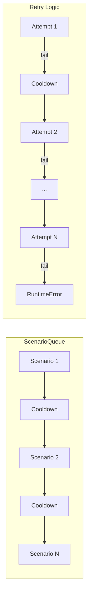

Key features:

- **Cooldown**: Configurable wait time (`cooldown_seconds`) between consecutive scenarios to allow CARLA server cleanup.
- **Retry**: Failed scenarios are retried up to `cooldown_max_retries` times before raising an error.
- **Server ownership**: Accepts an external `CarlaServerManager` or creates and owns one internally.
- **pytest integration**: `as_fixture()` generates a session-scoped pytest fixture with automatic skip when `CARLA_UE5_EXECUTABLE` is not set.

### Video Recording Pipeline

Video recording uses a two-pass approach:

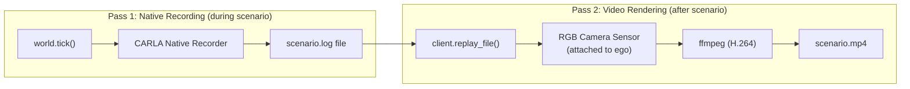

1. **During execution**: CARLA's native recorder captures all actor states to a `.log` file.
2. **After execution**: The recording is replayed in synchronous mode. An RGB camera sensor is attached to the ego vehicle at the same offset as the spectator camera. Frames are streamed to an `ffmpeg` subprocess for H.264 encoding via `CameraRecorder`.

`CameraRecorder` uses a frame queue (maxsize=2) to decouple sensor callbacks from the encoding thread, and writes frames synchronously after each `world.tick()` to avoid dropped frames.

---

## Condition and Action System

### Condition Architecture

Conditions evaluate scenario pass/fail criteria. All conditions inherit from `BaseCondition`:

```mermaid
classDiagram
    class BaseCondition {
        <<abstract>>
        +label: str
        +check(world, elapsed) ScenarioResult | None
        +get_details() dict
        +to_summary_dict() dict
    }

    class ScenarioResult {
        +passed: bool
        +message: str
        +elapsed_seconds: float
        +condition_statuses: list
    }

    class TimeoutCondition
    class ElapsedTimeCondition
    class CollisionCondition
    class EntityExistenceCondition
    class TrafficSignalCondition

    class EntityLanePositionCondition
    class EntityInAreaCondition
    class SpeedCondition
    class StandstillCondition
    class TemporaryStopCondition
    class WaypointCondition

    class AndCondition
    class OrCondition
    class NotCondition
    class StickyCondition
    class PersistentCondition
    class AlwaysTrueCondition

    BaseCondition <|-- TimeoutCondition
    BaseCondition <|-- ElapsedTimeCondition
    BaseCondition <|-- CollisionCondition
    BaseCondition <|-- EntityExistenceCondition
    BaseCondition <|-- TrafficSignalCondition
    BaseCondition <|-- EntityLanePositionCondition
    BaseCondition <|-- EntityInAreaCondition
    BaseCondition <|-- SpeedCondition
    BaseCondition <|-- StandstillCondition
    BaseCondition <|-- TemporaryStopCondition
    BaseCondition <|-- WaypointCondition
    BaseCondition <|-- AndCondition
    BaseCondition <|-- OrCondition
    BaseCondition <|-- NotCondition
    BaseCondition <|-- StickyCondition
    BaseCondition <|-- PersistentCondition
    BaseCondition <|-- AlwaysTrueCondition

    BaseCondition --> ScenarioResult : returns
```

**Condition categories:**

| Category | Conditions | Description |
|----------|-----------|-------------|
| **Temporal** | `TimeoutCondition`, `ElapsedTimeCondition` | Time-based triggers |
| **Safety** | `CollisionCondition`, `EntityExistenceCondition` | Collision detection, actor alive checks |
| **Position** | `EntityLanePositionCondition`, `EntityInAreaCondition`, `WaypointCondition` | Road/lane position, spatial region, waypoint crossing |
| **Velocity** | `SpeedCondition`, `StandstillCondition`, `TemporaryStopCondition` | Speed thresholds, standstill detection, stop-and-go |
| **Traffic** | `TrafficSignalCondition` | Traffic light state checks |
| **Composition** | `AndCondition`, `OrCondition`, `NotCondition` | Logical combinators |
| **Stateful** | `StickyCondition`, `PersistentCondition` | Latch once satisfied / persist across ticks |
| **Utility** | `AlwaysTrueCondition` | Unconditional trigger (default for actions) |

**`check()` contract:**

- Returns `ScenarioResult` when the condition is triggered (satisfied or violated).
- Returns `None` when not yet triggered.
- `__init_subclass__` auto-wraps `check()` to track the latest result for UI display.

### Action Architecture

Actions execute side effects when their trigger condition is met:

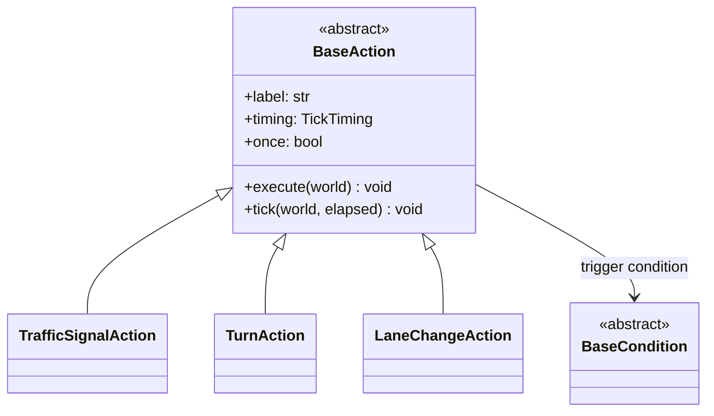

**Action lifecycle:**

1. Each tick, the runner calls `action.tick(world, elapsed)`.
2. `tick()` checks the internal `BaseCondition` via `condition.check(world, elapsed)`.
3. If the condition returns a non-`None` result, `execute(world)` is called.
4. If `once=True` (default), the action is marked as `done` and never re-evaluated.

**Tick timing:**

Actions can be registered as **pre-tick** (before `world.tick()`) or **post-tick** (after `world.tick()`) via `BaseScenario.register_pre_tick()` / `register_post_tick()`.

---

## Result Viewer

The result viewer is a web application for browsing, inspecting, and triggering scenario test results.

### Architecture Diagram

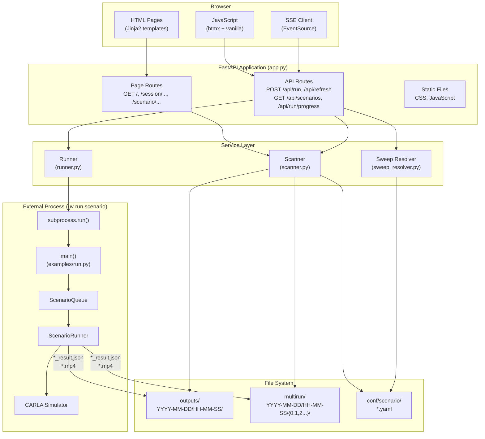

### Component Responsibilities

| Component | File | Responsibility |
|-----------|------|----------------|
| **`app.py`** | `ui/app.py` | FastAPI routes, template rendering, SSE streaming |
| **`scanner.py`** | `ui/scanner.py` | Scan `outputs/` and `multirun/` directories for result JSON files. Build session lists and condition trees. |
| **`runner.py`** | `ui/runner.py` | Execute `uv run scenario` as subprocesses in a background thread. Track progress with thread-safe global state. |
| **`sweep_resolver.py`** | `ui/sweep_resolver.py` | Resolve sweep constraints into concrete override lists without launching CARLA. Lightweight Hydra Compose API usage. |
| **`models.py`** | `ui/models.py` | Pydantic data models for the viewer UI. |

### Data Models

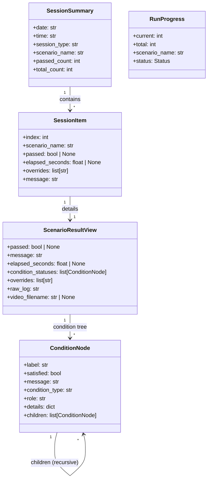

### Result Directory Structure

The scanner discovers results from two directory layouts:

```
base_path/
├── outputs/                          # Single and batch runs
│   └── YYYY-MM-DD/
│       └── HH-MM-SS/
│           ├── ScenarioName_result.json
│           ├── ScenarioName.log        # CARLA native recording
│           ├── ScenarioName.mp4        # Rendered video
│           ├── batch_results.json      # Batch summary (batch mode only)
│           └── .hydra/
│               └── overrides.yaml      # Hydra CLI overrides
│
└── multirun/                         # Sweep / multi-scenario runs
    └── YYYY-MM-DD/
        └── HH-MM-SS/
            ├── 0/                    # Job index 0
            │   ├── ScenarioName_result.json
            │   ├── ScenarioName.mp4
            │   ├── raw_output.log    # Subprocess stdout/stderr
            │   └── .hydra/
            │       └── overrides.yaml
            ├── 1/                    # Job index 1
            │   └── ...
            └── N/
```

**Session types:**

| Type | Source | Identification |
|------|--------|----------------|
| `multirun` | `multirun/` directory | Numbered subdirectories (0, 1, 2, ...) |
| `batch` | `outputs/` directory | Contains `batch_results.json` |
| `single` | `outputs/` directory | Contains `*_result.json` (no batch file) |

### Scenario Execution from Viewer

The viewer runs scenarios via subprocess to isolate the CARLA Python API (which can cause SIGSEGV) from the web server process:

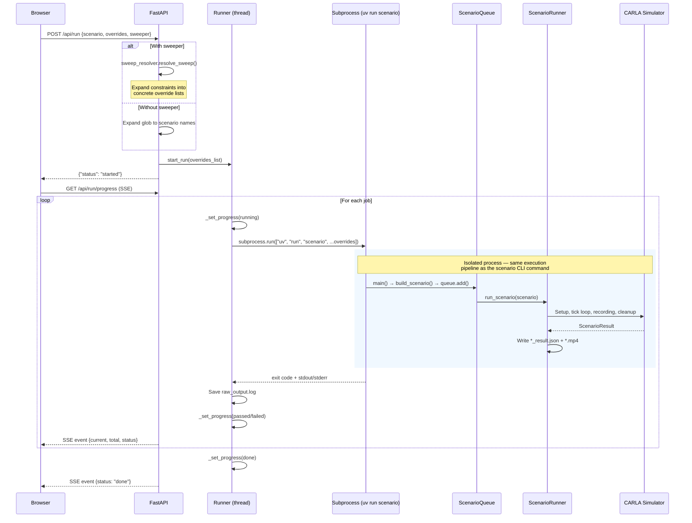

**Key design decisions:**

- **Process isolation**: Each scenario runs in a separate `uv run scenario` subprocess. This prevents CARLA's C++ extension from crashing the web server.
- **Thread-safe progress**: A global `RunProgress` object protected by `threading.Lock` provides progress state.
- **SSE streaming**: The `/api/run/progress` endpoint uses Server-Sent Events for real-time progress updates (polled at 0.5 s intervals).
- **Multirun grouping**: When running multiple scenarios, jobs share a timestamped `multirun/` directory with numbered subdirectories.

### Condition Tree Display

The viewer reconstructs the condition hierarchy from the JSON result for display:

```
pass[0](all_roads_visited)         ← AndCondition (top-level)
├── StickyCondition(road_5)        ← Wrapper
│   └── EntityLanePositionCondition  ← Leaf
├── StickyCondition(road_12)
│   └── EntityLanePositionCondition
└── StickyCondition(road_8)
    └── EntityLanePositionCondition

fail[0](default_timeout)           ← TimeoutCondition
fail[1](ego_existence)             ← EntityExistenceCondition
```

The `_build_condition_tree()` function in `scanner.py` recursively parses:

- `children` key for composite conditions (`AndCondition`, `OrCondition`)
- `child` key for wrapper conditions (`StickyCondition`, `PersistentCondition`, `NotCondition`)

### Caching Strategy

The scanner uses a module-level dictionary cache (`_cache`) keyed by path and session identifiers. The cache is cleared explicitly via the `/api/refresh` endpoint (triggered by the "Update" button in the UI). This avoids repeated filesystem scans while keeping results fresh on demand.

---

## Coordinate Transform System

Three coordinate systems are unified through `MapManager`:

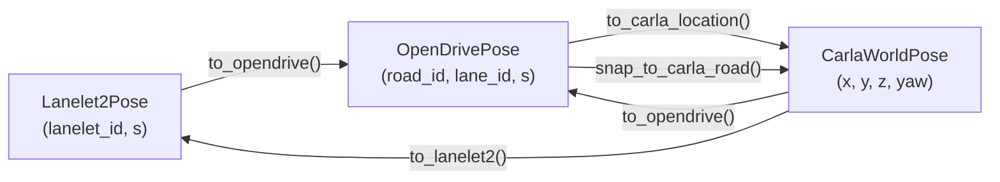

**`MapManager`** is a singleton that holds the `LaneletMap`, `RoadNetwork`, and a precomputed z-offset (averaged from CARLA spawn points). It is initialized once per `ScenarioQueue.start()` when both `xodr_path` and `lanelet2_path` are provided.

**`snap_to_carla_road()`** uses CARLA's ray-cast API to project an OpenDRIVE position onto the actual 3D road surface, accounting for terrain height differences between the map definition and the rendered world.

---

## Entity Management

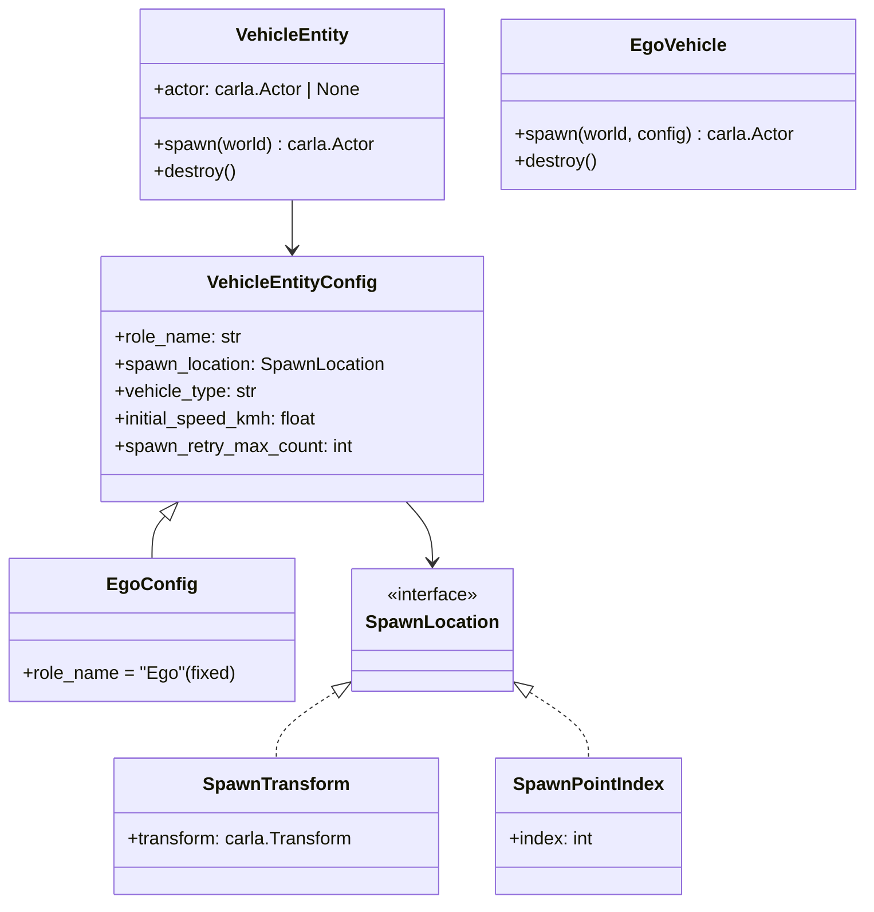

**Spawn retry logic**: When a vehicle fails to spawn (e.g., collision with existing geometry), the spawn system retries with lateral (`t_step`) and vertical (`z_step`) offsets, up to `spawn_retry_max_count` attempts.

---

## Lanelet Constraint Sweeper

The sweeper enables automated parameter sweeps across lanelets that match specified constraints:

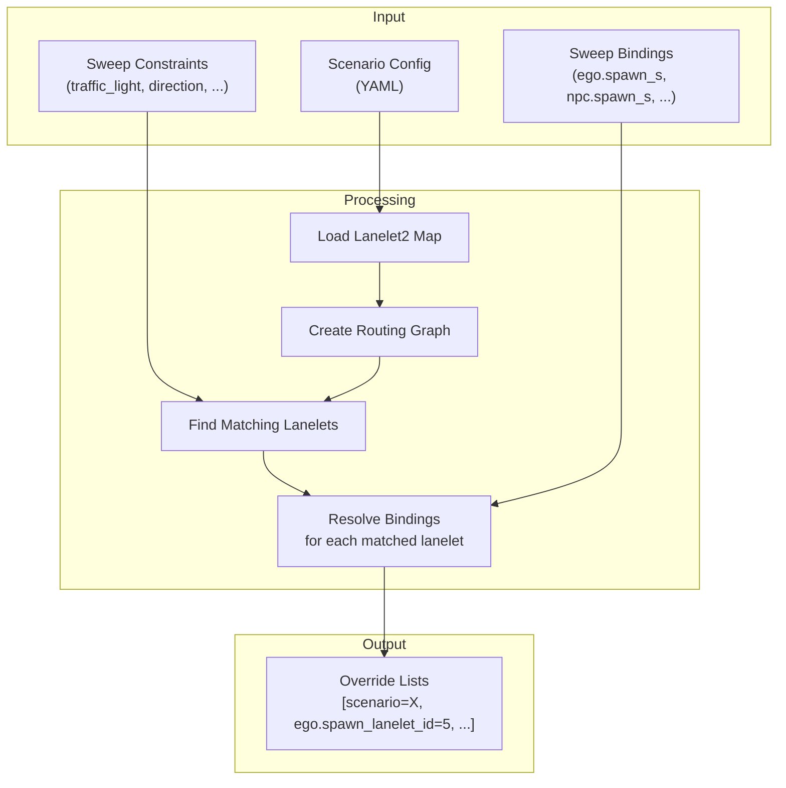

The sweeper is registered as a Hydra plugin (`hydra_plugins/autoware_scenario_sweeper/`) and can also be invoked directly from the viewer via `sweep_resolver.py` (without CARLA, using only the Lanelet2 map).

---

## Ports and Environment Variables

### Network Ports

The system uses three TCP ports for inter-process communication with the CARLA simulator and the viewer web server:

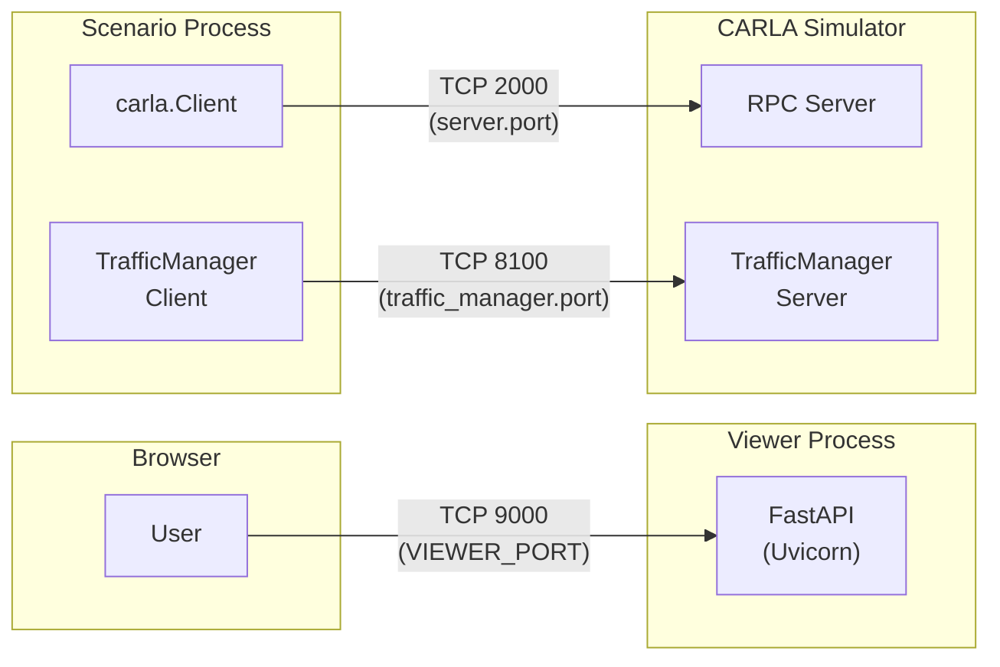

| Port | Default | Component | Protocol | Configured via | Description |
|------|---------|-----------|----------|----------------|-------------|
| **2000** | 2000 | CARLA RPC Server | TCP | `server.port` (Hydra), `--port` CLI arg | Main communication channel between `carla.Client` and the CARLA simulator. Used for world control, actor spawning, recording, etc. |
| **8100** | 8100 | CARLA TrafficManager | TCP | `traffic_manager.port` (Hydra), `tm_port` constructor arg | RPC port for the TrafficManager, which controls NPC vehicle autopilot behavior. The CARLA default is 8000, but this project uses 8100 to avoid conflicts with other services (e.g., VS Code). |
| **9000** | 9000 | Viewer Web Server | HTTP | `VIEWER_PORT` env var | FastAPI/Uvicorn server for the result viewer web UI. Serves HTML pages, REST API, and SSE progress stream. |

!!! note
    The CARLA RPC port and TrafficManager port are used within the **scenario subprocess**, not the viewer process. The viewer communicates with CARLA only indirectly through `subprocess.run(["uv", "run", "scenario", ...])`.

### Environment Variables

| Variable | Required | Default | Used by | Description |
|----------|----------|---------|---------|-------------|
| **`CARLA_UE5_EXECUTABLE`** | Yes (if launching server) | — | `CarlaServerManager` | Absolute path to the CARLA UE5 executable (`CarlaUE5.sh`). Required to launch a new CARLA server. When a server is already running and `reuse_if_running=True`, this variable is not needed. Also used as a gate for pytest: tests are skipped when this variable is unset. |
| **`NISHISHINJUKU_MAP_PATH`** | Yes (if using xodr overwrite) | — | `ScenarioRunner.load_map_by_overwriting_xodr()` | Path to the internal `.xodr` file inside the CARLA installation for the NishishinjukuMap. Used to overwrite the built-in OpenDRIVE file with a custom version while retaining full CARLA map assets (meshes, textures). The variable name is derived from the map name via CamelCase → `UPPER_SNAKE_CASE_PATH` conversion. |
| **`NISHISHINJUKU_XODR_PATH`** | No | `autoware_lanelet2_to_opendrive/test/data/nishishinjuku_carla.xodr` | Map config YAML (`${oc.env:...}`) | Path to the custom OpenDRIVE file for the Nishishinjuku map. Resolved by OmegaConf's `oc.env` interpolation in `conf/map/nishishinjuku.yaml`. |
| **`NISHISHINJUKU_LANELET2_PATH`** | No | `autoware_lanelet2_to_opendrive/test/data/nishishinjuku.osm` | Map config YAML (`${oc.env:...}`) | Path to the Lanelet2 `.osm` file for the Nishishinjuku map. Resolved by OmegaConf's `oc.env` interpolation. |
| **`VIEWER_BASE_PATH`** | No | Current working directory | Viewer (`ui/__init__.py`) | Base directory that the viewer scans for `outputs/` and `multirun/` result directories. |
| **`VIEWER_HOST`** | No | `0.0.0.0` | Viewer (`ui/__init__.py`) | Bind address for the Uvicorn HTTP server. |
| **`VIEWER_PORT`** | No | `9000` | Viewer (`ui/__init__.py`) | Listen port for the Uvicorn HTTP server. |
| **`SWEEP_RESUME_FROM`** | No | `0` | Sweeper (`lanelet_constraint_sweeper.py`) | Internal variable set by the `--resume-from N` CLI flag. Passed via environment because Hydra's CLI parser rejects unknown overrides. Tells the sweeper to skip the first N jobs. |

#### Dynamic Map Path Variables

`ScenarioRunner.load_map_by_overwriting_xodr()` derives the environment variable name from the CARLA map name using the `_map_name_to_env_var()` function:

| Map Name | Derived Variable |
|----------|-----------------|
| `NishishinjukuMap` | `NISHISHINJUKU_MAP_PATH` |
| `Town01` | `TOWN01_PATH` |
| `Town10HD_Opt` | `TOWN10_HD_OPT_PATH` |

The conversion rule is: insert `_` before each uppercase letter that follows a lowercase letter or digit, convert to UPPER_SNAKE_CASE, and append `_PATH`.

---

## Key Design Decisions

### Process Isolation for Viewer

The viewer deliberately avoids importing CARLA in its own process. All scenario execution happens via `subprocess.run(["uv", "run", "scenario", ...])`. This prevents CARLA's C++ extension from causing segmentation faults in the web server.

### Synchronous Simulation Mode

All scenario execution uses CARLA's synchronous mode at 20 Hz. This ensures:

- Deterministic tick ordering (actions, conditions, physics all advance together)
- Reproducible results with fixed random seeds
- No frame drops during recording

### Two-Pass Video Recording

Video is not rendered during execution but replayed afterwards. This avoids the overhead of RGB camera processing during the tick loop, keeping condition evaluation timing accurate.

### Condition Composition Pattern

Complex pass/fail criteria are built by composing atomic conditions:

```python
# Example: pass when ego visits all three road segments
pass_condition = AndCondition(
    label="all_roads_visited",
    children=[
        StickyCondition(EntityLanePositionCondition(road_id="5", ...)),
        StickyCondition(EntityLanePositionCondition(road_id="12", ...)),
        StickyCondition(EntityLanePositionCondition(road_id="8", ...)),
    ],
)
```

`StickyCondition` latches once its child is satisfied, so each road only needs to be visited once. `AndCondition` requires all children to be satisfied simultaneously.

### World Reload for Clean State

After each scenario, `ScenarioRunner` calls `client.reload_world()` instead of manually destroying actors. This guarantees a completely clean state (actors, sensors, physics, Traffic Manager internal maps) and avoids "failed to destroy actor" errors from the CARLA server.
