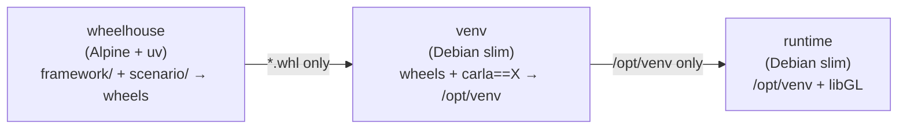

# Packing a scenario package into a container image

A scenario package created with `scenario-new` is a normal Python
distribution, so it can be shipped as a container image that carries the
framework, the scenario, its configs, and a **fixed** CARLA client. The image
is built by the `pack-scenario-image` composite action; the same Dockerfile
works by hand.

## What the image contains

Only installed code:

| Present | Absent |
| --- | --- |
| `/opt/venv` — the framework, `autoware-lanelet2-to-opendrive`, the scenario package, their dependencies, and one pinned CARLA client | Source trees, `pyproject.toml`, tests, docs, git history |
| `libgl1` / `libglib2.0-0` for OpenCV, `ffmpeg` when asked for | `uv`, wheels, build caches, a compiler |

The entry point is the `scenario` CLI and the working directory is `/work`,
where Hydra writes its run directory.

## Stage layout

`docker/scenario/Dockerfile` runs three stages, each handing the next strictly
less than it was given:



`wheelhouse` is Alpine because everything it touches is pure Python — `uv
build` emits `py3-none-any` wheels for all three packages — so the stage needs
neither glibc nor a compiler, and nothing but the wheels survives it.

The runtime is **not** Alpine, and cannot be. The CARLA client (the vendored
0.10.0 wheel and the PyPI 0.9.16 one alike), `opencv-python` and
`simple-lanelet2` publish manylinux wheels only. There is no musllinux wheel to
fall back to, so a musl runtime cannot install them at all; the CARLA extension
module additionally links glibc 2.34+ symbols directly, so even a forced
install would not import. Debian slim is the smallest base that runs the code.

## Pinning the CARLA client

`carla-version` is resolved once, during the build, and asserted before the
image is finished. `0.10.0` is not on PyPI and comes from the local
`carla_wheels/` directory; versions that are published (for example `0.9.16`)
come from the index. Nothing in the image can change the client afterwards, and
the version is recorded twice — in the default tag (`:carla0.10.0`) and in the
`io.autoware.carla-scenario.carla-version` label:

```bash
docker image inspect --format '{{ index .Config.Labels "io.autoware.carla-scenario.carla-version" }}' \
  ghcr.io/tier4/my-scenario:carla0.10.0
```

## In a workflow

```yaml
jobs:
  pack:
    runs-on: ubuntu-latest
    permissions:
      contents: read
      packages: write
    steps:
      - uses: actions/checkout@v4

      - name: Log in to GHCR
        uses: docker/login-action@v3
        with:
          registry: ghcr.io
          username: ${{ github.actor }}
          password: ${{ secrets.GITHUB_TOKEN }}

      - name: Pack the scenario package
        uses: ./.github/actions/pack-scenario-image
        with:
          scenario-package-path: packages/my_scenario_package
          image: ghcr.io/${{ github.repository_owner }}/my-scenario
          carla-version: "0.10.0"
          push: "true"
```

The scenario package does not have to live in this repository — check it out
anywhere on the runner and point `scenario-package-path` at it.

### Inputs

| Input | Default | Meaning |
| --- | --- | --- |
| `scenario-package-path` | — | The generated package (the directory with its `pyproject.toml`). Required. |
| `image` | — | Image name without a tag. Required. |
| `carla-version` | `0.10.0` | Client version baked into the image. |
| `tags` | `<image>:carla<version>` and `…-<sha>` | Newline-separated full references. |
| `framework-path` | this repository | uv workspace root supplying the framework packages. |
| `carla-wheel-dir` | `carla_wheels` | Local wheels for CARLA releases that are not on PyPI, relative to `framework-path`. |
| `python-version` | `3.10` | Interpreter in the image. The CARLA client caps this at 3.10. |
| `with-ffmpeg` | `false` | Install ffmpeg so `CameraRecorder` can encode MP4s. |
| `platforms` | `linux/amd64` | buildx platforms. More than one requires `load: "false"` and `smoke-test: "false"`. |
| `build-args` | — | Extra newline-separated `KEY=VALUE` build arguments. |
| `push` / `load` | `false` / `true` | Push to the registry / load into the local daemon. |
| `smoke-test` | `true` | Run the built image to verify the pin and the registration. |
| `cache` | `true` | Use the GitHub Actions build cache. |

Outputs: `image-ref`, `tags`, `digest` (pushed images only), `image-id`.

### The smoke test

With `smoke-test: "true"` the action runs `docker/scenario/smoke-test.py`
inside the freshly built image and checks that

1. the installed CARLA client is exactly `carla-version`,
2. the scenario package's `autoware_carla_scenario.scenarios` entry point loads
   and registers at least one scenario,
3. Hydra discovers `AutowareScenarioSearchPathPlugin`, so the package's
   `conf/` directory reaches the config search path, and
4. `scenario --help` composes a config without a CARLA server.

Check 3 is worth its keep: `hydra_plugins` is a namespace package that an
editable install resolves via `src/`, so losing it from the wheel breaks every
`scenario=<name>/…` override in the image while leaving development untouched.

## Building by hand

```bash
# 1. Assemble a minimal build context (framework + scenario, nothing else).
docker/scenario/assemble-context.sh \
  --scenario ../my_scenario_package \
  --out /tmp/scenario-ctx

# 2. Build.
docker build \
  --file docker/scenario/Dockerfile \
  --build-arg CARLA_VERSION=0.10.0 \
  --tag my-scenario:carla0.10.0 \
  /tmp/scenario-ctx

# 3. Verify.
docker run --rm --entrypoint python \
  -v "$PWD/docker/scenario/smoke-test.py:/tmp/smoke-test.py:ro" \
  my-scenario:carla0.10.0 /tmp/smoke-test.py 0.10.0
```

## Running a scenario

The image holds the client, not the simulator, so point it at a CARLA server
and give it the map files:

```bash
docker run --rm \
  --network host \
  --volume "$PWD/maps:/maps:ro" \
  --volume "$PWD/outputs:/work/outputs" \
  --env NISHISHINJUKU_XODR_PATH=/maps/nishishinjuku_carla.xodr \
  --env NISHISHINJUKU_LANELET2_PATH=/maps/nishishinjuku.osm \
  my-scenario:carla0.10.0 \
  scenario=my_scenario/default map=nishishinjuku
```

Without `--network host`, pass the server address explicitly with
`server.host=<address> server.port=2000`. Hydra writes under the working
directory, so `/work` needs a volume for the results to outlive the container —
the image runs as UID 1000, which must be able to write to it.
