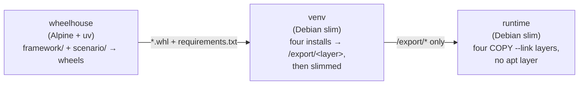

# Packing a scenario package into a container image

A scenario package created with `scenario-new` is a normal Python
distribution, so it can be shipped as a container image that carries the
framework, the scenario, its configs, and a **fixed** CARLA client.

The image is built by the `pack-scenario-image` composite action. Everything it
needs lives in the action's own directory, so it is meant to be referenced from
other repositories:

```yaml
- uses: tier4/autoware_lanelet2_to_opendrive/.github/actions/pack-scenario-image@main
```

The ref is both the action version and the framework version that ends up in
the image — the runner checks the whole repository out alongside the action,
and the framework packages are built from that copy. Pin a release tag instead
of `main` for reproducible framework versions. Your own repository does not
have to contain this framework, or even be checked out.

## What the image contains

Only installed code:

| Present | Absent |
| --- | --- |
| `/opt/venv` — the framework, `autoware-lanelet2-to-opendrive`, the scenario package, their dependencies, and one pinned CARLA client | Source trees, `pyproject.toml`, tests, docs, git history |
| `ffmpeg`, when asked for | `uv`, wheels, build caches, a compiler, any apt package at all |

The entry point is the `scenario` CLI and the working directory is `/work`,
where Hydra writes its run directory.

`/opt/venv` arrives as [four layers](#layer-layout), not one, so a client that
already holds another image built the same way pulls only what actually
differs.

## Stage layout

`.github/actions/pack-scenario-image/Dockerfile` runs three stages, each
handing the next strictly less than it was given:



`wheelhouse` is Alpine because everything it touches is pure Python — `uv
build` emits `py3-none-any` wheels for all three packages — so the stage needs
neither glibc nor a compiler, and nothing but the wheels survives it.

The runtime is **not** Alpine, and cannot be. The CARLA client (the vendored
0.10.0 wheel and the PyPI 0.9.16 one alike), `opencv-python-headless` and
`simple-lanelet2` publish manylinux wheels only. There is no musllinux wheel to
fall back to, so a musl runtime cannot install them at all; the CARLA extension
module additionally links glibc 2.34+ symbols directly, so even a forced
install would not import. Debian slim is the smallest base that runs the code.

## Layer layout

An image is pulled as a stack of layers, and a client downloads only the ones
it does not already have. A virtualenv shipped as a single `COPY` is a single
layer, so changing one line of a scenario means pulling all ~400 MB of it
again. The Dockerfile therefore installs `/opt/venv` in four steps and ships
each step as its own layer, ordered from the input that changes least often to
the one that changes on every commit:

| # | Layer | Holds | Rebuilt when | Size |
| --- | --- | --- | --- | --- |
| 1 | `carla` | The virtualenv itself and the pinned CARLA client | `carla-version`, `python-version` or the base image changes | ~12 MB |
| 2 | `deps` | The framework's third-party dependency closure — OpenCV, scipy, numpy, the matplotlib stack, … | `uv.lock` changes | ~400 MB |
| 3 | `framework` | `autoware-carla-scenario` and `autoware-lanelet2-to-opendrive` | Framework code changes | ~2 MB |
| 4 | `scenario` | The scenario wheel, plus any dependency it adds of its own | The scenario package changes | ~80 kB |

(Sizes are approximate, for a scaffolded package with CARLA 0.10.0.)

Layer 1 is installed on its own, before anything else and without a
constraints file: the CARLA client declares no dependencies, so the layer is a
function of the client version and the base image alone. Two images built for
the same client share it whatever else they contain — which is what the
`carla<version>` tag has always promised and now also means on the wire.

So editing a scenario and rebuilding transfers the fourth layer. Bumping the
framework transfers the third and fourth. Only a lock change moves the ~400 MB
of dependencies, and only a client bump moves everything. The push is
incremental for the same reason: a registry that already holds a blob is sent
the new layer and nothing else.

### What makes it hold

Layer reuse is by digest, and a digest covers file metadata as well as content,
so two things could quietly defeat the split:

- **Install timestamps.** The same wheel installed twice produces the same
  bytes at different times, and that alone is a different layer.
  `venv-layer.sh normalize` therefore stamps every exported file with one fixed
  timestamp (`LAYER_MTIME`, 2020-01-01 by default) before it is copied into the
  image. A rebuild from a cold cache reproduces layers 1–3 byte for byte.
- **The layers underneath.** A layer can only be reused together with its whole
  parent chain, so anything that varies has to sit *behind* the virtualenv
  rather than in front of it. The runtime stage therefore copies the four
  layers first and only then creates the user and installs `ffmpeg`: `apt`
  hands out whatever build it has today, and `useradd` writes the current date
  into `/etc/shadow`, which would otherwise put a fresh digest on every layer
  behind it. The copies use `COPY --link`, so each layer is built against an
  empty base and stays the same blob wherever it lands.

`slim-venv.py` runs once per layer rather than once over the virtualenv, so
stripping a shared object rewrites it inside the layer that installed it
instead of duplicating a stripped copy into a later one. The build then
reassembles the four trees exactly as the runtime stage stacks them and imports
the native extension modules from the result, so a file lost or shadowed by the
split fails the build rather than the container.

### Sharing the build cache

Layers are about the pull; `base-cache-scope` is the same idea for the build.
It is a second GitHub Actions cache scope, keyed on the CARLA and Python
versions but not on the image name, which the build reads in addition to
`cache-scope`. Every image built for the same client can restore the client and
dependency stages from it instead of resolving them again. A scope has one
occupant, so exactly one job should write it:

```yaml
- uses: ./.github/actions/pack-scenario-image
  with:
    scenario-package-path: packages/first_scenario
    image: ghcr.io/my-org/first-scenario
    # This job owns the shared scope; the others only read it.
    warm-base-cache: "true"
```

## Keeping the image small

Two things do the work, measured on a scaffolded package with CARLA 0.10.0:

| | virtualenv |
| --- | --- |
| Naive install | 565 MB |
| `opencv-python-headless` instead of `opencv-python` | 512 MB |
| …plus the `slim` pass | **413 MB** |

- **Headless OpenCV.** The framework's only OpenCV calls are `imencode` and
  `pointPolygonTest`; there is no `imshow` or `namedWindow` anywhere, so the GUI
  build's GTK/GStreamer payload is dead weight. Dropping it also removes the
  *last* external shared-library dependency: every `.so` in the venv now needs
  nothing beyond glibc, `libgcc_s`, `libstdc++` and `libz`, all of which the
  base image already has. The runtime therefore installs no apt packages and
  carries no apt layer unless `with-ffmpeg` is on.
- **The `slim` pass** (on by default, `slim: "false"` to disable) drops
  byte-code caches, vendored test suites, C headers, Cython sources and type
  stubs (29 MB), then runs `strip --strip-unneeded` over every bundled shared
  object (64 MB) — the manylinux wheels for scipy, numpy and OpenCV ship
  unstripped. Stripping leaves the dynamic symbol table intact.

    GNU binutils up to 2.40 — the version in Debian bookworm — rewrites some
    objects into a layout the kernel's ELF loader rejects with *"ELF load
    command address/offset not page-aligned"*; scipy's bundled OpenBLAS is one.
    So `slim-venv.py` re-reads every object it strips and restores the original
    unless each `PT_LOAD` segment still satisfies the loader's congruence rule.
    A newer binutils strips everything and restores nothing; on bookworm the
    one restored file costs about 2 MB. The build then imports the native
    extension modules and fails right there if anything did break.
- **Stage separation.** Wheels are built in a throwaway Alpine stage and the
  virtualenv in a throwaway Debian stage, so no source tree, wheel, build cache
  or copy of `uv` reaches the final image.

The [layer layout](#layer-layout) does not change any of these totals — the
same bytes are simply split across four layers instead of one, so that a
rebuild transfers only the layers that changed.

What is left is dominated by dependencies with no smaller variant: OpenCV,
scipy, numpy, and the matplotlib stack that `pyxodr` requires.

## Pinning the CARLA client — and everything else

`carla-version` is resolved once, during the build, and asserted before the
image is finished. `0.10.0` is not on PyPI and comes from the local
`carla_wheels/` directory; versions that are published (for example `0.9.16`)
come from the index. Nothing in the image can change the client afterwards, and
the version is recorded twice — in the default tag (`:carla0.10.0`) and in the
`io.autoware.carla-scenario.carla-version` label:

```bash
docker image inspect --format '{{ index .Config.Labels "io.autoware.carla-scenario.carla-version" }}' \
  ghcr.io/tier4/my-scenario:carla0.10.0
```

The rest of the dependency tree is pinned too, so the same ref rebuilt months
apart gives the same image: the build context carries `uv.lock`, the wheelhouse
stage exports it as a requirements file with `uv export --frozen`, and that
file is both what the dependency layer installs and what constrains the two
installs after it. This buys reproducibility rather than size — and, with the
timestamps normalised, it is what lets an unchanged dependency layer keep its
digest across rebuilds. Constraints only bound what is resolved, so a scenario
package that brings dependencies of its own still installs — they are the one
part that floats, and they land in the scenario layer.

## In a workflow

```yaml
jobs:
  pack:
    runs-on: ubuntu-latest
    permissions:
      contents: read
      packages: write
    steps:
      - uses: actions/checkout@v4

      - name: Log in to GHCR
        uses: docker/login-action@v3
        with:
          registry: ghcr.io
          username: ${{ github.actor }}
          password: ${{ secrets.GITHUB_TOKEN }}

      - name: Pack the scenario package
        uses: ./.github/actions/pack-scenario-image
        with:
          scenario-package-path: packages/my_scenario_package
          image: ghcr.io/${{ github.repository_owner }}/my-scenario
          carla-version: "0.10.0"
          push: "true"
```

The scenario package does not have to live in this repository — check it out
anywhere on the runner and point `scenario-package-path` at it.

### Inputs

`action.yml` carries the full list with defaults; these are the ones worth
explaining further:

| Input | Meaning |
| --- | --- |
| `scenario-package-path` | The generated package — the directory with its `pyproject.toml`. Required, and may sit outside this repository. |
| `carla-version` | The client baked into the image. `0.10.0` resolves from `carla-wheel-dir`, published versions (e.g. `0.9.16`) from the index. |
| `framework-path` | uv workspace root supplying the framework. Defaults to the action's own checkout, which is what makes the pinned ref the framework version. Its members are read from `[tool.uv.workspace] members`, globs included. |
| `with-ffmpeg` | Installs ffmpeg for `CameraRecorder`. The only input that adds an apt layer. |
| `slim` | Strips the virtualenv (see above). On by default. |
| `cache-scope` | Cache key namespace. Defaults to one scope per image and CARLA version, so images built in the same workflow do not evict each other. |
| `base-cache-scope` | A second scope, read as well, keyed on the CARLA and Python versions only — see [sharing the build cache](#sharing-the-build-cache). |
| `warm-base-cache` | Whether this job also *writes* that shared scope. Exactly one job should. |

Outputs: `image-ref`, `tags`, `digest` (pushed images only).

### The smoke test

With `smoke-test: "true"` the action runs its `smoke-test.py` inside the
freshly built image and checks that

1. the installed CARLA client is exactly `carla-version`,
2. the scenario package's `autoware_carla_scenario.scenarios` entry point loads
   and registers at least one scenario,
3. Hydra discovers `AutowareScenarioSearchPathPlugin`, so the package's
   `conf/` directory reaches the config search path, and
4. `scenario --help` composes a config without a CARLA server.

Check 3 is worth its keep: `hydra_plugins` is a namespace package that an
editable install resolves via `src/`, so losing it from the wheel breaks every
`scenario=<name>/…` override in the image while leaving development untouched.

## Building by hand

```bash
ACTION=.github/actions/pack-scenario-image

# 1. Assemble a minimal build context (framework + scenario, nothing else).
"$ACTION/assemble-context.sh" \
  --scenario ../my_scenario_package \
  --out /tmp/scenario-ctx

# 2. Build.
docker build \
  --file "$ACTION/Dockerfile" \
  --build-arg CARLA_VERSION=0.10.0 \
  --tag my-scenario:carla0.10.0 \
  /tmp/scenario-ctx

# 3. Verify.
docker run --rm -i --entrypoint python \
  my-scenario:carla0.10.0 - 0.10.0 < "$ACTION/smoke-test.py"
```

## Running a scenario

The image holds the client, not the simulator, so point it at a CARLA server
and give it the map files:

```bash
docker run --rm \
  --network host \
  --volume "$PWD/maps:/maps:ro" \
  --volume "$PWD/outputs:/work/outputs" \
  --env NISHISHINJUKU_XODR_PATH=/maps/nishishinjuku_carla.xodr \
  --env NISHISHINJUKU_LANELET2_PATH=/maps/nishishinjuku.osm \
  my-scenario:carla0.10.0 \
  scenario=my_scenario/default map=nishishinjuku
```

Without `--network host`, pass the server address explicitly with
`server.host=<address> server.port=2000`. Hydra writes under the working
directory, so `/work` needs a volume for the results to outlive the container —
the image runs as UID 1000, which must be able to write to it.
