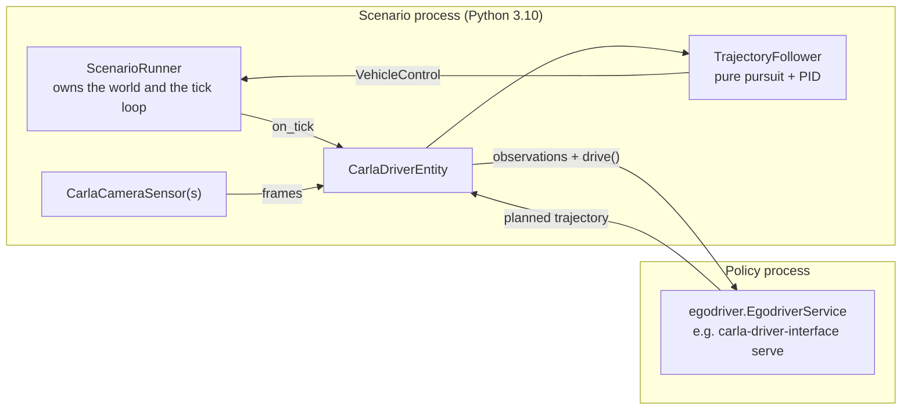

# External Driver Interface

The ego vehicle in a scenario is normally driven by CARLA's TrafficManager. This page
describes the alternative: handing the ego to an **external driving policy** that plans
over gRPC, so a scenario becomes a test of that policy rather than of TrafficManager.

The wire contract is alpasim's `egodriver.EgodriverService`, the same one
[`carla_driver_interface`](https://github.com/hakuturu583/carla_driver_interface)
implements, so any policy written against that package works here unchanged.

## Architecture

The scenario framework plays the **runtime** role: it owns the world, ticks the
simulation, renders observations, and asks the policy what to do. The policy is a
separate process serving `egodriver.EgodriverService`.



Each simulation tick, `CarlaDriverEntity` tracks the most recent plan and applies a
control. Every `driver.policy_timestep_s` it also submits fresh observations — camera
frames, the ego's pose and dynamic state, and a route window rolled forward from the
ego's current position — and asks the policy to re-plan. Between policy steps the cached
plan keeps being tracked, which is how a policy slower than the simulation stays usable.

## Running a scenario against a policy

Start the policy first — it is a server, the scenario is the client:

```bash
# In the policy's own environment
uv run carla-driver-interface serve --policy route_follower --port 50051
```

Then run any scenario with the `carla_driver` ego entity:

```bash
uv run scenario ego.entity=carla_driver driver.address=localhost:50051
```

`ScenarioRunner` logs `Autopilot skipped for ego (id=…) — external control expected`
when the policy has taken over. Pass and fail conditions, recording, video rendering,
and sweeps all behave exactly as they do for a TrafficManager-driven ego.

## Configuration

The `driver` config group (`conf/driver/default.yaml`) holds the settings:

```yaml
driver:
  address: localhost:50051
  timeout_s: 60.0
  policy_timestep_s: 0.1     # must be a multiple of the 0.05 s simulation step
  image_quality: 90
  route_horizon_m: 80.0
  route_resolution_m: 2.0
  rear_axle_offset_m: null   # null derives it from the wheel physics
  send_ground_truth: false
  send_renderer_data: true       # CARLA ground truth: lights, traffic, speed limit
  send_actor_ground_truth: true
  traffic_light_sight_distance_m: 60.0
  actor_horizon_m: 150.0
  random_seed: 0
  cameras:
    - logical_id: camera_front_wide_120fov
      image_width: 960
      image_height: 604
      fov: 120.0
      position_x: 1.5
      position_z: 1.6
  control:
    lookahead_gain_s: 0.9
    wheelbase_m: 2.8
    max_steer_angle_deg: 70.0
    speed_kp: 0.6
```

`ego.entity` selects the entity and accepts three values:

| Value | Behaviour |
| --- | --- |
| `autopilot` (default) | CARLA's TrafficManager drives the ego. |
| `autoware` | Nothing drives the ego; the actor is left for an external stack. |
| `carla_driver` | An external policy drives the ego over the contract described here. |

`logical_id` is the name the policy looks a camera up by, so it must match what the
policy expects. `carla_driver_interface`'s built-in policies use
`camera_front_wide_120fov`.

## Using it from Python

Scenarios that build their ego themselves can attach the entity directly:

```python
from autoware_carla_scenario import CarlaDriverEntity, DriverClientConfig

scenario.ego_entity = CarlaDriverEntity(
    DriverClientConfig(address="localhost:50051", policy_timestep_s=0.1)
)
```

`ScenarioRunner` calls `BaseScenario.create_ego()`, which returns `ego_entity` when one
is set and otherwise instantiates `ego_type`. Assigning `ego_entity` is the supported
way to supply an entity that needs constructor arguments.

To test against a fake policy, pass a `BaseEgoDriverClient` implementation:

```python
CarlaDriverEntity(config, client=MyFakeDriverClient(config))
```

## CARLA ground truth

The alpasim contract has no field for a traffic light and none for other vehicles.
Both ride inside `DriveRequest.renderer_data`, an upstream-sanctioned `bytes` extension
point, as a serialized `carla_driver.v0.CarlaRendererData`:

| Field | Contents |
| --- | --- |
| `ego_traffic_light` | State of the light governing the ego lane |
| `ego_traffic_light_distance_m` | Distance to its stop line **along the ego's heading**; negative once crossed or when no line applies |
| `speed_limit_mps` | Posted limit for the ego lane, 0 when unknown |
| `actors[]` | Other vehicles: pose, bounding box, and velocity, all in the local frame |
| `weather`, `map_name`, `frame_id` | Scene context |

!!! warning "Turning this off is not a no-op"
    A policy reads the payload defensively — a missing one means "no light applies" and
    "no other vehicles" rather than an error. So `send_renderer_data: false` does not
    fail loudly. It silently disables every rule that depends on the world outside the
    ego. For a specification-driven policy such as
    [stl_driver](https://github.com/hakuturu583/stl_driver), that is `stop_on_red`,
    `collision_free` and `safe_headway` — the car keeps driving and the rules simply
    stop applying.

### Finding the light that governs us

CARLA's `is_at_traffic_light()` answers a different question: whether the ego is inside
the light's *trigger volume*, which is about a metre thick along the road. A policy
asking CARLA therefore learns of a red light at the moment it arrives at it, when
stopping from any ordinary speed is already impossible.

So the lane graph is walked forward instead — up to `traffic_light_sight_distance_m` —
and any light whose stop line lies on one of those lanes governs us. Inside a junction
nothing governs us: having crossed the line, the thing to do is clear the box.

The point reported is not the stop waypoint itself but the **mouth of the junction it
governs**, reached by walking forward from the waypoint. Upstream measured stop
waypoints a median of 5.5 m short of their junction on `Town10HD_Opt`; a policy told to
stop there hesitates most of a car-and-a-half before the line a driver aims at.

This logic is ported from `carla_driver_interface`'s reference runtime
(`runtime/carla_world.py` at `af1dcd3`) so that a policy tuned against that runtime sees
the same numbers here.

### Diagnostics coming back

`DriveResponse.debug_info.unstructured_debug_info` is decoded as
`carla_driver.v0.CarlaDriveDebugInfo` when it parses as one, surfacing the policy's name,
its inference time, and whatever scalars it chose to publish. They are logged every ten
policy steps. Anything that does not parse is left as raw bytes — the field is
deliberately unstructured, and a policy is free to use its own encoding.

## Coordinate frames

Two conversions sit between CARLA and the contract, both handled in
`autoware_carla_scenario.driver.observation`:

* **Handedness.** CARLA's world is left-handed (x=East, y=South, z=Up, yaw clockwise);
  the contract is right-handed (x forward, y left, z up). Positions flip `y`, yaw is
  negated, and angular velocity — a pseudovector — picks up an extra sign flip.
* **Rig origin.** alpasim puts the rig origin at the rear-axle centre projected to the
  ground, while a CARLA actor's origin is at the vehicle centre. The offset is derived
  from the vehicle's wheel physics and logged at session start.

!!! warning "Rear-axle offset on CARLA 0.9.x"
    CARLA 0.9.x reports wheel positions in world coordinates and centimetres, so the
    derived offset can land far outside a plausible range. When that happens the value
    falls back to half the bounding-box length and a warning is logged. Set
    `driver.rear_axle_offset_m` (e.g. `-1.4`) to pin it explicitly.

Observations are submitted with the ego pose in the **local** frame and velocities in
the **rig** frame; the route is submitted in the rig frame. The plan comes back in the
local frame and is converted to the rig frame before the controller tracks it.

## Early termination

A policy can set `terminate_session` on its response. The entity records it, and
`ScenarioRunner` ends the tick loop — but only after evaluating the scenario's own pass
and fail conditions, so a condition firing on the same tick still decides the outcome.
On its own, an early stop is reported as a failure with the message
`Ego entity requested session termination`, because the scenario never satisfied its
pass condition.

## Protobuf definitions

The protobuf definitions are **vendored**, not installed. `carla-driver-interface` and
its `alpasim-grpc` dependency require Python ≥ 3.11, while this package is pinned to
3.10 by the CPython-3.10-only CARLA 0.10.0 wheel, so the two cannot share an
environment. Instead the `.proto` files are copied verbatim from two upstreams
(both Apache-2.0) and compiled locally:

| Proto | Source | Carries |
| --- | --- | --- |
| `alpasim_grpc/v0/*` | `NVlabs/alpasim@6870924` | The `egodriver` service and its messages |
| `carla_driver/v0/*` | `hakuturu583/carla_driver_interface@af1dcd3` | The CARLA extension payloads | Field numbers, package names, and import paths are preserved exactly, which is
what keeps the messages wire compatible.

Regenerate the committed modules after updating the vendored protos:

```bash
uv run python autoware_carla_scenario/scripts/compile_protos.py
```

`test_proto_generated.py` fails if the committed output drifts from the `.proto` files.
See `autoware_carla_scenario/proto/README.md` for the full provenance.

## Limitations

* Only RGB cameras are streamed. Lidar is not wired up.
* `submit_recording_ground_truth` is not called; `send_ground_truth` is accepted but not
  acted on. This is the *recorded* trajectory channel, unrelated to the CARLA ground
  truth in `renderer_data`, which is sent.
* The route is a lane-following walk of CARLA's road graph, taking the first
  continuation at each fork. It is a rolling window, re-sent on every policy step so the
  horizon stays ahead of the vehicle, but it is not a global plan: the ego will not turn
  toward a goal. Scenarios needing a specific route should submit their own waypoints
  through the client.
* Actor reporting covers vehicles only — pedestrians are not included.
* Actor `dynamic_state` carries linear velocity; angular velocity and acceleration are
  left zero, matching the reference runtime.
