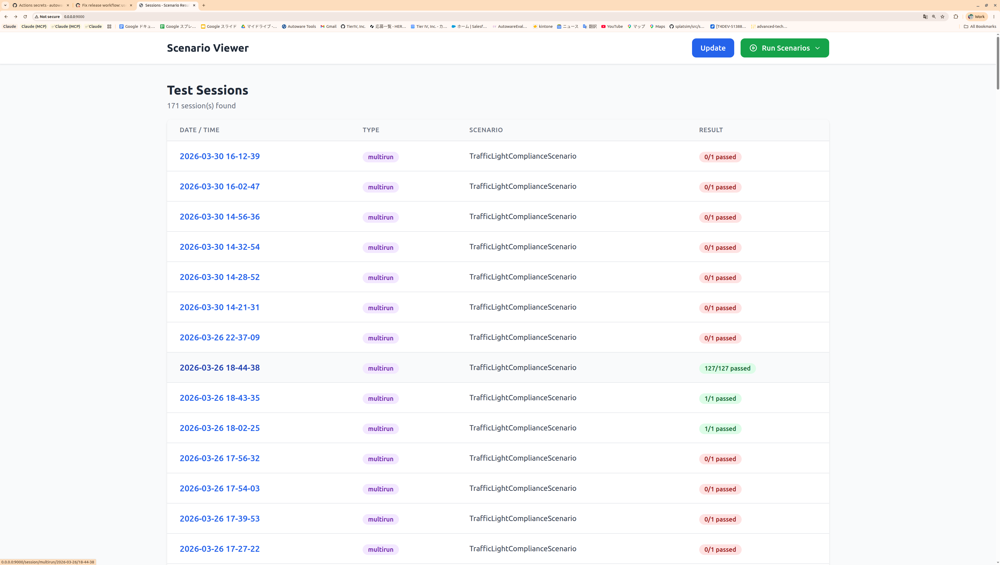
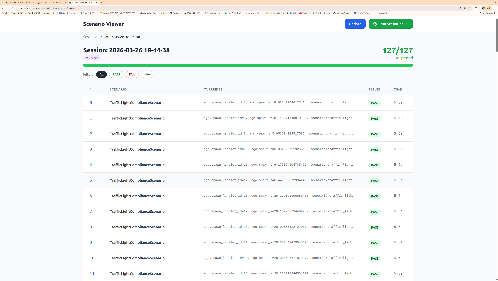
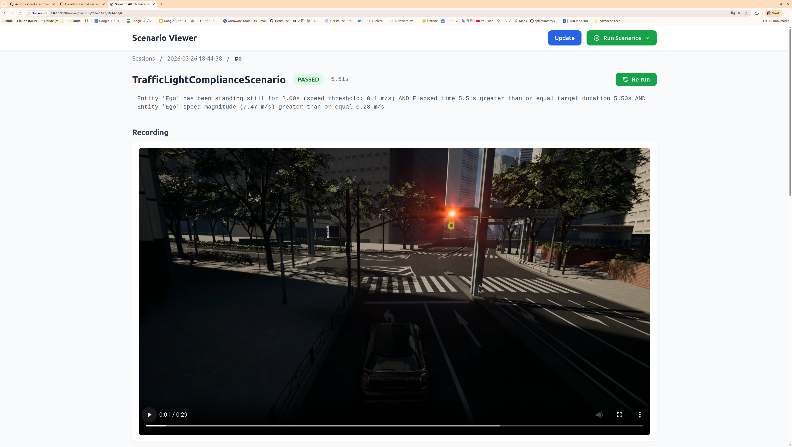
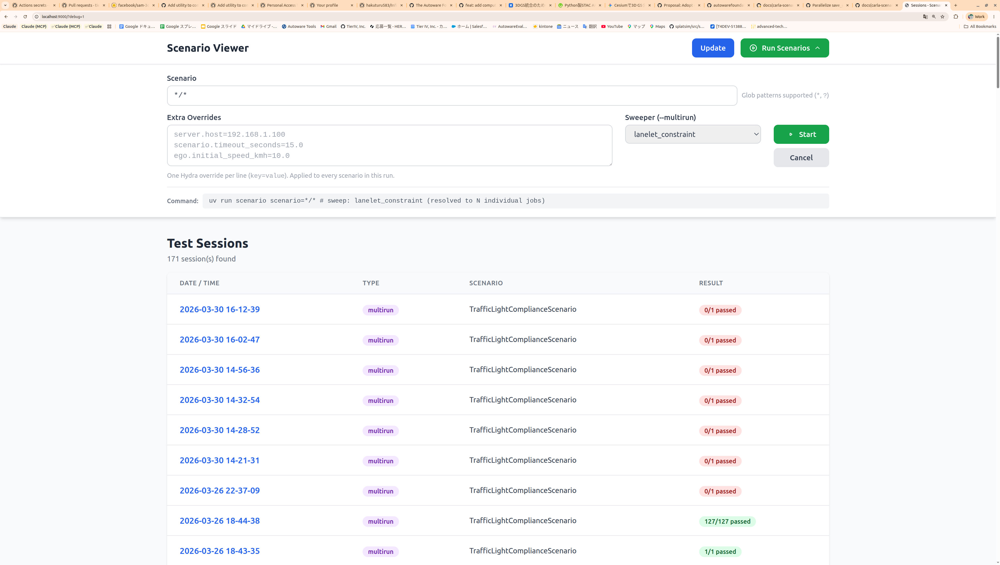

# Tutorial: Writing Your First Scenario

This tutorial shows two paths to creating a scenario:

1. **Quick Start (recommended)** — Use the bundled Claude Code plugin.
   Describe what you want in plain text and let Claude generate all files.
2. **Manual walkthrough** — Understand every file by building one yourself.

---

## Quick Start with Claude Code Plugin

This repository ships a **`write-scenario` plugin** inside
`.claude/local-marketplace/`. It is pre-enabled in `.claude/settings.json`
— **no extra setup is needed**. Just open Claude Code in the repository root
and the plugin is ready to use.

### How It Works

Type `/write-scenario` followed by a natural-language description of the
test you want. Claude walks you through a 7-stage workflow automatically:

| Stage | What Claude does |
|---|---|
| 1. Understand | Parses your description, asks clarifying questions |
| 2. Discover | Scans the codebase for available Conditions, Actions, Constraints, and Bindings |
| 3. Write | Generates all four files: Python class, config dataclass, YAML, and `run.py` registration |
| 4. Debug | Runs the scenario in CARLA, reads logs, fixes failures iteratively |
| 5. Review | Analyzes parameter orthogonality and sweeper compatibility |
| 6. Sweep | Adds `sweep.constraints` / `bindings` to the YAML for parametric testing |
| 7. Multirun | Provides the exact command to execute the logical scenario across the map |

### Example

```
> /write-scenario I want to test that the ego stops at a stop sign,
  waits 3 seconds, then proceeds through the intersection.
```

Claude will:

1. Identify `StandstillCondition` and `TimeoutCondition` from the codebase
2. Generate `my_scenario.py`, update `configs.py`, create YAML, register in `run.py`
3. Run the scenario, analyze the result, and iterate until it passes
4. Propose sweep constraints so the test generalizes to every stop sign on the map

You do not need to memorize the framework API — the plugin discovers
everything dynamically.

### Other Plugin Commands

| Command | When to use |
|---|---|
| `/write-scenario` | Create a new scenario from scratch |
| `/debug-concrete-scenario` | An existing scenario fails — analyze logs and fix |
| `/review-scenario` | Before adding sweep — check parameter design |

---

The rest of this page explains the manual process. Read on if you want to
understand what the plugin generates under the hood.

---

## Key Concepts

| Term | What it is | File type |
|---|---|---|
| **Abstract scenario** | Reusable Python class that defines *what to test* (conditions, actions, entities). | `*.py` |
| **Config dataclass** | Typed parameters the scenario accepts (timeout, speed, lanelet IDs, ...). | `*.py` |
| **Concrete scenario** | YAML file that binds an abstract scenario to *specific* parameter values. | `*.yaml` |

One abstract scenario can have many concrete variants (straight, left turn, right turn, etc.).

---

## Step 1 — Create the Config Dataclass

Add your config to `src/autoware_carla_scenario/examples/configs.py`:

```python
@dataclass
class MyScenarioConfig:
    """Parameters for my custom scenario."""

    name: str = "my_scenario"

    #: Lanelet IDs the ego should visit.
    expected_lanelet_ids: list[int] = field(default_factory=lambda: [460])

    #: Fail-safe timeout in seconds.
    timeout_seconds: float = 10.0
```

Every field becomes overridable from the YAML side via Hydra.

---

## Step 2 — Create the Abstract Scenario

Create `src/autoware_carla_scenario/examples/my_scenario.py`:

```python
from __future__ import annotations

from autoware_carla_scenario import (
    EGO_ROLE_NAME,
    AndCondition,
    BaseScenario,
    EgoConfig,
    EntityLanePositionCondition,
    GroundProjectionConfig,
    Lanelet2Pose,
    StickyCondition,
    TimeoutCondition,
    to_opendrive,
)

from .configs import MyScenarioConfig


class MyScenario(BaseScenario):
    """Verify the ego visits every expected road."""

    def __init__(
        self,
        ego_config: EgoConfig,
        spawn_pose: Lanelet2Pose,
        config: MyScenarioConfig | None = None,
        ground_projection: GroundProjectionConfig | None = None,
    ) -> None:
        super().__init__(
            ego_config, spawn_pose=spawn_pose,
            ground_projection=ground_projection,
        )
        self._config = config or MyScenarioConfig()

    def setup(self) -> None:
        # 1. Snap ego spawn to CARLA road surface
        self._setup_ego_spawn()

        cfg = self._config

        # 2. Build pass condition — "ego visited all expected roads"
        stickies = []
        for ll_id in cfg.expected_lanelet_ids:
            od = to_opendrive(Lanelet2Pose(lanelet_id=ll_id, s=0.0))
            stickies.append(
                StickyCondition(
                    EntityLanePositionCondition(
                        entity_name=EGO_ROLE_NAME,
                        road_id=od.road_id,
                    )
                )
            )
        self.register_pass_condition(AndCondition(stickies))

        # 3. Fail-safe timeout
        self.register_fail_condition(
            TimeoutCondition(cfg.timeout_seconds, label="timeout")
        )

    def is_done(self) -> bool:
        return False
```

### Anatomy of `setup()`

Every scenario follows the same structure:

1. **Spawn** — call `self._setup_ego_spawn()` (snaps the Lanelet2 pose to the
   CARLA road surface).
2. **Pass conditions** — register one or more conditions via
   `self.register_pass_condition()`. When all pass conditions are met the
   scenario succeeds.
3. **Fail conditions** — register via `self.register_fail_condition()`.
   If any fail condition triggers first, the scenario fails.
4. **Actions** (optional) — e.g. `TurnAction`, `TrafficSignalAction`.

!!! tip "Discovering available Conditions and Actions"
    Run `grep -r "class.*Condition" src/autoware_carla_scenario/conditions/` and
    `grep -r "class.*Action" src/autoware_carla_scenario/actions/` to see
    everything the framework provides.

---

## Step 3 — Register the Scenario

In `src/autoware_carla_scenario/examples/run.py`, add the import and
registration:

```python
from .my_scenario import MyScenario
from .configs import MyScenarioConfig

register_scenario("my_scenario", MyScenario, MyScenarioConfig)
```

The first argument (`"my_scenario"`) is the name referenced in YAML's
`scenario.name` field.

---

## Step 4 — Write a Concrete Scenario (YAML)

Create `src/autoware_carla_scenario/examples/conf/scenario/my_scenario/default.yaml`:

```yaml
# @package _global_
scenario:
  name: my_scenario
  expected_lanelet_ids: [460, 265]
  timeout_seconds: 8.0

ego:
  initial_speed_kmh: 5.0
  spawn_lanelet_id: 242
  spawn_s: 25.0
```

!!! note "`# @package _global_`"
    This Hydra directive is **required** on the first line. It tells Hydra to
    merge the file into the root config, not into a nested key.

### Minimal checklist

- [x] `scenario.name` matches the registered name (`"my_scenario"`)
- [x] `ego.spawn_lanelet_id` is a valid lanelet ID in the target map
- [x] `ego.spawn_s` is within the lanelet length

---

## Step 5 — Run It

```bash
# Single run
uv run scenario scenario=my_scenario/default

# Batch — run all variants under my_scenario/
uv run scenario scenario='my_scenario/*'

# Override a parameter on the fly
uv run scenario scenario=my_scenario/default scenario.timeout_seconds=20.0
```

---

## Step 6 — Check Results in the Viewer

```bash
# Start the viewer (defaults to port 9000)
uv run viewer

# Or point at a specific output directory
VIEWER_BASE_PATH=outputs uv run viewer
```

Open <http://localhost:9000> in your browser. The viewer has three levels of
navigation:

### 1. Session list

The top page lists every test session with its timestamp, run type
(`multirun` / single), scenario name, and overall result.



Each row is color-coded: green for all-passed, red if any scenario failed.
Click a session to drill down.

### 2. Session detail

Inside a session you see every concrete scenario that was executed.
For multirun (sweep) sessions, this can be hundreds of rows — each with its
parameter overrides, individual PASS/FAIL badge, and execution time.



The progress bar and counter at the top (e.g. **127/127 All passed**) give an
at-a-glance summary. Use the **PASS** / **FAIL** / **N/A** filter buttons to
narrow the list.

### 3. Concrete scenario detail

Click any row to open the detail view for a single concrete scenario. Here you
can see:

- **Pass/Fail status** and elapsed time
- **Condition tree** — the evaluated condition expression showing exactly which
  sub-conditions were met
- **Recording** — a video captured from CARLA during the scenario execution



The **Re-run** button in the top-right corner lets you re-execute the same
scenario directly from the viewer.

### 4. Running scenarios from the viewer

You can also launch scenario runs directly from the browser without using the
CLI. Click the **Run Scenarios** dropdown in the top-right corner to open the
run form.



The form lets you configure:

- **Scenario** — a glob pattern to select which scenarios to run (e.g. `*/*`
  for all scenarios)
- **Extra Overrides** — Hydra overrides applied to every scenario in the run
  (one `key=value` per line, e.g. `server.host=192.168.1.100`)
- **Sweeper** — select `lanelet_constraint` to run a multirun sweep across
  matching lanelets

Click **Start** to begin execution. The generated command is shown at the
bottom of the form for reference. Results appear in the session list below
once the run completes — click **Update** to refresh.

### Additional notes

- The viewer scans `outputs/` (single/batch runs) and `multirun/` (sweep runs)
  for `*_result.json` files. Click **Update** if you ran a scenario while the
  viewer was open.

---

## Adding Sweep (Parametric Testing)

To test the same scenario across many lanelets automatically, add a `sweep`
section to the YAML:

```yaml
# @package _global_
scenario:
  name: my_scenario
  expected_lanelet_ids: [460, 265]
  timeout_seconds: 8.0

ego:
  initial_speed_kmh: 5.0
  spawn_lanelet_id: 242
  spawn_s: 25.0

sweep:
  constraints:
    ego.spawn_lanelet_id:
      - type: and
        constraints:
          - type: lanelet_length
            rule: greater_than_or_equal
            value: 10.0
          - type: not
            constraint:
              type: is_junction
```

Run as a multirun:

```bash
uv run scenario --multirun scenario=my_scenario/default \
  hydra/sweeper=lanelet_constraint
```

The sweeper evaluates constraints against the Lanelet2 map and generates one
job per matching lanelet. Results appear under `multirun/` in the viewer.
