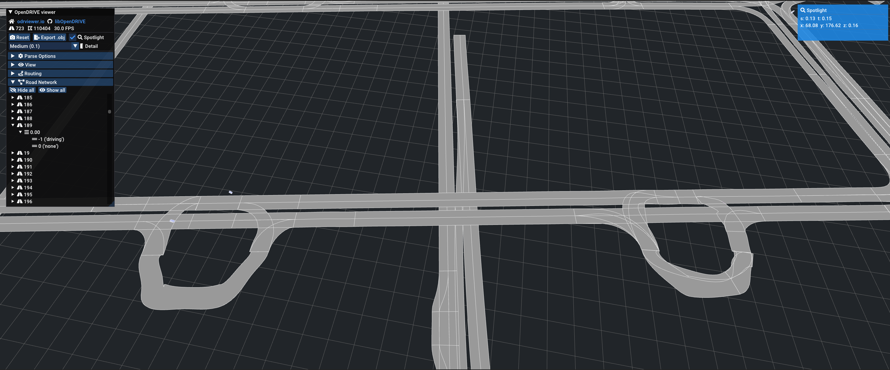

# CARLA OpenDRIVE and Lanelet2 Tag Mapping

This document describes how OpenDRIVE tags are used within CARLA and how Lanelet2 tags are processed and mapped to OpenDRIVE format.

## Overview

CARLA UE5 uses a modular OpenDRIVE parser system located in [`LibCarla/source/carla/opendrive/`](https://github.com/carla-simulator/carla/tree/master/LibCarla/source/carla/opendrive) directory. The parser consists of specialized components that handle different aspects of the OpenDRIVE specification:

- **XML Parsing**: Uses the `pugixml` library for XML processing
- **Modular Architecture**: Separate parser classes for different OpenDRIVE elements
- **Map Building**: Constructs CARLA's internal road network representation from parsed data

This document focuses on which OpenDRIVE tags CARLA reads and how they are used internally, which is essential for understanding what needs to be generated when converting from Lanelet2 format.


## OpenDRIVE Tags in CARLA

This section provides a comprehensive reference of OpenDRIVE tags, showing how they are used in CARLA's parser and how Lanelet2 elements map to these tags during conversion.

**Table columns:**

- **Parser Module**: CARLA parser component (click to jump to detailed notes)
- **OpenDRIVE Tag/Attribute**: Tag name in OpenDRIVE format
- **CARLA Purpose**: How CARLA uses this tag
- **CARLA Code Location**: Link to source code
- **Lanelet2 Mapping**: How this tag is generated from Lanelet2 data
- **Status**: Implementation status (see legend below)
- **Conversion Notes**: Important considerations for conversion
- **CARLA NPC Behavior Impact**: How this tag affects NPC vehicle/pedestrian behavior in simulation
- **NPC Behavior Source**: Source code references for NPC behavior implementation (comma-separated if multiple)

**Legend:**

- ✅ Fully implemented (direct mapping from Lanelet2)
- ⚠️ Partially implemented or requires generation/calculation
- ⛔ Not in Lanelet2 specification (concept doesn't exist in Lanelet2)
- 📋 Enhancement required (not currently implemented, could be added)

| Parser Module | OpenDRIVE Tag/Attribute | CARLA Purpose | CARLA Code Location | Lanelet2 Mapping | Status | Conversion Notes | CARLA NPC Behavior Impact | NPC Behavior Source |
|---------------|-------------------------|---------------|---------------------|------------------|--------|------------------|------------------------|---------------------|
| [GeoReferenceParser](#georeferenceparser) | [`header/geoReference`](https://publications.pages.asam.net/standards/ASAM_OpenDRIVE/ASAM_OpenDRIVE_Specification/latest/specification/08_coordinate_systems/08_05_geo_referencing.html) | PROJ format georeference string, Geographic coordinate system definition | [`GeoReferenceParser.cpp` L62](https://github.com/carla-simulator/carla/blob/master/LibCarla/source/carla/opendrive/parser/GeoReferenceParser.cpp#L62) | Lanelet2 origin (MGRS or lat/lon) | ✅ | Convert MGRS to lat/lon, generate PROJ string | - | - |
| [GeoReferenceParser](#georeferenceparser) | [`+lat_0=`](https://publications.pages.asam.net/standards/ASAM_OpenDRIVE/ASAM_OpenDRIVE_Specification/latest/specification/08_coordinate_systems/08_05_geo_referencing.html) | Latitude origin, Origin point for coordinate transformation | [`GeoReferenceParser.cpp` L28-L50](https://github.com/carla-simulator/carla/blob/master/LibCarla/source/carla/opendrive/parser/GeoReferenceParser.cpp#L28-L50) | Lanelet2 origin latitude | ✅ | Direct extraction from origin | - | - |
| [GeoReferenceParser](#georeferenceparser) | [`+lon_0=`](https://publications.pages.asam.net/standards/ASAM_OpenDRIVE/ASAM_OpenDRIVE_Specification/latest/specification/08_coordinate_systems/08_05_geo_referencing.html) | Longitude origin, Origin point for coordinate transformation | [`GeoReferenceParser.cpp` L28-L50](https://github.com/carla-simulator/carla/blob/master/LibCarla/source/carla/opendrive/parser/GeoReferenceParser.cpp#L28-L50) | Lanelet2 origin longitude | ✅ | Direct extraction from origin | - | - |
| [RoadParser](#roadparser) | [`road@id`](https://publications.pages.asam.net/standards/ASAM_OpenDRIVE/ASAM_OpenDRIVE_Specification/latest/specification/10_roads/10_01_introduction.html) | Road identifier, Unique road identification | [`RoadParser.cpp` L113-L120](https://github.com/carla-simulator/carla/blob/master/LibCarla/source/carla/opendrive/parser/RoadParser.cpp#L113-L120) | Auto-generated | ⚠️ | Group adjacent lanelets into roads | - | - |
| [RoadParser](#roadparser) | [`road@name`](https://publications.pages.asam.net/standards/ASAM_OpenDRIVE/ASAM_OpenDRIVE_Specification/latest/specification/10_roads/10_01_introduction.html) | Road name, Road naming/labeling | [`RoadParser.cpp` L113-L120](https://github.com/carla-simulator/carla/blob/master/LibCarla/source/carla/opendrive/parser/RoadParser.cpp#L113-L120) | Optional | ⚠️ | Can use lanelet IDs or custom names | - | - |
| [RoadParser](#roadparser) | [`road@length`](https://publications.pages.asam.net/standards/ASAM_OpenDRIVE/ASAM_OpenDRIVE_Specification/latest/specification/10_roads/10_01_introduction.html) | Road length (meters), Road geometry calculation | [`RoadParser.cpp` L113-L120](https://github.com/carla-simulator/carla/blob/master/LibCarla/source/carla/opendrive/parser/RoadParser.cpp#L113-L120) | Calculated from Lanelet2 centerline | ⚠️ | Sum of geometry segment lengths | - | - |
| [RoadParser](#roadparser) | [`road@junction`](https://publications.pages.asam.net/standards/ASAM_OpenDRIVE/ASAM_OpenDRIVE_Specification/latest/specification/10_roads/10_01_introduction.html) | Junction ID reference, Links road to junction | [`RoadParser.cpp` L113-L120](https://github.com/carla-simulator/carla/blob/master/LibCarla/source/carla/opendrive/parser/RoadParser.cpp#L113-L120) | Lanelet2 `turn_direction` tag | ✅ | Lanelets with turn_direction → junction roads | NPC uses junction navigation logic for turns | [local_planner.py L30-150](https://github.com/carla-simulator/carla/blob/master/PythonAPI/carla/agents/navigation/local_planner.py#L30-L150) |
| [RoadParser](#roadparser) | [`road/link/predecessor@elementId`](https://publications.pages.asam.net/standards/ASAM_OpenDRIVE/ASAM_OpenDRIVE_Specification/latest/specification/10_roads/10_03_road_linkage.html) | Previous road ID, Road connectivity | [`RoadParser.cpp` L122-L130](https://github.com/carla-simulator/carla/blob/master/LibCarla/source/carla/opendrive/parser/RoadParser.cpp#L122-L130) | Lanelet2 predecessor connectivity | ✅ | Map lanelet to road connectivity | Affects route planning and road connectivity | [local_planner.py L30-150](https://github.com/carla-simulator/carla/blob/master/PythonAPI/carla/agents/navigation/local_planner.py#L30-L150) |
| [RoadParser](#roadparser) | [`road/link/successor@elementId`](https://publications.pages.asam.net/standards/ASAM_OpenDRIVE/ASAM_OpenDRIVE_Specification/latest/specification/10_roads/10_03_road_linkage.html) | Next road ID, Road connectivity | [`RoadParser.cpp` L122-L130](https://github.com/carla-simulator/carla/blob/master/LibCarla/source/carla/opendrive/parser/RoadParser.cpp#L122-L130) | Lanelet2 successor connectivity | ✅ | Map lanelet to road connectivity | Affects route planning and road connectivity | [local_planner.py L30-150](https://github.com/carla-simulator/carla/blob/master/PythonAPI/carla/agents/navigation/local_planner.py#L30-L150) |
| [RoadParser](#roadparser) | [`road/type@s`](https://publications.pages.asam.net/standards/ASAM_OpenDRIVE/ASAM_OpenDRIVE_Specification/latest/specification/10_roads/10_04_road_type.html) | Start position, Road type section position | [`RoadParser.cpp` L133-L145](https://github.com/carla-simulator/carla/blob/master/LibCarla/source/carla/opendrive/parser/RoadParser.cpp#L133-L145) | Generated | ⚠️ | Segment start positions | - | - |
| [RoadParser](#roadparser) | [`road/type@type`](https://publications.pages.asam.net/standards/ASAM_OpenDRIVE/ASAM_OpenDRIVE_Specification/latest/specification/10_roads/10_04_road_type.html) | Road type, Road classification (town, highway, etc.) | [`RoadParser.cpp` L133-L145](https://github.com/carla-simulator/carla/blob/master/LibCarla/source/carla/opendrive/parser/RoadParser.cpp#L133-L145) | Lanelet2 `location` tag | ✅ | urban→TOWN, highway→MOTORWAY, rural→RURAL | Highway: higher cruise speed; Town: slower, more cautious | [RoadParser.cpp L50-100](https://github.com/carla-simulator/carla/blob/master/LibCarla/source/carla/opendrive/parser/RoadParser.cpp#L50-L100), [behavior_agent.py L50-100](https://github.com/carla-simulator/carla/blob/master/PythonAPI/carla/agents/navigation/behavior_agent.py#L50-L100) |
| [RoadParser](#roadparser) | [`road/type/speed@max`](https://publications.pages.asam.net/standards/ASAM_OpenDRIVE/ASAM_OpenDRIVE_Specification/latest/specification/10_roads/10_04_road_type.html) | Maximum speed, Speed limit | [`RoadParser.cpp` L133-L145](https://github.com/carla-simulator/carla/blob/master/LibCarla/source/carla/opendrive/parser/RoadParser.cpp#L133-L145) | Lanelet2 `speed_limit` tag | ✅ | Direct value (km/h) | Sets NPC cruise speed limit | [SignalParser.cpp L50-60](https://github.com/carla-simulator/carla/blob/master/LibCarla/source/carla/opendrive/parser/SignalParser.cpp#L50-L60), [behavior_agent.py L100-150](https://github.com/carla-simulator/carla/blob/master/PythonAPI/carla/agents/navigation/behavior_agent.py#L100-L150) |
| [RoadParser](#roadparser) | [`road/type/speed@unit`](https://publications.pages.asam.net/standards/ASAM_OpenDRIVE/ASAM_OpenDRIVE_Specification/latest/specification/10_roads/10_04_road_type.html) | Speed unit, Speed unit (km/h, mph, etc.) | [`RoadParser.cpp` L133-L145](https://github.com/carla-simulator/carla/blob/master/LibCarla/source/carla/opendrive/parser/RoadParser.cpp#L133-L145) | Default km/h | ⚠️ | Lanelet2 uses km/h | - | - |
| [RoadParser](#roadparser) | [`road/lanes/laneOffset@s,a,b,c,d`](https://publications.pages.asam.net/standards/ASAM_OpenDRIVE/ASAM_OpenDRIVE_Specification/latest/specification/11_lanes/11_01_introduction.html) | Lane offset parameters, Lane lateral offset polynomial | [`RoadParser.cpp` L147-L155](https://github.com/carla-simulator/carla/blob/master/LibCarla/source/carla/opendrive/parser/RoadParser.cpp#L147-L155) | Default 0 | ⚠️ | Lanelet2 has no lane offset concept | - | - |
| [RoadParser](#roadparser) | [`road/lanes/laneSection@s`](https://publications.pages.asam.net/standards/ASAM_OpenDRIVE/ASAM_OpenDRIVE_Specification/latest/specification/11_lanes/11_01_introduction.html) | Lane section start, Lane section definition | [`RoadParser.cpp` L157-L180](https://github.com/carla-simulator/carla/blob/master/LibCarla/source/carla/opendrive/parser/RoadParser.cpp#L157-L180) | Generated | ⚠️ | Section start positions from lanelet groups | - | - |
| [RoadParser](#roadparser) | [`lane@id`](https://publications.pages.asam.net/standards/ASAM_OpenDRIVE/ASAM_OpenDRIVE_Specification/latest/specification/11_lanes/11_03_lane_sections.html) | Lane identifier, Lane identification | [`RoadParser.cpp` L157-L180](https://github.com/carla-simulator/carla/blob/master/LibCarla/source/carla/opendrive/parser/RoadParser.cpp#L157-L180) | Generated from ordering | ⚠️ | Sequential lane numbering | - | - |
| [RoadParser](#roadparser) | [`lane@type`](https://publications.pages.asam.net/standards/ASAM_OpenDRIVE/ASAM_OpenDRIVE_Specification/latest/specification/11_lanes/11_03_lane_sections.html) | Lane type, Lane classification | [`RoadParser.cpp` L157-L180](https://github.com/carla-simulator/carla/blob/master/LibCarla/source/carla/opendrive/parser/RoadParser.cpp#L157-L180) | Lanelet2 `subtype` tag | ✅ | road→driving, walkway→sidewalk, bicycle_lane→biking | NPCs only drive in 'driving' lanes; ignore sidewalk/biking | [LaneParser.cpp L30-90](https://github.com/carla-simulator/carla/blob/master/LibCarla/source/carla/opendrive/parser/LaneParser.cpp#L30-L90), [LocalizationStage.cpp L30-100](https://github.com/carla-simulator/carla/blob/master/LibCarla/source/carla/trafficmanager/LocalizationStage.cpp#L30-L100) |
| [RoadParser](#roadparser) | [`lane@level`](https://publications.pages.asam.net/standards/ASAM_OpenDRIVE/ASAM_OpenDRIVE_Specification/latest/specification/11_lanes/11_03_lane_sections.html) | Lane level, Stacked lane handling | [`RoadParser.cpp` L157-L180](https://github.com/carla-simulator/carla/blob/master/LibCarla/source/carla/opendrive/parser/RoadParser.cpp#L157-L180) | Default 0 | ⚠️ | Lanelet2 has no stacked lanes | - | - |
| [RoadParser](#roadparser) | [`lane/link/predecessor`](https://publications.pages.asam.net/standards/ASAM_OpenDRIVE/ASAM_OpenDRIVE_Specification/latest/specification/11_lanes/11_05_lane_link.html) | Previous lane, Lane connectivity | [`RoadParser.cpp` L157-L180](https://github.com/carla-simulator/carla/blob/master/LibCarla/source/carla/opendrive/parser/RoadParser.cpp#L157-L180) | Lanelet2 predecessor lanelet | ✅ | Lane connectivity mapping | Used for lane-level route planning | [local_planner.py L30-150](https://github.com/carla-simulator/carla/blob/master/PythonAPI/carla/agents/navigation/local_planner.py#L30-L150) |
| [RoadParser](#roadparser) | [`lane/link/successor`](https://publications.pages.asam.net/standards/ASAM_OpenDRIVE/ASAM_OpenDRIVE_Specification/latest/specification/11_lanes/11_05_lane_link.html) | Next lane, Lane connectivity | [`RoadParser.cpp` L157-L180](https://github.com/carla-simulator/carla/blob/master/LibCarla/source/carla/opendrive/parser/RoadParser.cpp#L157-L180) | Lanelet2 successor lanelet | ✅ | Lane connectivity mapping | Used for lane-level route planning | [local_planner.py L30-150](https://github.com/carla-simulator/carla/blob/master/PythonAPI/carla/agents/navigation/local_planner.py#L30-L150) |
| [GeometryParser](#geometryparser) | [`geometry@s`](https://publications.pages.asam.net/standards/ASAM_OpenDRIVE/ASAM_OpenDRIVE_Specification/latest/specification/09_geometries/09_01_introduction.html) | Start position along road, Geometry segment positioning | [`GeometryParser.cpp` L77-L84](https://github.com/carla-simulator/carla/blob/master/LibCarla/source/carla/opendrive/parser/GeometryParser.cpp#L77-L84) | Lanelet2 centerline segments | ✅ | Cumulative distance along reference line | - | - |
| [GeometryParser](#geometryparser) | [`geometry@x`](https://publications.pages.asam.net/standards/ASAM_OpenDRIVE/ASAM_OpenDRIVE_Specification/latest/specification/09_geometries/09_01_introduction.html) | X coordinate, Geometry start point | [`GeometryParser.cpp` L77-L84](https://github.com/carla-simulator/carla/blob/master/LibCarla/source/carla/opendrive/parser/GeometryParser.cpp#L77-L84) | Lanelet2 centerline points | ✅ | Extract x-coordinate from points | - | - |
| [GeometryParser](#geometryparser) | [`geometry@y`](https://publications.pages.asam.net/standards/ASAM_OpenDRIVE/ASAM_OpenDRIVE_Specification/latest/specification/09_geometries/09_01_introduction.html) | Y coordinate, Geometry start point | [`GeometryParser.cpp` L77-L84](https://github.com/carla-simulator/carla/blob/master/LibCarla/source/carla/opendrive/parser/GeometryParser.cpp#L77-L84) | Lanelet2 centerline points | ✅ | Extract y-coordinate from points | - | - |
| [GeometryParser](#geometryparser) | [`geometry@hdg`](https://publications.pages.asam.net/standards/ASAM_OpenDRIVE/ASAM_OpenDRIVE_Specification/latest/specification/09_geometries/09_01_introduction.html) | Heading angle, Geometry orientation | [`GeometryParser.cpp` L77-L84](https://github.com/carla-simulator/carla/blob/master/LibCarla/source/carla/opendrive/parser/GeometryParser.cpp#L77-L84) | Lanelet2 centerline direction | ✅ | Calculate heading from consecutive points | - | - |
| [GeometryParser](#geometryparser) | [`geometry@length`](https://publications.pages.asam.net/standards/ASAM_OpenDRIVE/ASAM_OpenDRIVE_Specification/latest/specification/09_geometries/09_01_introduction.html) | Geometry length, Segment length | [`GeometryParser.cpp` L77-L84](https://github.com/carla-simulator/carla/blob/master/LibCarla/source/carla/opendrive/parser/GeometryParser.cpp#L77-L84) | Lanelet2 centerline segments | ✅ | Distance between consecutive points | - | - |
| [GeometryParser](#geometryparser) | [`geometry/line`](https://publications.pages.asam.net/standards/ASAM_OpenDRIVE/ASAM_OpenDRIVE_Specification/latest/specification/09_geometries/09_03_straight_line.html) | Straight line, Linear road segment | [`GeometryParser.cpp` L89, L120](https://github.com/carla-simulator/carla/blob/master/LibCarla/source/carla/opendrive/parser/GeometryParser.cpp#L89) | Lanelet2 centerline (simple) | ✅ | Direct point-to-point conversion | - | - |
| [GeometryParser](#geometryparser) | [`geometry/arc@curvature`](https://publications.pages.asam.net/standards/ASAM_OpenDRIVE/ASAM_OpenDRIVE_Specification/latest/specification/09_geometries/09_05_arc.html) | Arc curvature, Curved road segment | [`GeometryParser.cpp` L88-91, L122-123](https://github.com/carla-simulator/carla/blob/master/LibCarla/source/carla/opendrive/parser/GeometryParser.cpp#L88-L91) | Optional | ⚠️ | Requires curve fitting | Affects steering behavior on curves | [controller.py L20-80](https://github.com/carla-simulator/carla/blob/master/PythonAPI/carla/agents/navigation/controller.py#L20-L80) |
| [GeometryParser](#geometryparser) | [`geometry/spiral@curvStart`](https://publications.pages.asam.net/standards/ASAM_OpenDRIVE/ASAM_OpenDRIVE_Specification/latest/specification/09_geometries/09_04_spiral.html) | Spiral start curvature, Clothoid transition | [`GeometryParser.cpp` L91-94, L124-131](https://github.com/carla-simulator/carla/blob/master/LibCarla/source/carla/opendrive/parser/GeometryParser.cpp#L91-L94) | Optional | ⚠️ | Requires clothoid fitting | Affects steering behavior on transitions | [controller.py L20-80](https://github.com/carla-simulator/carla/blob/master/PythonAPI/carla/agents/navigation/controller.py#L20-L80) |
| [GeometryParser](#geometryparser) | [`geometry/spiral@curvEnd`](https://publications.pages.asam.net/standards/ASAM_OpenDRIVE/ASAM_OpenDRIVE_Specification/latest/specification/09_geometries/09_04_spiral.html) | Spiral end curvature, Clothoid transition | [`GeometryParser.cpp` L91-94, L124-131](https://github.com/carla-simulator/carla/blob/master/LibCarla/source/carla/opendrive/parser/GeometryParser.cpp#L91-L94) | Optional | ⚠️ | Requires clothoid fitting | Affects steering behavior on transitions | [controller.py L20-80](https://github.com/carla-simulator/carla/blob/master/PythonAPI/carla/agents/navigation/controller.py#L20-L80) |
| [GeometryParser](#geometryparser) | [`geometry/poly3@a,b,c,d`](https://publications.pages.asam.net/standards/ASAM_OpenDRIVE/ASAM_OpenDRIVE_Specification/latest/specification/09_geometries/09_07_poly3.html) | Cubic polynomial coefficients, Parametric road shape | [`GeometryParser.cpp` L94-99, L133-144](https://github.com/carla-simulator/carla/blob/master/LibCarla/source/carla/opendrive/parser/GeometryParser.cpp#L94-L99) | Optional | ⚠️ | Requires polynomial fitting | - | - |
| [GeometryParser](#geometryparser) | [`geometry/paramPoly3@aU,bU,cU,dU`](https://publications.pages.asam.net/standards/ASAM_OpenDRIVE/ASAM_OpenDRIVE_Specification/latest/specification/09_geometries/09_06_param_poly3.html) | U-direction polynomial, Parametric curve U | [`GeometryParser.cpp` L99-110, L144-159](https://github.com/carla-simulator/carla/blob/master/LibCarla/source/carla/opendrive/parser/GeometryParser.cpp#L99-L110) | Lanelet2 centerline (advanced) | ✅ | B-spline fitting for smoother roads | - | - |
| [GeometryParser](#geometryparser) | [`geometry/paramPoly3@aV,bV,cV,dV`](https://publications.pages.asam.net/standards/ASAM_OpenDRIVE/ASAM_OpenDRIVE_Specification/latest/specification/09_geometries/09_06_param_poly3.html) | V-direction polynomial, Parametric curve V | [`GeometryParser.cpp` L99-110, L144-159](https://github.com/carla-simulator/carla/blob/master/LibCarla/source/carla/opendrive/parser/GeometryParser.cpp#L99-L110) | Lanelet2 centerline (advanced) | ✅ | B-spline fitting for smoother roads | - | - |
| [GeometryParser](#geometryparser) | [`geometry/paramPoly3@pRange`](https://publications.pages.asam.net/standards/ASAM_OpenDRIVE/ASAM_OpenDRIVE_Specification/latest/specification/09_geometries/09_06_param_poly3.html) | Parameter range, Parametric curve range | [`GeometryParser.cpp` L99-110, L144-159](https://github.com/carla-simulator/carla/blob/master/LibCarla/source/carla/opendrive/parser/GeometryParser.cpp#L99-L110) | Generated | ⚠️ | arcLength for parameter range | - | - |
| [LaneParser](#laneparser) | [`lane/width@sOffset,a,b,c,d`](https://publications.pages.asam.net/standards/ASAM_OpenDRIVE/ASAM_OpenDRIVE_Specification/latest/specification/11_lanes/11_06_lane_geometry.html) | Lane width polynomial, Lane width calculation | [`LaneParser.cpp` L17-L185](https://github.com/carla-simulator/carla/blob/master/LibCarla/source/carla/opendrive/parser/LaneParser.cpp#L17-L185) | Calculated from Lanelet2 boundaries | ⚠️ | Distance between left/right bounds (not preferred) | Narrow lanes: NPCs drive more cautiously | [behavior_agent.py L700-800](https://github.com/carla-simulator/carla/blob/master/PythonAPI/carla/agents/navigation/behavior_agent.py#L700-L800) |
| [LaneParser](#laneparser) | [`lane/border@sOffset,a,b,c,d`](https://publications.pages.asam.net/standards/ASAM_OpenDRIVE/ASAM_OpenDRIVE_Specification/latest/specification/11_lanes/11_06_lane_geometry.html) | Lane border polynomial, Lane boundary definition | [`LaneParser.cpp` L17-L185](https://github.com/carla-simulator/carla/blob/master/LibCarla/source/carla/opendrive/parser/LaneParser.cpp#L17-L185) | Lanelet2 left/right boundaries | ✅ | Polynomial fit of boundary points (preferred) | Defines drivable area boundaries | [local_planner.py L30-150](https://github.com/carla-simulator/carla/blob/master/PythonAPI/carla/agents/navigation/local_planner.py#L30-L150) |
| [LaneParser](#laneparser) | [`lane/roadMark@*`](https://publications.pages.asam.net/standards/ASAM_OpenDRIVE/ASAM_OpenDRIVE_Specification/latest/specification/11_lanes/11_08_road_markings.html) | Road marking attributes, Lane markings/striping | [`LaneParser.cpp` L17-L185](https://github.com/carla-simulator/carla/blob/master/LibCarla/source/carla/opendrive/parser/LaneParser.cpp#L17-L185) | Enhancement required | ⛔ | Lanelet2 has no road marking data | - | - |
| [LaneParser](#laneparser) | [`lane/roadMark/type/line@*`](https://publications.pages.asam.net/standards/ASAM_OpenDRIVE/ASAM_OpenDRIVE_Specification/latest/specification/11_lanes/11_08_road_markings.html) | Line marking details, Detailed marking geometry | [`LaneParser.cpp` L17-L185](https://github.com/carla-simulator/carla/blob/master/LibCarla/source/carla/opendrive/parser/LaneParser.cpp#L17-L185) | Enhancement required | ⛔ | Lanelet2 has no detailed marking geometry | - | - |
| [LaneParser](#laneparser) | [`lane/material@*`](https://publications.pages.asam.net/standards/ASAM_OpenDRIVE/ASAM_OpenDRIVE_Specification/latest/specification/11_lanes/11_07_lane_properties.html) | Lane surface material, Surface properties | [`LaneParser.cpp` L17-L185](https://github.com/carla-simulator/carla/blob/master/LibCarla/source/carla/opendrive/parser/LaneParser.cpp#L17-L185) | Enhancement required | ⛔ | Lanelet2 has no material data | - | - |
| [LaneParser](#laneparser) | [`lane/speed@sOffset`](https://publications.pages.asam.net/standards/ASAM_OpenDRIVE/ASAM_OpenDRIVE_Specification/latest/specification/11_lanes/11_07_lane_properties.html) | Speed limit start position, Lane-specific speed limit | [`LaneParser.cpp` L17-L185](https://github.com/carla-simulator/carla/blob/master/LibCarla/source/carla/opendrive/parser/LaneParser.cpp#L17-L185) | Generated | ⚠️ | Section start positions | - | - |
| [LaneParser](#laneparser) | [`lane/speed@max`](https://publications.pages.asam.net/standards/ASAM_OpenDRIVE/ASAM_OpenDRIVE_Specification/latest/specification/11_lanes/11_07_lane_properties.html) | Maximum speed, Lane speed restriction | [`LaneParser.cpp` L17-L185](https://github.com/carla-simulator/carla/blob/master/LibCarla/source/carla/opendrive/parser/LaneParser.cpp#L17-L185) | Lanelet2 `speed_limit` tag | ✅ | Lane-specific speed (overrides road) | Overrides road speed; sets NPC cruise speed for this lane | [SignalParser.cpp L50-60](https://github.com/carla-simulator/carla/blob/master/LibCarla/source/carla/opendrive/parser/SignalParser.cpp#L50-L60), [behavior_agent.py L100-150](https://github.com/carla-simulator/carla/blob/master/PythonAPI/carla/agents/navigation/behavior_agent.py#L100-L150) |
| [LaneParser](#laneparser) | [`lane/speed@unit`](https://publications.pages.asam.net/standards/ASAM_OpenDRIVE/ASAM_OpenDRIVE_Specification/latest/specification/11_lanes/11_07_lane_properties.html) | Speed unit, Speed unit specification | [`LaneParser.cpp` L17-L185](https://github.com/carla-simulator/carla/blob/master/LibCarla/source/carla/opendrive/parser/LaneParser.cpp#L17-L185) | Default km/h | ⚠️ | Lanelet2 uses km/h | - | - |
| [LaneParser](#laneparser) | [`lane/access@sOffset`](https://publications.pages.asam.net/standards/ASAM_OpenDRIVE/ASAM_OpenDRIVE_Specification/latest/specification/11_lanes/11_07_lane_properties.html) | Access rule start position, Lane access restrictions | [`LaneParser.cpp` L17-L185](https://github.com/carla-simulator/carla/blob/master/LibCarla/source/carla/opendrive/parser/LaneParser.cpp#L17-L185) | Enhancement required | ⛔ | Lanelet2 has no access restriction data | - | - |
| [LaneParser](#laneparser) | [`lane/access@rule`](https://publications.pages.asam.net/standards/ASAM_OpenDRIVE/ASAM_OpenDRIVE_Specification/latest/specification/11_lanes/11_07_lane_properties.html) | Access rule type, Access control | [`LaneParser.cpp` L17-L185](https://github.com/carla-simulator/carla/blob/master/LibCarla/source/carla/opendrive/parser/LaneParser.cpp#L17-L185) | Enhancement required | ⛔ | Lanelet2 has no access rules | Could restrict NPC vehicle types (not fully implemented) | [LocalizationStage.cpp L30-100](https://github.com/carla-simulator/carla/blob/master/LibCarla/source/carla/trafficmanager/LocalizationStage.cpp#L30-L100) |
| [LaneParser](#laneparser) | [`lane/access@restriction`](https://publications.pages.asam.net/standards/ASAM_OpenDRIVE/ASAM_OpenDRIVE_Specification/latest/specification/11_lanes/11_07_lane_properties.html) | Restriction details, Detailed access rules | [`LaneParser.cpp` L17-L185](https://github.com/carla-simulator/carla/blob/master/LibCarla/source/carla/opendrive/parser/LaneParser.cpp#L17-L185) | Enhancement required | ⛔ | Lanelet2 has no detailed restrictions | - | - |
| [LaneParser](#laneparser) | [`lane/height@sOffset`](https://publications.pages.asam.net/standards/ASAM_OpenDRIVE/ASAM_OpenDRIVE_Specification/latest/specification/11_lanes/11_07_lane_properties.html) | Height change position, Vertical lane offset | [`LaneParser.cpp` L17-L185](https://github.com/carla-simulator/carla/blob/master/LibCarla/source/carla/opendrive/parser/LaneParser.cpp#L17-L185) | Enhancement required | ⛔ | Lanelet2 has no height offset data | - | - |
| [LaneParser](#laneparser) | [`lane/height@inner`](https://publications.pages.asam.net/standards/ASAM_OpenDRIVE/ASAM_OpenDRIVE_Specification/latest/specification/11_lanes/11_07_lane_properties.html) | Inner edge height, Height at inner boundary | [`LaneParser.cpp` L17-L185](https://github.com/carla-simulator/carla/blob/master/LibCarla/source/carla/opendrive/parser/LaneParser.cpp#L17-L185) | Enhancement required | ⛔ | Lanelet2 has no height data | - | - |
| [LaneParser](#laneparser) | [`lane/height@outer`](https://publications.pages.asam.net/standards/ASAM_OpenDRIVE/ASAM_OpenDRIVE_Specification/latest/specification/11_lanes/11_07_lane_properties.html) | Outer edge height, Height at outer boundary | [`LaneParser.cpp` L17-L185](https://github.com/carla-simulator/carla/blob/master/LibCarla/source/carla/opendrive/parser/LaneParser.cpp#L17-L185) | Enhancement required | ⛔ | Lanelet2 has no height data | - | - |
| [LaneParser](#laneparser) | [`lane/rule@sOffset,value`](https://publications.pages.asam.net/standards/ASAM_OpenDRIVE/ASAM_OpenDRIVE_Specification/latest/specification/11_lanes/11_09_specific_lane_rules.html) | Lane rule position/value, Lane-specific rules | [`LaneParser.cpp` L17-L185](https://github.com/carla-simulator/carla/blob/master/LibCarla/source/carla/opendrive/parser/LaneParser.cpp#L17-L185) | Enhancement required | ⛔ | Lanelet2 has no lane rules | - | - |
| [LaneParser](#laneparser) | [`lane/visibility@*`](https://publications.pages.asam.net/standards/ASAM_OpenDRIVE/ASAM_OpenDRIVE_Specification/latest/specification/11_lanes/11_07_lane_properties.html) | Visibility attributes, Lane visibility properties | [`LaneParser.cpp` L17-L185](https://github.com/carla-simulator/carla/blob/master/LibCarla/source/carla/opendrive/parser/LaneParser.cpp#L17-L185) | Enhancement required | ⛔ | Lanelet2 has no visibility data | - | - |
| [ProfilesParser](#profilesparser) | [`elevationProfile/elevation@s`](https://publications.pages.asam.net/standards/ASAM_OpenDRIVE/ASAM_OpenDRIVE_Specification/latest/specification/10_roads/10_05_elevation.html) | Elevation start position, Vertical profile positioning | [`ProfilesParser.cpp` L46-L80](https://github.com/carla-simulator/carla/blob/master/LibCarla/source/carla/opendrive/parser/ProfilesParser.cpp#L46-L80) | Generated | ⚠️ | Segment start positions | - | - |
| [ProfilesParser](#profilesparser) | [`elevationProfile/elevation@a,b,c,d`](https://publications.pages.asam.net/standards/ASAM_OpenDRIVE/ASAM_OpenDRIVE_Specification/latest/specification/10_roads/10_05_elevation.html) | Elevation polynomial, Vertical road shape | [`ProfilesParser.cpp` L46-L80](https://github.com/carla-simulator/carla/blob/master/LibCarla/source/carla/opendrive/parser/ProfilesParser.cpp#L46-L80) | Lanelet2 z-coordinates | ✅ | Polynomial fit of elevation points | Steep grades: NPCs adjust speed accordingly | [controller.py L20-80](https://github.com/carla-simulator/carla/blob/master/PythonAPI/carla/agents/navigation/controller.py#L20-L80) |
| [ProfilesParser](#profilesparser) | [`lateralProfile/superelevation@s`](https://publications.pages.asam.net/standards/ASAM_OpenDRIVE/ASAM_OpenDRIVE_Specification/latest/specification/10_roads/10_06_road_surface.html) | Superelevation start, Banking start position | [`ProfilesParser.cpp` L46-L80](https://github.com/carla-simulator/carla/blob/master/LibCarla/source/carla/opendrive/parser/ProfilesParser.cpp#L46-L80) | Enhancement required | ⛔ | Lanelet2 has no superelevation data | - | - |
| [ProfilesParser](#profilesparser) | [`lateralProfile/superelevation@a,b,c,d`](https://publications.pages.asam.net/standards/ASAM_OpenDRIVE/ASAM_OpenDRIVE_Specification/latest/specification/10_roads/10_06_road_surface.html) | Superelevation polynomial, Road banking/tilt | [`ProfilesParser.cpp` L46-L80](https://github.com/carla-simulator/carla/blob/master/LibCarla/source/carla/opendrive/parser/ProfilesParser.cpp#L46-L80) | Enhancement required | ⛔ | Lanelet2 has no banking data | - | - |
| [ProfilesParser](#profilesparser) | [`lateralProfile/shape@s`](https://publications.pages.asam.net/standards/ASAM_OpenDRIVE/ASAM_OpenDRIVE_Specification/latest/specification/10_roads/10_06_road_surface.html) | Shape change start, Lateral shape positioning | [`ProfilesParser.cpp` L46-L80](https://github.com/carla-simulator/carla/blob/master/LibCarla/source/carla/opendrive/parser/ProfilesParser.cpp#L46-L80) | Enhancement required | ⛔ | Lanelet2 has no lateral shape data | - | - |
| [ProfilesParser](#profilesparser) | [`lateralProfile/shape@t`](https://publications.pages.asam.net/standards/ASAM_OpenDRIVE/ASAM_OpenDRIVE_Specification/latest/specification/10_roads/10_06_road_surface.html) | Lateral offset, Transverse position | [`ProfilesParser.cpp` L46-L80](https://github.com/carla-simulator/carla/blob/master/LibCarla/source/carla/opendrive/parser/ProfilesParser.cpp#L46-L80) | Enhancement required | ⛔ | Lanelet2 has no lateral offset | - | - |
| [ProfilesParser](#profilesparser) | [`lateralProfile/shape@a,b,c,d`](https://publications.pages.asam.net/standards/ASAM_OpenDRIVE/ASAM_OpenDRIVE_Specification/latest/specification/10_roads/10_06_road_surface.html) | Shape polynomial, Lateral profile shape | [`ProfilesParser.cpp` L46-L80](https://github.com/carla-simulator/carla/blob/master/LibCarla/source/carla/opendrive/parser/ProfilesParser.cpp#L46-L80) | Enhancement required | ⛔ | Lanelet2 has no shape profile | - | - |
| [JunctionParser](#junctionparser) | [`junction@id`](https://publications.pages.asam.net/standards/ASAM_OpenDRIVE/ASAM_OpenDRIVE_Specification/latest/specification/12_junctions/12_01_introduction.html) | Junction identifier, Unique junction identification | [`JunctionParser.cpp` L17-L50](https://github.com/carla-simulator/carla/blob/master/LibCarla/source/carla/opendrive/parser/JunctionParser.cpp#L17-L50) | Generated | ⚠️ | From lanelets with turn_direction tag | - | - |
| [JunctionParser](#junctionparser) | [`junction@name`](https://publications.pages.asam.net/standards/ASAM_OpenDRIVE/ASAM_OpenDRIVE_Specification/latest/specification/12_junctions/12_01_introduction.html) | Junction name, Junction naming/labeling | [`JunctionParser.cpp` L17-L50](https://github.com/carla-simulator/carla/blob/master/LibCarla/source/carla/opendrive/parser/JunctionParser.cpp#L17-L50) | Optional | ⚠️ | Can use custom names | - | - |
| [JunctionParser](#junctionparser) | [`junction/connection@id`](https://publications.pages.asam.net/standards/ASAM_OpenDRIVE/ASAM_OpenDRIVE_Specification/latest/specification/12_junctions/12_01_introduction.html) | Connection identifier, Connection identification | [`JunctionParser.cpp` L17-L50](https://github.com/carla-simulator/carla/blob/master/LibCarla/source/carla/opendrive/parser/JunctionParser.cpp#L17-L50) | Generated | ⚠️ | Sequential connection numbering | - | - |
| [JunctionParser](#junctionparser) | [`junction/connection@incomingRoad`](https://publications.pages.asam.net/standards/ASAM_OpenDRIVE/ASAM_OpenDRIVE_Specification/latest/specification/12_junctions/12_01_introduction.html) | Incoming road ID, Junction entry point | [`JunctionParser.cpp` L17-L50](https://github.com/carla-simulator/carla/blob/master/LibCarla/source/carla/opendrive/parser/JunctionParser.cpp#L17-L50) | Lanelet2 junction predecessor | ✅ | Map incoming lanelet group to road | Defines NPC turning options at intersections | [local_planner.py L18-40](https://github.com/carla-simulator/carla/blob/master/PythonAPI/carla/agents/navigation/local_planner.py#L18-L40) |
| [JunctionParser](#junctionparser) | [`junction/connection@connectingRoad`](https://publications.pages.asam.net/standards/ASAM_OpenDRIVE/ASAM_OpenDRIVE_Specification/latest/specification/12_junctions/12_01_introduction.html) | Connecting road ID, Junction internal path | [`JunctionParser.cpp` L17-L50](https://github.com/carla-simulator/carla/blob/master/LibCarla/source/carla/opendrive/parser/JunctionParser.cpp#L17-L50) | Lanelet2 junction lanelet | ✅ | Map junction lanelet to connecting road | NPC follows connecting road through junction | [local_planner.py L18-40](https://github.com/carla-simulator/carla/blob/master/PythonAPI/carla/agents/navigation/local_planner.py#L18-L40) |
| [JunctionParser](#junctionparser) | [`junction/connection@contactPoint`](https://publications.pages.asam.net/standards/ASAM_OpenDRIVE/ASAM_OpenDRIVE_Specification/latest/specification/12_junctions/12_01_introduction.html) | Connection point type, Start/end specification | [`JunctionParser.cpp` L17-L50](https://github.com/carla-simulator/carla/blob/master/LibCarla/source/carla/opendrive/parser/JunctionParser.cpp#L17-L50) | Generated | ⚠️ | Determined from junction geometry | - | - |
| [JunctionParser](#junctionparser) | [`junction/connection/laneLink@from`](https://publications.pages.asam.net/standards/ASAM_OpenDRIVE/ASAM_OpenDRIVE_Specification/latest/specification/12_junctions/12_01_introduction.html) | Source lane ID, Lane-level connection source | [`JunctionParser.cpp` L17-L50](https://github.com/carla-simulator/carla/blob/master/LibCarla/source/carla/opendrive/parser/JunctionParser.cpp#L17-L50) | Lanelet2 source lane | ✅ | Lane connectivity through junction | Determines valid lane-to-lane turns for NPCs | [local_planner.py L18-40](https://github.com/carla-simulator/carla/blob/master/PythonAPI/carla/agents/navigation/local_planner.py#L18-L40) |
| [JunctionParser](#junctionparser) | [`junction/connection/laneLink@to`](https://publications.pages.asam.net/standards/ASAM_OpenDRIVE/ASAM_OpenDRIVE_Specification/latest/specification/12_junctions/12_01_introduction.html) | Target lane ID, Lane-level connection target | [`JunctionParser.cpp` L17-L50](https://github.com/carla-simulator/carla/blob/master/LibCarla/source/carla/opendrive/parser/JunctionParser.cpp#L17-L50) | Lanelet2 target lane | ✅ | Lane connectivity through junction | Determines valid lane-to-lane turns for NPCs | [local_planner.py L18-40](https://github.com/carla-simulator/carla/blob/master/PythonAPI/carla/agents/navigation/local_planner.py#L18-L40) |
| [SignalParser](#signalparser) | [`road/signals/signal@s`](https://publications.pages.asam.net/standards/ASAM_OpenDRIVE/ASAM_OpenDRIVE_Specification/latest/specification/14_signals/14_01_introduction.html) | Signal S-coordinate position, Longitudinal position along road | [`SignalParser.cpp` L47](https://github.com/carla-simulator/carla/blob/master/LibCarla/source/carla/opendrive/parser/SignalParser.cpp#L47) | Lanelet2 regulatory_element position | ✅ | Calculate from regulatory_element refers | - | - |
| [SignalParser](#signalparser) | [`road/signals/signal@t`](https://publications.pages.asam.net/standards/ASAM_OpenDRIVE/ASAM_OpenDRIVE_Specification/latest/specification/14_signals/14_01_introduction.html) | Signal T-coordinate position, Lateral offset from reference line | [`SignalParser.cpp` L48](https://github.com/carla-simulator/carla/blob/master/LibCarla/source/carla/opendrive/parser/SignalParser.cpp#L48) | Generated | ⚠️ | Default lateral offset for signal placement | - | - |
| [SignalParser](#signalparser) | [`road/signals/signal@id`](https://publications.pages.asam.net/standards/ASAM_OpenDRIVE/ASAM_OpenDRIVE_Specification/latest/specification/14_signals/14_01_introduction.html) | Signal identifier, Unique signal identification | [`SignalParser.cpp` L49](https://github.com/carla-simulator/carla/blob/master/LibCarla/source/carla/opendrive/parser/SignalParser.cpp#L49) | Lanelet2 regulatory_element ID | ✅ | Use regulatory_element ID directly | - | - |
| [SignalParser](#signalparser) | [`road/signals/signal@name`](https://publications.pages.asam.net/standards/ASAM_OpenDRIVE/ASAM_OpenDRIVE_Specification/latest/specification/14_signals/14_01_introduction.html) | Signal name, Signal naming/labeling | [`SignalParser.cpp` L50](https://github.com/carla-simulator/carla/blob/master/LibCarla/source/carla/opendrive/parser/SignalParser.cpp#L50) | Optional | ⚠️ | Can use regulatory_element subtype | - | - |
| [SignalParser](#signalparser) | [`road/signals/signal@dynamic`](https://publications.pages.asam.net/standards/ASAM_OpenDRIVE/ASAM_OpenDRIVE_Specification/latest/specification/14_signals/14_01_introduction.html) | Dynamic signal flag, Indicates if signal state changes | [`SignalParser.cpp` L51](https://github.com/carla-simulator/carla/blob/master/LibCarla/source/carla/opendrive/parser/SignalParser.cpp#L51) | Lanelet2 traffic_light type | ✅ | yes for traffic_light, no for traffic_sign | Dynamic signals (traffic lights): NPCs obey state changes | [SignalParser.cpp L20-70](https://github.com/carla-simulator/carla/blob/master/LibCarla/source/carla/opendrive/parser/SignalParser.cpp#L20-L70), [TrafficLightStage.cpp L45-75](https://github.com/carla-simulator/carla/blob/master/LibCarla/source/carla/trafficmanager/TrafficLightStage.cpp#L45-L75) |
| [SignalParser](#signalparser) | [`road/signals/signal@orientation`](https://publications.pages.asam.net/standards/ASAM_OpenDRIVE/ASAM_OpenDRIVE_Specification/latest/specification/14_signals/14_01_introduction.html) | Signal orientation, Signal facing direction (+/- for lane direction) | [`SignalParser.cpp` L52](https://github.com/carla-simulator/carla/blob/master/LibCarla/source/carla/opendrive/parser/SignalParser.cpp#L52) | Generated | ⚠️ | Determine from lane direction | - | - |
| [SignalParser](#signalparser) | [`road/signals/signal@zOffset`](https://publications.pages.asam.net/standards/ASAM_OpenDRIVE/ASAM_OpenDRIVE_Specification/latest/specification/14_signals/14_01_introduction.html) | Signal Z-offset, Vertical position above road surface | [`SignalParser.cpp` L53](https://github.com/carla-simulator/carla/blob/master/LibCarla/source/carla/opendrive/parser/SignalParser.cpp#L53) | Default height | ⚠️ | Use standard signal height (e.g., 5m) | - | - |
| [SignalParser](#signalparser) | [`road/signals/signal@country`](https://publications.pages.asam.net/standards/ASAM_OpenDRIVE/ASAM_OpenDRIVE_Specification/latest/specification/14_signals/14_01_introduction.html) | Country code, Signal standard specification (e.g., DE) | [`SignalParser.cpp` L54](https://github.com/carla-simulator/carla/blob/master/LibCarla/source/carla/opendrive/parser/SignalParser.cpp#L54) | Default DE | ⚠️ | Use ISO 3166-1 alpha-2 country codes | - | - |
| [SignalParser](#signalparser) | [`road/signals/signal@type`](https://publications.pages.asam.net/standards/ASAM_OpenDRIVE/ASAM_OpenDRIVE_Specification/latest/specification/14_signals/14_01_introduction.html) | Signal type code, Signal classification (1000001=vehicle traffic light, 1000002=pedestrian) | [`SignalParser.cpp` L55](https://github.com/carla-simulator/carla/blob/master/LibCarla/source/carla/opendrive/parser/SignalParser.cpp#L55) | Lanelet2 subtype mapping | ✅ | Map Lanelet2 subtypes to OpenDRIVE codes | Determines signal meaning: traffic light, speed limit, stop, etc. | [SignalParser.cpp L45-80](https://github.com/carla-simulator/carla/blob/master/LibCarla/source/carla/opendrive/parser/SignalParser.cpp#L45-L80) |
| [SignalParser](#signalparser) | [`road/signals/signal@subtype`](https://publications.pages.asam.net/standards/ASAM_OpenDRIVE/ASAM_OpenDRIVE_Specification/latest/specification/14_signals/14_01_introduction.html) | Signal subtype, Detailed signal classification | [`SignalParser.cpp` L56](https://github.com/carla-simulator/carla/blob/master/LibCarla/source/carla/opendrive/parser/SignalParser.cpp#L56) | Lanelet2 `light_bulbs` `arrow` attributes (vehicle TLs) | ✅ | Bitmask: `left=1`, `right=2`, `up=4` (OR-combined). `-1` when bulb info is unavailable (pedestrian TLs, vanilla `TrafficLight` without `lightBulbs`, empty/raising accessor). See `signals.md` for the full encoding. | - | - |
| [SignalParser](#signalparser) | [`road/signals/signal@value`](https://publications.pages.asam.net/standards/ASAM_OpenDRIVE/ASAM_OpenDRIVE_Specification/latest/specification/14_signals/14_01_introduction.html) | Signal value, Numeric value (e.g., speed limit number) | [`SignalParser.cpp` L57](https://github.com/carla-simulator/carla/blob/master/LibCarla/source/carla/opendrive/parser/SignalParser.cpp#L57) | Lanelet2 speed_limit or other values | ✅ | Extract value from regulatory_element | Speed limit value: NPCs adjust speed to comply | [SignalParser.cpp L50-60](https://github.com/carla-simulator/carla/blob/master/LibCarla/source/carla/opendrive/parser/SignalParser.cpp#L50-L60), [behavior_agent.py L100-150](https://github.com/carla-simulator/carla/blob/master/PythonAPI/carla/agents/navigation/behavior_agent.py#L100-L150) |
| [SignalParser](#signalparser) | [`road/signals/signal@unit`](https://publications.pages.asam.net/standards/ASAM_OpenDRIVE/ASAM_OpenDRIVE_Specification/latest/specification/14_signals/14_01_introduction.html) | Signal unit, Unit of measurement for value | [`SignalParser.cpp` L58](https://github.com/carla-simulator/carla/blob/master/LibCarla/source/carla/opendrive/parser/SignalParser.cpp#L58) | Default unit | ⚠️ | km/h for speed, m for distance | - | - |
| [SignalParser](#signalparser) | [`road/signals/signal@height`](https://publications.pages.asam.net/standards/ASAM_OpenDRIVE/ASAM_OpenDRIVE_Specification/latest/specification/14_signals/14_01_introduction.html) | Signal height, Physical signal height | [`SignalParser.cpp` L59](https://github.com/carla-simulator/carla/blob/master/LibCarla/source/carla/opendrive/parser/SignalParser.cpp#L59) | Default dimensions | ⚠️ | Standard signal dimensions | - | - |
| [SignalParser](#signalparser) | [`road/signals/signal@width`](https://publications.pages.asam.net/standards/ASAM_OpenDRIVE/ASAM_OpenDRIVE_Specification/latest/specification/14_signals/14_01_introduction.html) | Signal width, Physical signal width | [`SignalParser.cpp` L60](https://github.com/carla-simulator/carla/blob/master/LibCarla/source/carla/opendrive/parser/SignalParser.cpp#L60) | Default dimensions | ⚠️ | Standard signal dimensions | - | - |
| [SignalParser](#signalparser) | [`road/signals/signal@text`](https://publications.pages.asam.net/standards/ASAM_OpenDRIVE/ASAM_OpenDRIVE_Specification/latest/specification/14_signals/14_01_introduction.html) | Signal text, Displayed text on signal | [`SignalParser.cpp` L61](https://github.com/carla-simulator/carla/blob/master/LibCarla/source/carla/opendrive/parser/SignalParser.cpp#L61) | Optional | ⚠️ | Textual signal information if available | - | - |
| [SignalParser](#signalparser) | [`road/signals/signal@hOffset`](https://publications.pages.asam.net/standards/ASAM_OpenDRIVE/ASAM_OpenDRIVE_Specification/latest/specification/14_signals/14_01_introduction.html) | Signal horizontal offset, Additional horizontal displacement | [`SignalParser.cpp` L62](https://github.com/carla-simulator/carla/blob/master/LibCarla/source/carla/opendrive/parser/SignalParser.cpp#L62) | Default 0 | ⚠️ | Typically 0 unless specific placement needed | - | - |
| [SignalParser](#signalparser) | [`road/signals/signal@pitch`](https://publications.pages.asam.net/standards/ASAM_OpenDRIVE/ASAM_OpenDRIVE_Specification/latest/specification/14_signals/14_01_introduction.html) | Signal pitch angle, Vertical tilt angle | [`SignalParser.cpp` L63](https://github.com/carla-simulator/carla/blob/master/LibCarla/source/carla/opendrive/parser/SignalParser.cpp#L63) | Default 0 | ⚠️ | Default vertical orientation | - | - |
| [SignalParser](#signalparser) | [`road/signals/signal@roll`](https://publications.pages.asam.net/standards/ASAM_OpenDRIVE/ASAM_OpenDRIVE_Specification/latest/specification/14_signals/14_01_introduction.html) | Signal roll angle, Horizontal tilt angle | [`SignalParser.cpp` L64](https://github.com/carla-simulator/carla/blob/master/LibCarla/source/carla/opendrive/parser/SignalParser.cpp#L64) | Default 0 | ⚠️ | Default roll orientation | - | - |
| [SignalParser](#signalparser) | [`signal/validity@fromLane`](https://publications.pages.asam.net/standards/ASAM_OpenDRIVE/ASAM_OpenDRIVE_Specification/latest/specification/14_signals/14_01_introduction.html) | Validity start lane, Signal applies from this lane ID | [`SignalParser.cpp` L25](https://github.com/carla-simulator/carla/blob/master/LibCarla/source/carla/opendrive/parser/SignalParser.cpp#L25) | Lanelet2 refers lanelets | ✅ | Map referenced lanelets to lane IDs | Signals only affect NPCs in specified lane range | [SignalParser.cpp L20-70](https://github.com/carla-simulator/carla/blob/master/LibCarla/source/carla/opendrive/parser/SignalParser.cpp#L20-L70) |
| [SignalParser](#signalparser) | [`signal/validity@toLane`](https://publications.pages.asam.net/standards/ASAM_OpenDRIVE/ASAM_OpenDRIVE_Specification/latest/specification/14_signals/14_01_introduction.html) | Validity end lane, Signal applies up to this lane ID | [`SignalParser.cpp` L26](https://github.com/carla-simulator/carla/blob/master/LibCarla/source/carla/opendrive/parser/SignalParser.cpp#L26) | Lanelet2 refers lanelets | ✅ | Map referenced lanelets to lane IDs | Signals only affect NPCs in specified lane range | [SignalParser.cpp L20-70](https://github.com/carla-simulator/carla/blob/master/LibCarla/source/carla/opendrive/parser/SignalParser.cpp#L20-L70) |
| [SignalParser](#signalparser) | [`signal/dependency@id`](https://publications.pages.asam.net/standards/ASAM_OpenDRIVE/ASAM_OpenDRIVE_Specification/latest/specification/14_signals/14_01_introduction.html) | Dependency signal ID, References another signal | [`SignalParser.cpp` L110](https://github.com/carla-simulator/carla/blob/master/LibCarla/source/carla/opendrive/parser/SignalParser.cpp#L110) | Enhancement required | ⛔ | Lanelet2 has no signal dependency concept | - | - |
| [SignalParser](#signalparser) | [`signal/dependency@type`](https://publications.pages.asam.net/standards/ASAM_OpenDRIVE/ASAM_OpenDRIVE_Specification/latest/specification/14_signals/14_01_introduction.html) | Dependency type, Type of signal dependency | [`SignalParser.cpp` L111](https://github.com/carla-simulator/carla/blob/master/LibCarla/source/carla/opendrive/parser/SignalParser.cpp#L111) | Enhancement required | ⛔ | Lanelet2 has no dependency types | - | - |
| [SignalParser](#signalparser) | [`signal/positionInertial@x`](https://publications.pages.asam.net/standards/ASAM_OpenDRIVE/ASAM_OpenDRIVE_Specification/latest/specification/14_signals/14_01_introduction.html) | Inertial X position, Absolute X coordinate | [`SignalParser.cpp` L116](https://github.com/carla-simulator/carla/blob/master/LibCarla/source/carla/opendrive/parser/SignalParser.cpp#L116) | Calculate from road coordinates | ⚠️ | Transform from s,t to absolute X,Y | - | - |
| [SignalParser](#signalparser) | [`signal/positionInertial@y`](https://publications.pages.asam.net/standards/ASAM_OpenDRIVE/ASAM_OpenDRIVE_Specification/latest/specification/14_signals/14_01_introduction.html) | Inertial Y position, Absolute Y coordinate | [`SignalParser.cpp` L117](https://github.com/carla-simulator/carla/blob/master/LibCarla/source/carla/opendrive/parser/SignalParser.cpp#L117) | Calculate from road coordinates | ⚠️ | Transform from s,t to absolute X,Y | - | - |
| [SignalParser](#signalparser) | [`signal/positionInertial@z`](https://publications.pages.asam.net/standards/ASAM_OpenDRIVE/ASAM_OpenDRIVE_Specification/latest/specification/14_signals/14_01_introduction.html) | Inertial Z position, Absolute Z coordinate | [`SignalParser.cpp` L118](https://github.com/carla-simulator/carla/blob/master/LibCarla/source/carla/opendrive/parser/SignalParser.cpp#L118) | Calculate from elevation + zOffset | ⚠️ | Road elevation + signal zOffset | - | - |
| [SignalParser](#signalparser) | [`signal/positionInertial@hdg`](https://publications.pages.asam.net/standards/ASAM_OpenDRIVE/ASAM_OpenDRIVE_Specification/latest/specification/14_signals/14_01_introduction.html) | Inertial heading, Absolute heading angle | [`SignalParser.cpp` L119](https://github.com/carla-simulator/carla/blob/master/LibCarla/source/carla/opendrive/parser/SignalParser.cpp#L119) | Calculate from road heading | ⚠️ | Road heading at signal position | - | - |
| [SignalParser](#signalparser) | [`signal/positionInertial@pitch`](https://publications.pages.asam.net/standards/ASAM_OpenDRIVE/ASAM_OpenDRIVE_Specification/latest/specification/14_signals/14_01_introduction.html) | Inertial pitch, Absolute pitch angle | [`SignalParser.cpp` L120](https://github.com/carla-simulator/carla/blob/master/LibCarla/source/carla/opendrive/parser/SignalParser.cpp#L120) | Default 0 | ⚠️ | Combined with signal pitch | - | - |
| [SignalParser](#signalparser) | [`signal/positionInertial@roll`](https://publications.pages.asam.net/standards/ASAM_OpenDRIVE/ASAM_OpenDRIVE_Specification/latest/specification/14_signals/14_01_introduction.html) | Inertial roll, Absolute roll angle | [`SignalParser.cpp` L121](https://github.com/carla-simulator/carla/blob/master/LibCarla/source/carla/opendrive/parser/SignalParser.cpp#L121) | Default 0 | ⚠️ | Combined with signal roll | - | - |
| [SignalParser](#signalparser) | [`road/signals/signalReference@s`](https://publications.pages.asam.net/standards/ASAM_OpenDRIVE/ASAM_OpenDRIVE_Specification/latest/specification/14_signals/14_01_introduction.html) | Signal reference S position, Reference to signal at position | [`SignalParser.cpp` L129](https://github.com/carla-simulator/carla/blob/master/LibCarla/source/carla/opendrive/parser/SignalParser.cpp#L129) | Same as signal@s | ⚠️ | Cross-reference to signal definition | - | - |
| [SignalParser](#signalparser) | [`road/signals/signalReference@t`](https://publications.pages.asam.net/standards/ASAM_OpenDRIVE/ASAM_OpenDRIVE_Specification/latest/specification/14_signals/14_01_introduction.html) | Signal reference T position, Lateral reference position | [`SignalParser.cpp` L130](https://github.com/carla-simulator/carla/blob/master/LibCarla/source/carla/opendrive/parser/SignalParser.cpp#L130) | Same as signal@t | ⚠️ | Cross-reference lateral offset | - | - |
| [SignalParser](#signalparser) | [`road/signals/signalReference@id`](https://publications.pages.asam.net/standards/ASAM_OpenDRIVE/ASAM_OpenDRIVE_Specification/latest/specification/14_signals/14_01_introduction.html) | Signal reference ID, References signal by ID | [`SignalParser.cpp` L131](https://github.com/carla-simulator/carla/blob/master/LibCarla/source/carla/opendrive/parser/SignalParser.cpp#L131) | Lanelet2 regulatory_element ref | ✅ | Links road to signal definition | Links signal to road segment for NPC awareness | [SignalParser.cpp L45-80](https://github.com/carla-simulator/carla/blob/master/LibCarla/source/carla/opendrive/parser/SignalParser.cpp#L45-L80) |
| [SignalParser](#signalparser) | [`road/signals/signalReference@orientation`](https://publications.pages.asam.net/standards/ASAM_OpenDRIVE/ASAM_OpenDRIVE_Specification/latest/specification/14_signals/14_01_introduction.html) | Signal reference orientation, Reference direction | [`SignalParser.cpp` L133](https://github.com/carla-simulator/carla/blob/master/LibCarla/source/carla/opendrive/parser/SignalParser.cpp#L133) | Generated | ⚠️ | Match signal orientation | - | - |
| [ControllerParser](#controllerparser) | [`controller@id`](https://publications.pages.asam.net/standards/ASAM_OpenDRIVE/ASAM_OpenDRIVE_Specification/latest/specification/14_signals/14_01_introduction.html) | Controller identifier, Unique controller identification | [`ControllerParser.cpp` L27](https://github.com/carla-simulator/carla/blob/master/LibCarla/source/carla/opendrive/parser/ControllerParser.cpp#L27) | Generated from traffic_light groups | ⚠️ | Group related traffic_lights | - | - |
| [ControllerParser](#controllerparser) | [`controller@name`](https://publications.pages.asam.net/standards/ASAM_OpenDRIVE/ASAM_OpenDRIVE_Specification/latest/specification/14_signals/14_01_introduction.html) | Controller name, Controller naming/labeling | [`ControllerParser.cpp` L28](https://github.com/carla-simulator/carla/blob/master/LibCarla/source/carla/opendrive/parser/ControllerParser.cpp#L28) | Optional | ⚠️ | Can use intersection name | - | - |
| [ControllerParser](#controllerparser) | [`controller@sequence`](https://publications.pages.asam.net/standards/ASAM_OpenDRIVE/ASAM_OpenDRIVE_Specification/latest/specification/14_signals/14_01_introduction.html) | Controller sequence, Signal phase sequence number | [`ControllerParser.cpp` L29](https://github.com/carla-simulator/carla/blob/master/LibCarla/source/carla/opendrive/parser/ControllerParser.cpp#L29) | Not in Lanelet2 specification | ⛔ | Lanelet2 has no phase sequence data | Signal phase sequence: affects NPC waiting time at lights | [TrafficLightStage.cpp L45-75](https://github.com/carla-simulator/carla/blob/master/LibCarla/source/carla/trafficmanager/TrafficLightStage.cpp#L45-L75) |
| [ControllerParser](#controllerparser) | [`controller/control@signalId`](https://publications.pages.asam.net/standards/ASAM_OpenDRIVE/ASAM_OpenDRIVE_Specification/latest/specification/14_signals/14_01_introduction.html) | Controlled signal ID, References signal under control | [`ControllerParser.cpp` L39](https://github.com/carla-simulator/carla/blob/master/LibCarla/source/carla/opendrive/parser/ControllerParser.cpp#L39) | Lanelet2 traffic_light IDs in group | ✅ | Map traffic_light refs to signal IDs | Groups signals for coordinated NPC traffic flow | [TrafficLightStage.cpp L45-75](https://github.com/carla-simulator/carla/blob/master/LibCarla/source/carla/trafficmanager/TrafficLightStage.cpp#L45-L75) |
| [ControllerParser](#controllerparser) | [`controller/control@type`](https://publications.pages.asam.net/standards/ASAM_OpenDRIVE/ASAM_OpenDRIVE_Specification/latest/specification/14_signals/14_01_introduction.html) | Control type, Type of controller (not yet used in CARLA) | [`ControllerParser.cpp` L41](https://github.com/carla-simulator/carla/blob/master/LibCarla/source/carla/opendrive/parser/ControllerParser.cpp#L41) | Optional | ⚠️ | Currently not used by CARLA | - | - |
| [ObjectParser](#objectparser) | [`road/objects/object@type`](https://publications.pages.asam.net/standards/ASAM_OpenDRIVE/ASAM_OpenDRIVE_Specification/latest/specification/13_objects/13_01_introduction.html) | Object type classification, Type of road object (crosswalk, etc.) | [`ObjectParser.cpp` L34](https://github.com/carla-simulator/carla/blob/master/LibCarla/source/carla/opendrive/parser/ObjectParser.cpp#L34) | Lanelet2 area/polygon type | ⚠️ | crosswalk only (speed sign, stop line not implemented) | Crosswalk: used for pedestrian pathfinding only; NPC vehicles do NOT yield to pedestrians at crosswalks | - |
| [ObjectParser](#objectparser) | [`road/objects/object@name`](https://publications.pages.asam.net/standards/ASAM_OpenDRIVE/ASAM_OpenDRIVE_Specification/latest/specification/13_objects/13_01_introduction.html) | Object name, Object identification name | [`ObjectParser.cpp` L35](https://github.com/carla-simulator/carla/blob/master/LibCarla/source/carla/opendrive/parser/ObjectParser.cpp#L35) | Lanelet2 area/polygon ID or name | ✅ | Speed_*, Stencil_STOP patterns | - | - |
| [ObjectParser](#objectparser) | [`road/objects/object@id`](https://publications.pages.asam.net/standards/ASAM_OpenDRIVE/ASAM_OpenDRIVE_Specification/latest/specification/13_objects/13_01_introduction.html) | Object identifier, Unique object identification | [`ObjectParser.cpp` L78](https://github.com/carla-simulator/carla/blob/master/LibCarla/source/carla/opendrive/parser/ObjectParser.cpp#L78) | Lanelet2 area/polygon ID | ✅ | Direct ID mapping | - | - |
| [ObjectParser](#objectparser) | [`road/objects/object@s`](https://publications.pages.asam.net/standards/ASAM_OpenDRIVE/ASAM_OpenDRIVE_Specification/latest/specification/13_objects/13_01_introduction.html) | Object S position, Longitudinal position along road | [`ObjectParser.cpp` L79](https://github.com/carla-simulator/carla/blob/master/LibCarla/source/carla/opendrive/parser/ObjectParser.cpp#L79) | Project crosswalk centroid onto nearest road reference line | ✅ | Arc-length position from road start; computed via ParamPoly3 sampling | - | - |
| [ObjectParser](#objectparser) | [`road/objects/object@t`](https://publications.pages.asam.net/standards/ASAM_OpenDRIVE/ASAM_OpenDRIVE_Specification/latest/specification/13_objects/13_01_introduction.html) | Object T position, Lateral offset from reference line | [`ObjectParser.cpp` L80](https://github.com/carla-simulator/carla/blob/master/LibCarla/source/carla/opendrive/parser/ObjectParser.cpp#L80) | Signed lateral distance from nearest road sample point | ✅ | Positive = left of reference line | - | - |
| [ObjectParser](#objectparser) | [`road/objects/object@zOffset`](https://publications.pages.asam.net/standards/ASAM_OpenDRIVE/ASAM_OpenDRIVE_Specification/latest/specification/13_objects/13_01_introduction.html) | Object Z offset, Vertical position above road | [`ObjectParser.cpp` L84](https://github.com/carla-simulator/carla/blob/master/LibCarla/source/carla/opendrive/parser/ObjectParser.cpp#L84) | Road-surface-relative height at crosswalk s-position | ✅ | crosswalk_absolute_z − road_elevation_at_s (cubic polynomial evaluation of road elevation profile); result ≈ 0.0 for on-road crosswalks | - | - |
| [ObjectParser](#objectparser) | [`road/objects/object@hdg`](https://publications.pages.asam.net/standards/ASAM_OpenDRIVE/ASAM_OpenDRIVE_Specification/latest/specification/13_objects/13_01_introduction.html) | Object heading, Orientation angle | [`ObjectParser.cpp` L93](https://github.com/carla-simulator/carla/blob/master/LibCarla/source/carla/opendrive/parser/ObjectParser.cpp#L93) | Angle of leftBound direction relative to road heading | ✅ | Normalized to (−π, π); 0 = aligned with road direction | - | - |
| [ObjectParser](#objectparser) | [`road/objects/object@pitch`](https://publications.pages.asam.net/standards/ASAM_OpenDRIVE/ASAM_OpenDRIVE_Specification/latest/specification/13_objects/13_01_introduction.html) | Object pitch, Vertical tilt angle | [`ObjectParser.cpp` L94](https://github.com/carla-simulator/carla/blob/master/LibCarla/source/carla/opendrive/parser/ObjectParser.cpp#L94) | Fixed 0.0 | ✅ | Flat surface assumption | - | - |
| [ObjectParser](#objectparser) | [`road/objects/object@roll`](https://publications.pages.asam.net/standards/ASAM_OpenDRIVE/ASAM_OpenDRIVE_Specification/latest/specification/13_objects/13_01_introduction.html) | Object roll, Horizontal tilt angle | [`ObjectParser.cpp` L95](https://github.com/carla-simulator/carla/blob/master/LibCarla/source/carla/opendrive/parser/ObjectParser.cpp#L95) | Fixed 0.0 | ✅ | Flat surface assumption | - | - |
| [ObjectParser](#objectparser) | [`road/objects/object@orientation`](https://publications.pages.asam.net/standards/ASAM_OpenDRIVE/ASAM_OpenDRIVE_Specification/latest/specification/13_objects/13_01_introduction.html) | Object orientation, Direction relative to road (+/-/none) | [`ObjectParser.cpp` L83](https://github.com/carla-simulator/carla/blob/master/LibCarla/source/carla/opendrive/parser/ObjectParser.cpp#L83) | Fixed "none" | ✅ | Crosswalks apply to both directions | - | - |
| [ObjectParser](#objectparser) | [`road/objects/object@width`](https://publications.pages.asam.net/standards/ASAM_OpenDRIVE/ASAM_OpenDRIVE_Specification/latest/specification/13_objects/13_01_introduction.html) | Object width, Physical width dimension | [`ObjectParser.cpp` L91](https://github.com/carla-simulator/carla/blob/master/LibCarla/source/carla/opendrive/parser/ObjectParser.cpp#L91) | Distance between leftBound[0] and rightBound[0] | ✅ | Span across road (road-parallel direction) | - | - |
| [ObjectParser](#objectparser) | [`road/objects/object@length`](https://publications.pages.asam.net/standards/ASAM_OpenDRIVE/ASAM_OpenDRIVE_Specification/latest/specification/13_objects/13_01_introduction.html) | Object length, Physical length dimension | [`ObjectParser.cpp` L63](https://github.com/carla-simulator/carla/blob/master/LibCarla/source/carla/opendrive/parser/ObjectParser.cpp#L63) | Average of leftBound and rightBound lengths | ✅ | Crossing distance (road-perpendicular direction) | - | - |
| [ObjectParser](#objectparser) | [`road/objects/object@height`](https://publications.pages.asam.net/standards/ASAM_OpenDRIVE/ASAM_OpenDRIVE_Specification/latest/specification/13_objects/13_01_introduction.html) | Object height, Physical height dimension | [`ObjectParser.cpp` L90](https://github.com/carla-simulator/carla/blob/master/LibCarla/source/carla/opendrive/parser/ObjectParser.cpp#L90) | Default height | ⚠️ | Standard object height | - | - |
| [ObjectParser](#objectparser) | [`object/outline/cornerLocal@u`](https://publications.pages.asam.net/standards/ASAM_OpenDRIVE/ASAM_OpenDRIVE_Specification/latest/specification/13_objects/13_01_introduction.html) | Corner U coordinate, Local U coordinate of outline point | [`ObjectParser.cpp` L43](https://github.com/carla-simulator/carla/blob/master/LibCarla/source/carla/opendrive/parser/ObjectParser.cpp#L43) | Lanelet2 area vertices | ✅ | Transform area vertices to local U,V | - | - |
| [ObjectParser](#objectparser) | [`object/outline/cornerLocal@v`](https://publications.pages.asam.net/standards/ASAM_OpenDRIVE/ASAM_OpenDRIVE_Specification/latest/specification/13_objects/13_01_introduction.html) | Corner V coordinate, Local V coordinate of outline point | [`ObjectParser.cpp` L44](https://github.com/carla-simulator/carla/blob/master/LibCarla/source/carla/opendrive/parser/ObjectParser.cpp#L44) | Lanelet2 area vertices | ✅ | Transform area vertices to local U,V | - | - |
| [ObjectParser](#objectparser) | [`object/outline/cornerLocal@z`](https://publications.pages.asam.net/standards/ASAM_OpenDRIVE/ASAM_OpenDRIVE_Specification/latest/specification/13_objects/13_01_introduction.html) | Corner Z coordinate, Local Z coordinate of outline point | [`ObjectParser.cpp` L45](https://github.com/carla-simulator/carla/blob/master/LibCarla/source/carla/opendrive/parser/ObjectParser.cpp#L45) | Lanelet2 area vertex Z | ⚠️ | Use Z from vertices if 3D | - | - |
| [TrafficGroupParser](#trafficgroupparser) | [`userData/trafficGroup@id`](https://publications.pages.asam.net/standards/ASAM_OpenDRIVE/ASAM_OpenDRIVE_Specification/latest/specification/07_additional_data/07_02_user_data.html) | Traffic group identifier, Signal group identification (STUBBED) | [`TrafficGroupParser.cpp` L37](https://github.com/carla-simulator/carla/blob/master/LibCarla/source/carla/opendrive/parser/TrafficGroupParser.cpp#L37) | Enhancement required | ⛔ | Feature currently stubbed in CARLA | - | - |
| [TrafficGroupParser](#trafficgroupparser) | [`userData/trafficGroup@redTime`](https://publications.pages.asam.net/standards/ASAM_OpenDRIVE/ASAM_OpenDRIVE_Specification/latest/specification/07_additional_data/07_02_user_data.html) | Red signal duration, Red phase timing in seconds (STUBBED) | [`TrafficGroupParser.cpp` L38](https://github.com/carla-simulator/carla/blob/master/LibCarla/source/carla/opendrive/parser/TrafficGroupParser.cpp#L38) | Enhancement required | ⛔ | Timing data not in Lanelet2 | Red duration: NPCs wait at red light (if implemented) | [TrafficLightStage.cpp L45-75](https://github.com/carla-simulator/carla/blob/master/LibCarla/source/carla/trafficmanager/TrafficLightStage.cpp#L45-L75) |
| [TrafficGroupParser](#trafficgroupparser) | [`userData/trafficGroup@yellowTime`](https://publications.pages.asam.net/standards/ASAM_OpenDRIVE/ASAM_OpenDRIVE_Specification/latest/specification/07_additional_data/07_02_user_data.html) | Yellow signal duration, Yellow phase timing in seconds (STUBBED) | [`TrafficGroupParser.cpp` L39](https://github.com/carla-simulator/carla/blob/master/LibCarla/source/carla/opendrive/parser/TrafficGroupParser.cpp#L39) | Enhancement required | ⛔ | Timing data not in Lanelet2 | Yellow duration: NPCs prepare to stop (if implemented) | [TrafficLightStage.cpp L45-75](https://github.com/carla-simulator/carla/blob/master/LibCarla/source/carla/trafficmanager/TrafficLightStage.cpp#L45-L75) |
| [TrafficGroupParser](#trafficgroupparser) | [`userData/trafficGroup@greenTime`](https://publications.pages.asam.net/standards/ASAM_OpenDRIVE/ASAM_OpenDRIVE_Specification/latest/specification/07_additional_data/07_02_user_data.html) | Green signal duration, Green phase timing in seconds (STUBBED) | [`TrafficGroupParser.cpp` L40](https://github.com/carla-simulator/carla/blob/master/LibCarla/source/carla/opendrive/parser/TrafficGroupParser.cpp#L40) | Enhancement required | ⛔ | Timing data not in Lanelet2 | Green duration: NPCs proceed through intersection | [TrafficLightStage.cpp L45-75](https://github.com/carla-simulator/carla/blob/master/LibCarla/source/carla/trafficmanager/TrafficLightStage.cpp#L45-L75) |
| [JunctionParser](#junctionparser) | [`junction/controller@id`](https://publications.pages.asam.net/standards/ASAM_OpenDRIVE/ASAM_OpenDRIVE_Specification/latest/specification/12_junctions/12_01_introduction.html) | Controller ID, Traffic signal reference | [`JunctionParser.cpp` L17-L50](https://github.com/carla-simulator/carla/blob/master/LibCarla/source/carla/opendrive/parser/JunctionParser.cpp#L17-L50) | Generated from traffic_light groups | ⚠️ | Lanelet2 has no controller concept; auto-generated | Links junction to traffic signal controller | [TrafficLightStage.cpp L45-75](https://github.com/carla-simulator/carla/blob/master/LibCarla/source/carla/trafficmanager/TrafficLightStage.cpp#L45-L75) |
| [JunctionParser](#junctionparser) | [`junction/controller@type`](https://publications.pages.asam.net/standards/ASAM_OpenDRIVE/ASAM_OpenDRIVE_Specification/latest/specification/12_junctions/12_01_introduction.html) | Controller type, Controller classification | [`JunctionParser.cpp` L17-L50](https://github.com/carla-simulator/carla/blob/master/LibCarla/source/carla/opendrive/parser/JunctionParser.cpp#L17-L50) | Optional | ⚠️ | Default controller type | - | - |

### Parser-Specific Notes

#### GeoReferenceParser

[`GeoReferenceParser.cpp`](https://github.com/carla-simulator/carla/blob/master/LibCarla/source/carla/opendrive/parser/GeoReferenceParser.cpp)

- CARLA only reads latitude/longitude origins; UTM/MGRS zones are not directly supported
- Geographic reference is optional in OpenDRIVE but recommended for proper geo-location

#### RoadParser

[`RoadParser.cpp`](https://github.com/carla-simulator/carla/blob/master/LibCarla/source/carla/opendrive/parser/RoadParser.cpp)

##### Supported Lane Types

([`RoadParser.cpp` L66-L110](https://github.com/carla-simulator/carla/blob/master/LibCarla/source/carla/opendrive/parser/RoadParser.cpp#L66-L110))

- `driving`, `bidirectional`, `stop`, `shoulder`, `biking`, `sidewalk`
- `parking`, `border`, `restricted`, `median`, `entry`, `exit`
- `onRamp`, `offRamp`, `rail`, `tram`, `roadWorks`
- `special1`, `special2`, `special3`, `none`

##### Speed Limit Hierarchy

- Lane speed limits override road speed limits (OpenDRIVE spec 11.7)
- Signal speed limits have highest priority
- See Conversion Challenges for road grouping from Lanelet2

#### GeometryParser

[`GeometryParser.cpp`](https://github.com/carla-simulator/carla/blob/master/LibCarla/source/carla/opendrive/parser/GeometryParser.cpp)

##### Supported Geometry Types

- `<line>`: Straight segments (always supported)
- `<arc>`: Circular arcs
- `<spiral>`: Clothoid curves
- `<poly3>`, `<paramPoly3>`: Polynomial curves

See Conversion Challenges for Lanelet2 centerline conversion approaches

#### LaneParser

[`LaneParser.cpp`](https://github.com/carla-simulator/carla/blob/master/LibCarla/source/carla/opendrive/parser/LaneParser.cpp)

##### Width vs Border Specification

(OpenDRIVE Spec 1.8c)

- `<width>` and `<border>` are mutually exclusive within the same lane group
- If both exist, applications **must use** `<width>` elements per spec
- See CARLA-Specific Considerations for Lanelet2 conversion recommendations

##### Additional Attributes

- Road markings, material, speed limits, access rules parsed but usage in CARLA varies
- Height and visibility attributes have limited CARLA support

#### ProfilesParser

[`ProfilesParser.cpp`](https://github.com/carla-simulator/carla/blob/master/LibCarla/source/carla/opendrive/parser/ProfilesParser.cpp)

##### Parsing Details

- Reads elevation, superelevation, and lateral shape profiles
- Polynomial coefficients (a, b, c, d) define profile shape
- See CARLA-Specific Considerations for elevation profile requirements

#### JunctionParser

[`JunctionParser.cpp`](https://github.com/carla-simulator/carla/blob/master/LibCarla/source/carla/opendrive/parser/JunctionParser.cpp)

##### Related MapBuilder Functions

- `AddJunction`: [`MapBuilder.cpp` L566](https://github.com/carla-simulator/carla/blob/master/LibCarla/source/carla/road/MapBuilder.cpp#L566)
- `AddConnection`: [`MapBuilder.cpp` L570](https://github.com/carla-simulator/carla/blob/master/LibCarla/source/carla/road/MapBuilder.cpp#L570)
- `AddLaneLink`: [`MapBuilder.cpp` L580](https://github.com/carla-simulator/carla/blob/master/LibCarla/source/carla/road/MapBuilder.cpp#L580)

##### Junction Semantics

- **laneLink**: Defines lane-level connectivity within junction
- **connection**: Defines road-level connectivity (which roads connect to junction)
- **Road Assignment**: Roads must specify which junction they belong to via `road@junction` attribute

#### SignalParser

[`SignalParser.cpp`](https://github.com/carla-simulator/carla/blob/master/LibCarla/source/carla/opendrive/parser/SignalParser.cpp)

##### Supported Signal Types

- **Traffic Signals**: Dynamic signals (traffic lights with changing states)
- **Traffic Signs**: Static signals (speed limits, stop signs, etc.)
- **Signal Validity**: Lane-specific signal applicability via `fromLane`/`toLane`
- **Signal Dependencies**: Cross-referencing between related signals

##### Position Specification

Signals can be positioned using two methods:

- **Road coordinates** (`s`, `t`, `zOffset`): Position relative to road reference line
- **Inertial coordinates** (`x`, `y`, `z`, `hdg`, `pitch`, `roll`): Absolute world position

##### Signal References

- **`<signal>`**: Full signal definition with all attributes
- **`<signalReference>`**: Lightweight reference to existing signal by ID
- References allow multiple roads to share the same signal definition

##### Lanelet2 Mapping

- `regulatory_element` with `traffic_light` or `traffic_sign` subtypes map to signals
- Signal ID: Use regulatory_element ID
- Signal type: Map Lanelet2 subtype to OpenDRIVE type codes (1000001 for vehicle traffic light, 1000002 for pedestrian)
- Signal position: Calculate s-coordinate from regulatory_element refers
- Signal validity: Map refers lanelets to fromLane/toLane range

#### ControllerParser

[`ControllerParser.cpp`](https://github.com/carla-simulator/carla/blob/master/LibCarla/source/carla/opendrive/parser/ControllerParser.cpp)

##### Purpose

Controllers manage groups of traffic signals, coordinating their states and sequencing (e.g., traffic light phases at an intersection).

##### Key Elements

- **Controller ID**: Unique identifier for signal group
- **Sequence**: Phase sequence number (order of signal state changes)
- **Control**: List of signal IDs managed by this controller

##### Lanelet2 Mapping

- Lanelet2 has no built-in signal controller concept
- Controllers can be generated from traffic_light groups at intersections
- Group all traffic_lights affecting the same junction into one controller
- Sequence number requires external phase timing data (not in Lanelet2)

##### Current Status

Controllers are parsed but signal phase timing logic is not fully integrated in CARLA's map builder.

#### ObjectParser

[`ObjectParser.cpp`](https://github.com/carla-simulator/carla/blob/master/LibCarla/source/carla/opendrive/parser/ObjectParser.cpp)

##### Supported Object Types

CARLA recognizes specific object types for autonomous driving scenarios:

- **`crosswalk`**: Pedestrian crossing areas with detailed outline geometry
- **Speed signs**: Objects named `Speed_*` (e.g., `Speed_30`, `Speed_50`)
- **Stop lines**: Objects named `Stencil_STOP` for stop sign markings

##### Object Geometry

- **Simple objects**: Defined by position, dimensions (width, length, height), and orientation
- **Outline objects**: Defined by polygon vertices using `<outline>/<cornerLocal>` with U,V,Z coordinates

##### Lanelet2 Mapping

- **Crosswalks**: Map from Lanelet2 **lanelets** with `subtype="crosswalk"` (not Lanelet2 `area` elements)
  - Centroid of four boundary vertices projected onto nearest road reference line → `s`, `t`
  - `leftBound` direction relative to road heading → `hdg`
  - Boundary geometry → `width`, `length`, `<outline><cornerLocal>` polygon
  - See [Crosswalk Objects](crosswalk_objects.md) for full algorithm details
- **Speed signs**: Generate from `speed_limit` regulatory_elements
- **Stop lines**: Map from `stop_line` regulatory_elements
- Object position: Project lanelet/element center onto road to get s,t coordinates
- Object outline: Transform polygon vertices to local U,V coordinates

##### RoadRunner Integration

This parser is designed to work with RoadRunner-generated OpenDRIVE files, which use object naming patterns like `Speed_*` and `Stencil_STOP` for signal-like elements.

#### TrafficGroupParser

[`TrafficGroupParser.cpp`](https://github.com/carla-simulator/carla/blob/master/LibCarla/source/carla/opendrive/parser/TrafficGroupParser.cpp)

##### Current Status: STUBBED

**Important**: This parser exists in CARLA's codebase but is **currently disabled** (all parsing code is commented out).

##### Intended Purpose

Parse traffic signal timing groups with phase durations:

- **Red time**: Duration of red signal phase (seconds)
- **Yellow time**: Duration of yellow signal phase (seconds)
- **Green time**: Duration of green signal phase (seconds)

##### XML Structure

Located in `<userData>` section as custom extension:

```xml
<userData>
  <trafficGroup id="group1" redTime="30" yellowTime="5" greenTime="25"/>
</userData>
```

##### Lanelet2 Mapping

Not applicable - Lanelet2 has no signal timing data. This would require external timing configuration or simulation-specific data.

##### Future Implementation

If enabled, this would allow CARLA to simulate realistic traffic signal timing patterns, but requires:

1. Uncommenting parser code in TrafficGroupParser.cpp
2. Integrating timing data into MapBuilder's signal management
3. External timing configuration source (Lanelet2 doesn't provide this)

## CARLA-Specific Considerations

??? info "CARLA Compatibility Requirements and Recommendations"
    Based on the CARLA parser analysis, the following considerations are important for CARLA compatibility:

    ### Required Elements

    CARLA **requires** these elements for proper map loading:

    1. **Geographic Reference** (`header/geoReference`):
       - Must include `+lat_0=` and `+lon_0=` parameters
       - CARLA uses this for coordinate system initialization

    2. **Road Geometry** (`road/planView/geometry`):
       - At least one geometry element per road
       - `<line>` is the simplest and always supported

    3. **Lane Sections** (`road/lanes/laneSection`):
       - At least one lane section per road
       - Lane count changes require new lane sections

    4. **Elevation Profile** (`road/elevationProfile`):
       - Optional in OpenDRIVE spec but critical for CARLA
       - Without this, roads may appear at incorrect heights

    ### Optional but Recommended

    1. **Lane Borders** (`lane/border`):
       - Preferred over `lane/width` for geometric accuracy
       - More direct mapping from Lanelet2 boundaries

    2. **Speed Limits**:
       - Can be specified at road level (`road/type/speed`) or lane level (`lane/speed`)
       - Signal speed limits override road/lane speeds

    3. **Junction Connections**:
       - Required for intersection navigation
       - Must include `laneLink` for lane-level routing

    ### Signal and Object Support

    CARLA **does support** the following elements:

    1. **Traffic Signals** (`road/signals/signal`):
       - Fully parsed via SignalParser
       - Supports both static signs and dynamic traffic lights
       - Includes signal validity ranges, dependencies, and positioning
       - See SignalParser section for detailed mapping

    2. **Road Objects** (`road/objects/object`):
       - Parsed via ObjectParser for specific types
       - Supported: crosswalks, speed signs (Speed_*), stop lines (Stencil_STOP)
       - Objects can have outline geometry for precise boundaries

    3. **Traffic Controllers** (`controller`):
       - Parsed via ControllerParser
       - Manages signal groups and sequencing
       - Phase timing integration is partial

    ### Elements Not Used by CARLA

    The following OpenDRIVE elements are **not** currently parsed or have limited support:

    - `road/surface` (road surface properties) - Not parsed
    - `lane/userData` (custom lane data) - Not parsed
    - `userData/trafficGroup` (signal timing) - Parser exists but stubbed out
    - Complex geometry types (e.g., `<spiral>` support varies by CARLA version)

## Preprocessing Requirements

Before converting Lanelet2 maps to OpenDRIVE format, the following preprocessing steps are **required** to ensure data quality and compatibility with CARLA:

### Lanelet Boundary Length Normalization

**⚠️ Critical Requirement**: When adjacent lanelets have significantly different left and right boundary lengths, they must be preprocessed to equalize the lengths. Mismatched boundary lengths can cause:

- Incorrect lane width calculations in OpenDRIVE
- Geometry interpolation errors in CARLA
- Visual artifacts and vehicle positioning issues

**Required Operations**:

To address boundary length mismatches, apply combinations of the following Lanelet2 preprocessing operations:

1. **Merge Operations** (`merge`)
   - Combine multiple short lanelets into longer segments to match adjacent lane lengths
   - Reduces unnecessary segmentation and improves geometric consistency

2. **Split Operations** (`split`)
   - Divide long lanelets into smaller segments to align with shorter adjacent lanes
   - Ensures proper correspondence between lane boundaries

3. **Delete Operations** (`delete`)
   - Remove redundant or problematic lanelet segments that cannot be normalized
   - Use cautiously and only when other operations are insufficient

**Implementation Guidelines**:

- **Threshold**: Define acceptable boundary length difference ratio (e.g., max 10% deviation)
- **Priority**: Prefer merge operations over split operations to minimize segmentation
- **Validation**: Verify that preprocessing maintains lane connectivity and topology
- **Documentation**: Record all preprocessing operations for reproducibility

**Example Scenario**:

**Real-World Example: Curved Road with Boundary Length Mismatch**

In areas with high curvature (tight curves, intersections), the inner and outer boundaries naturally have different arc lengths. This geometric property can cause significant boundary length mismatches between adjacent lanelets.



*Figure: Lanelet2 map showing curved roads and intersections where inner boundaries (shorter arc) and outer boundaries (longer arc) have significantly different lengths due to road curvature.*

**Impact on OpenDRIVE Conversion**:

When boundary length mismatches occur, the B-spline interpolation algorithm used to calculate `paramPoly3` lane boundary geometries fails to work correctly. This is because the algorithm expects corresponding points on left and right boundaries to align at similar arc length positions. Severe mismatches cause the interpolation to produce invalid geometries, resulting in **polygon flipping** artifacts where lane boundaries cross over each other or invert.

**Numeric Example**:

```
Before preprocessing:
  Lane A: left boundary = 50m, right boundary = 50m
  Lane B: left boundary = 100m, right boundary = 25m  ← Mismatch!

After preprocessing (merge Lane B with adjacent segments):
  Lane A: left boundary = 50m, right boundary = 50m
  Lane B: left boundary = 50m, right boundary = 50m  ✓ Normalized
```

---

## Conversion Challenges and Solutions

| Challenge | Description | Solution Approach | Implementation Status |
|-----------|-------------|---|----------------------|
| Road Grouping | Lanelet2 has no "Road" concept | Group connected lanelets by connectivity | ✅ Implemented |
| Lane Width | Lanelet2 lacks width calculation | Compute from boundary separation | ✅ Implemented |
| Smooth Geometry | Line segments vs. curves | B-spline fitting to centerline | ✅ Implemented (optional) |
| Junction Detection | Must identify intersections | Use `turn_direction` tag | ✅ Implemented |
| Elevation Profile | Convert z-coordinates to polynomial | Fit cubic polynomial to elevation data | ⚠️ Basic implementation |
| Signal Positioning | Convert to (s, t) coordinates | Project signal position onto road | ✅ Implemented |
| Lane Connectivity | OpenDRIVE uses Road+Lane IDs | Map Lanelet IDs to Road+Lane pairs | ✅ Implemented |

**Legend:**

- ✅ Fully implemented
- ⚠️ Partially implemented or basic support
- ❌ Not implemented

## References

### CARLA Documentation

- [CARLA OpenDRIVE Parser Source Code](https://github.com/carla-simulator/carla/tree/master/LibCarla/source/carla/opendrive/parser)
- [CARLA UE5 OpenDRIVE Integration](https://tier4.atlassian.net/wiki/spaces/T4DC/pages/4573266027/OpenDRIVE) (Internal Tier4 documentation)

### OpenDRIVE Specification

- [ASAM OpenDRIVE Specification v1.8](https://publications.pages.asam.net/standards/ASAM_OpenDRIVE/ASAM_OpenDRIVE_Specification/v1.8.1/specification/)
- [OpenDRIVE Coordinate Systems](https://publications.pages.asam.net/standards/ASAM_OpenDRIVE/ASAM_OpenDRIVE_Specification/v1.8.1/specification/08_coordinate_systems/08_05_geo_referencing.html)
- [OpenDRIVE Geometries](https://publications.pages.asam.net/standards/ASAM_OpenDRIVE/ASAM_OpenDRIVE_Specification/v1.8.1/specification/09_geometries/09_01_introduction.html)
- [OpenDRIVE Junctions](https://publications.pages.asam.net/standards/ASAM_OpenDRIVE/ASAM_OpenDRIVE_Specification/v1.8.1/specification/12_junctions/12_04_connecting_roads.html)
- [OpenDRIVE Lane Properties](https://publications.pages.asam.net/standards/ASAM_OpenDRIVE/ASAM_OpenDRIVE_Specification/v1.8.1/specification/11.7_additional_lane_properties/README.html)

### Converter Documentation

- [Conversion Process Flow](conversion-process.md) - Detailed conversion pipeline documentation
- [Signals Documentation](signals.md) - Traffic signal conversion details
- [Known Limitations](limitations/index.md) - Current converter limitations and CARLA compatibility notes

### Related Tools

- [Lanelet2](https://github.com/fzi-forschungszentrum-informatik/Lanelet2) - Lanelet2 library and format specification
- [CommonRoad Scenario Designer](https://commonroad.in.tum.de/) - Alternative Lanelet2 to OpenDRIVE converter
