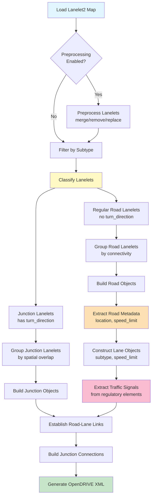

# Conversion Process Flow

This page provides a comprehensive overview of the Lanelet2 to OpenDRIVE conversion process, including detailed processing steps, data flow, and tag usage.

## Overview

The converter transforms Lanelet2 map data into OpenDRIVE format through a multi-stage pipeline that:

1. Loads and preprocesses Lanelet2 map data
2. Classifies lanelets into roads and junctions
3. Extracts metadata from lanelet attributes (tags)
4. Constructs OpenDRIVE objects (roads, lanes, signals)
5. Establishes connectivity between elements
6. Exports to OpenDRIVE XML format

---

## High-Level Processing Pipeline



---

## Detailed Processing Stages

### Stage 1: Map Loading and Preprocessing

**Purpose:** Load the Lanelet2 map and optionally apply preprocessing operations.

**Input:**
- Lanelet2 OSM file path
- Origin coordinates (lat, lon, elevation)
- Optional preprocessing operations

**Processing:**
1. Load Lanelet2 map using `lanelet2` library
2. Apply coordinate transformation from WGS84 to local coordinates
3. Execute preprocessing operations (if specified):
   - **Merge operations:** Combine multiple lanelets into one
   - **Remove operations:** Delete specified lanelets
   - **Replace operations:** Replace one lanelet with another

**Output:** Preprocessed Lanelet2 map

**Code Location:** `src/autoware_lanelet2_to_opendrive/main.py`

---

### Stage 2: Lanelet Classification

**Purpose:** Separate lanelets into junction lanelets and regular road lanelets.

**Criteria:**
- **Junction lanelet:** Has `turn_direction` attribute (present in intersection lanelets)
- **Regular road lanelet:** Does NOT have `turn_direction` attribute

**Processing:**
```python
junction_lanelets = filter_lanelets_inside_junction(lanelet_map)
road_lanelets = filter_lanelets_outside_junction(lanelet_map)
```

**Output:**
- List of junction lanelets
- List of regular road lanelets

**Code Location:** `src/autoware_lanelet2_to_opendrive/junction.py:8-52`

---

### Stage 3: Road Grouping

**Purpose:** Group adjacent road lanelets into roads based on connectivity.

**Processing:**
1. Filter lanelets by subtype (e.g., only "road" lanelets)
2. Build connectivity graph using successor/predecessor relationships
3. Group connected lanelets into road segments

**Output:** List of road groups (each group = list of lanelets)

**Code Location:** `src/autoware_lanelet2_to_opendrive/main.py`

---

### Stage 4: Road Metadata Extraction

**Purpose:** Extract road-level metadata from lanelet tags.

**Tags Used:**

| Tag | Purpose | Mapping |
|-----|---------|---------|
| `location` | Road type classification | `"urban"` → `TOWN`<br/>`"highway"` → `MOTORWAY`<br/>`"rural"` → `RURAL`<br/>`"private"` (≤10 km/h) → `LOW_SPEED` |
| `speed_limit` | Speed restrictions | Parsed as float → `RoadTypeSpeed.max` |

**Fallback Logic:**
If `location` tag is not present, road type is inferred from speed:
- `speed ≤ 10` → `LOW_SPEED`
- `10 < speed ≤ 40` → `TOWN`
- `40 < speed ≤ 90` → `RURAL`
- `speed > 90` → `MOTORWAY`

**Processing:**
```python
road_type_definitions = Road._extract_road_types_from_lanelets(lanelets)
```

**Output:** `RoadTypeDefinition` objects with speed and road type

**Code Location:** `src/autoware_lanelet2_to_opendrive/opendrive/road.py:453-513`

---

### Stage 5: Lane Construction

**Purpose:** Construct OpenDRIVE Lane objects from Lanelet2 lanelets.

**Tags Used:**

| Tag | Purpose | Mapping |
|-----|---------|---------|
| `subtype` | Lane type classification | `"road"` or `"highway"` → `DRIVING`<br/>`"walkway"` → `SIDEWALK`<br/>`"bicycle_lane"` → `BIKING`<br/>Default → `DRIVING` |
| `speed_limit` | Lane-level speed limit | Added as `LaneSpeed` at s=0.0 |

**Processing:**
```python
lane = Lane.construct_from_lanelet(lanelet, lanelet_map, lane_id, direction)
```

**Output:** `Lane` objects with proper type and speed attributes

**Code Location:** `src/autoware_lanelet2_to_opendrive/opendrive/lane.py:150-216`

---

### Stage 6: Traffic Signal Extraction

**Purpose:** Extract traffic lights and controllers from Lanelet2 regulatory elements.

**Tags Used:**

| Tag | Source | Purpose | Mapping |
|-----|--------|---------|---------|
| `type` or `subtype` | Traffic light regulatory element | Signal type | `"red_yellow_green"` or `"3_lights"` → `TRAFFIC_LIGHT_3_LIGHTS`<br/>`"pedestrian"` → `TRAFFIC_LIGHT_PEDESTRIAN`<br/>`"arrow"` → `TRAFFIC_LIGHT_ARROW` |
| `trafficLights` | Regulatory element | Signal geometry | LineString3d → Signal position |

**Processing:**
1. Filter all traffic light regulatory elements
2. Extract signal positions from LineString geometries
3. Map signals to affected roads via lanelet references
4. Create `Signal` and `Controller` objects

**Output:**
- List of `Signal` objects with positions (s, t coordinates)
- List of `Controller` objects grouping related signals

**Code Location:**
- Signal extraction: `src/autoware_lanelet2_to_opendrive/opendrive/signals_and_controllers.py:75-249`
- Type mapping: `src/autoware_lanelet2_to_opendrive/opendrive/signal.py:281-304`

---

### Stage 7: Junction Processing

**Purpose:** Group intersection lanelets into junction objects and create connecting roads.

**Processing:**
1. Group junction lanelets by spatial overlap
2. Create `Junction` objects for each group
3. Build `ConnectingRoad` objects for junction lanes
4. Link connecting roads to incoming/outgoing roads

**Output:** List of `Junction` objects with connections

**Code Location:** `src/autoware_lanelet2_to_opendrive/junction.py:54-107`

---

### Stage 8: Road-Lane Linking

**Purpose:** Establish predecessor/successor relationships between roads and lanes.

**Processing:**
1. Map lanelet successor/predecessor relationships
2. Convert to road-level and lane-level links
3. Set `Link` objects on `Road` and `Lane` instances

**Output:** Complete connectivity graph

---

### Stage 9: OpenDRIVE XML Generation

**Purpose:** Serialize the constructed OpenDRIVE objects to XML format.

**Processing:**
1. Create `OpenDRIVE` root object
2. Add all roads, junctions, and signals
3. Serialize to XML using `xsdata` library
4. Write to output file

**Output:** OpenDRIVE XML file

**Code Location:** `src/autoware_lanelet2_to_opendrive/main.py`

---

## Lanelet2 Tag Usage Summary

This section summarizes which Lanelet2 tags are used by the converter and which are ignored.

### Tags Used by Converter

| Tag | Scope | Used In | Purpose | Required? |
|-----|-------|---------|---------|-----------|
| **`subtype`** | Lanelet | Lane construction | Determines lane type (DRIVING, SIDEWALK, BIKING) | No (defaults to DRIVING) |
| **`speed_limit`** | Lanelet | Road & Lane metadata | Sets speed restrictions | No (uses fallback values) |
| **`location`** | Lanelet | Road type classification | Determines road type (TOWN, MOTORWAY, etc.) | No (inferred from speed) |
| **`turn_direction`** | Lanelet | Junction detection | Identifies intersection lanelets | Yes (for junctions) |
| **`type`** / **`subtype`** | Traffic light | Signal type mapping | Maps to OpenDRIVE signal types | No (defaults available) |
| **`trafficLights`** | Regulatory element | Signal positioning | Provides signal geometry | Yes (for signals) |

!!! note "Tag Extraction Priority"
    - **Lane level:** `subtype`, `speed_limit` are read per-lanelet
    - **Road level:** `location`, `speed_limit` are aggregated across lanelets in a road
    - **Junction detection:** `turn_direction` presence/absence is binary classifier

---

### Tags NOT Used by Converter

The following Lanelet2 tags are commonly found in maps but are **not currently used** by this converter:

| Tag | Scope | Typical Use | Reason Not Used | Future Consideration |
|-----|-------|-------------|-----------------|----------------------|
| **`participant`** | Lanelet | Specifies allowed users (vehicle, pedestrian, bicycle) | Not mapped to OpenDRIVE lane access restrictions | Could enhance lane `<access>` elements |
| **`one_way`** | Lanelet | Indicates one-way streets | Lanelet2 directionality already encoded in geometry | Redundant with Lanelet2 semantics |
| **`vehicle`** | Lanelet | Vehicle type restrictions (car, bus, truck) | Not mapped to OpenDRIVE lane restrictions | Could enhance lane `<access>` rules |
| **`region`** | Lanelet | Administrative region or area type | Not relevant to OpenDRIVE geometry | Out of scope for geometric conversion |
| **`dynamic_speed_limit`** | Regulatory element | Variable speed limits | OpenDRIVE does not support dynamic attributes | Static conversion only |
| **`traffic_sign`** | Regulatory element | Traffic sign information | Partially supported (only traffic lights) | Future enhancement for general signs |
| **`right_of_way`** | Regulatory element | Priority rules at intersections | Not encoded in OpenDRIVE junctions | Complex to map without controller logic |
| **`surface`** | Lanelet | Road surface type (asphalt, gravel, etc.) | Not part of OpenDRIVE road specification | Could add as `<userData>` if needed |
| **`width`** | Lanelet boundary | Lane width information | Currently computed from geometry | Could improve width calculation accuracy |

!!! warning "Ignored Attributes"
    Tags not listed in "Tags Used by Converter" are silently ignored. No warnings are currently emitted for unused tags.

---

### Geometry Attributes

The following Point-level attributes are created during preprocessing but are not sourced from original Lanelet2 tags:

| Attribute | Source | Purpose |
|-----------|--------|---------|
| `local_x` | Calculated | Local X coordinate after coordinate transformation |
| `local_y` | Calculated | Local Y coordinate after coordinate transformation |
| `ele` | Lanelet2 Point.z | Elevation (passed through from original data) |

---

## Tag Reading Code Locations

For developers seeking to understand or modify tag handling:

| Operation | File | Code Link | Description |
|-----------|------|-----------|-------------|
| **Road type extraction** | `opendrive/road.py` | [Lines 453-513](https://github.com/tier4/autoware_lanelet2_to_opendrive/blob/master/src/autoware_lanelet2_to_opendrive/opendrive/road.py#L453-L513) | Reads `location` and `speed_limit` tags |
| **Lane type extraction** | `opendrive/lane.py` | [Lines 150-216](https://github.com/tier4/autoware_lanelet2_to_opendrive/blob/master/src/autoware_lanelet2_to_opendrive/opendrive/lane.py#L150-L216) | Reads `subtype` and `speed_limit` tags |
| **Junction filtering** | `junction.py` | [Lines 8-52](https://github.com/tier4/autoware_lanelet2_to_opendrive/blob/master/src/autoware_lanelet2_to_opendrive/junction.py#L8-L52) | Checks for `turn_direction` tag presence |
| **Signal type mapping** | `opendrive/signal.py` | [Lines 281-304](https://github.com/tier4/autoware_lanelet2_to_opendrive/blob/master/src/autoware_lanelet2_to_opendrive/opendrive/signal.py#L281-L304) | Reads `type`/`subtype` from traffic lights |
| **Signal extraction** | `opendrive/signals_and_controllers.py` | [Lines 75-249](https://github.com/tier4/autoware_lanelet2_to_opendrive/blob/master/src/autoware_lanelet2_to_opendrive/opendrive/signals_and_controllers.py#L75-L249) | Extracts regulatory elements |
| **Subtype filtering** | `util.py` | [Lines 456-503](https://github.com/tier4/autoware_lanelet2_to_opendrive/blob/master/src/autoware_lanelet2_to_opendrive/util.py#L456-L503) | Filters lanelets by `subtype` |

---

## Best Practices for Input Maps

To ensure optimal conversion results:

1. **Tag Required Attributes:**
   - Add `location` tag to lanelets for proper road type classification
   - Add `speed_limit` tag for accurate speed restrictions
   - Add `turn_direction` to intersection lanelets for junction detection

2. **Consistent Subtype Usage:**
   - Use standard subtypes: `"road"`, `"highway"`, `"walkway"`, `"bicycle_lane"`
   - Avoid custom subtypes that won't be recognized

3. **Traffic Light Setup:**
   - Ensure traffic lights have `type` or `subtype` attributes
   - Link traffic lights to appropriate lanelets via regulatory elements

4. **Geometry Quality:**
   - Ensure lanelet boundaries are properly connected
   - Verify successor/predecessor relationships are correct
   - Check for gaps or overlaps in the lanelet network

---

## Troubleshooting Tag Issues

### Missing Road Types

**Symptom:** Roads classified incorrectly or as generic type

**Cause:** Missing `location` tag

**Solution:** Add `location` attribute to lanelets with values: `"urban"`, `"highway"`, `"rural"`, or `"private"`

---

### Missing Speed Limits

**Symptom:** No speed limits in output OpenDRIVE

**Cause:** Missing `speed_limit` tag

**Solution:** Add `speed_limit` attribute to lanelets with numeric values in km/h

---

### Incorrect Lane Types

**Symptom:** Sidewalks or bike lanes classified as driving lanes

**Cause:** Missing or incorrect `subtype` tag

**Solution:** Ensure `subtype` is set correctly:
- Driving lanes: `"road"` or `"highway"`
- Sidewalks: `"walkway"`
- Bike lanes: `"bicycle_lane"`

---

### Junctions Not Detected

**Symptom:** Intersection lanelets treated as regular roads

**Cause:** Missing `turn_direction` tag on junction lanelets

**Solution:** Add `turn_direction` attribute to all lanelets within intersections (value can be `"straight"`, `"left"`, `"right"`, etc.)

---

### Traffic Lights Not Exported

**Symptom:** Traffic signals missing from OpenDRIVE output

**Cause:**
- Regulatory elements not properly defined
- Missing `type` or `subtype` on traffic light

**Solution:**
- Ensure traffic lights are added as regulatory elements
- Add `type` or `subtype` attribute with standard values
- Verify traffic lights reference the correct lanelets

---

## Future Enhancements

Potential improvements to tag handling:

1. **Extended Tag Support:**
   - Support `participant` tag for lane access restrictions
   - Support `vehicle` tag for vehicle type restrictions
   - Support general `traffic_sign` regulatory elements

2. **Tag Validation:**
   - Emit warnings for unknown tags
   - Validate tag values against known schemas
   - Report missing recommended tags

3. **Dynamic Attributes:**
   - Support time-based speed limits
   - Support conditional lane restrictions

4. **Surface and Material:**
   - Map `surface` tag to OpenDRIVE surface properties
   - Support lane material specifications

---

## See Also

- [API Reference](api.md) - Detailed API documentation for all classes
- [Usage Guide](usage.md) - Command-line usage and examples
- [Signals](signals.md) - Detailed signal conversion documentation
- [Known Limitations](limitations.md) - Current converter limitations
