# Conversion Process Flow

This page provides a comprehensive overview of the Lanelet2 to OpenDRIVE conversion process, including detailed processing steps, data flow, and tag usage.

## Overview

The converter transforms Lanelet2 map data into OpenDRIVE format through a multi-stage pipeline that:

1. Loads and preprocesses Lanelet2 map data
2. Classifies lanelets into roads and junctions
3. Extracts metadata from lanelet attributes (tags)
4. Constructs OpenDRIVE objects (roads, lanes, signals)
5. Establishes connectivity between elements
6. Exports to OpenDRIVE XML format

---

## High-Level Processing Pipeline

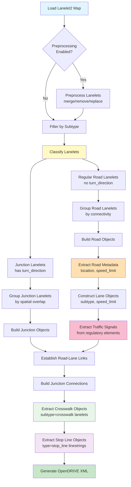

---

## Detailed Processing Stages

### Stage 1: Map Loading and Preprocessing

**Purpose:** Load the Lanelet2 map, apply coordinate transformations, and optionally execute preprocessing operations to clean or modify the map structure.

**Input:**

- Lanelet2 OSM file path
- Origin specification (MGRS grid code OR lat/lon coordinates)
- Optional coordinate offset (x, y, z)
- Optional preprocessing operations (8 types available)

---

#### **1.1: Origin Specification and Coordinate Systems**

The converter supports three methods for specifying the map origin:

**Method 1: MGRS Grid Code Only**
```yaml
mgrs_code: "54SUE"
```
- Converts MGRS grid to lat/lon using zero-padding to grid origin
- Example: "54SUE" → "54SUE0000000000" (grid southwest corner)
- Used when map is already aligned to MGRS grid

**Method 2: MGRS Grid Code + Offset**
```yaml
mgrs_code: "54SUE"
offset:
  x: 81550.0  # Easting offset in meters
  y: 150100.0 # Northing offset in meters
  z: 0.0      # Altitude offset in meters (optional)
```
- Applies offset to MGRS grid origin
- Useful for maps with local coordinate systems
- **Coordinate offset is subtracted** during export: `output = coordinate - offset`

**Method 3: Latitude/Longitude**
```yaml
origin:
  lat: 35.6762   # Latitude in decimal degrees [-90, 90]
  lon: 139.6503  # Longitude in decimal degrees [-180, 180]
  altitude: 0.0  # Altitude in meters (optional)
```
- Direct lat/lon origin specification
- MGRS grid is derived automatically for PROJ string generation
- Validates latitude and longitude ranges

!!! note "Mutual Exclusivity"
    Only **one** origin method can be specified. Using both MGRS and lat/lon will raise a validation error.

---

#### **1.2: Coordinate Transformations**

**A. WGS84 to Local Coordinates**

During map loading (`load_lanelet2_map()` in [main.py:52-81](https://github.com/tier4/autoware_lanelet2_to_opendrive/blob/master/src/autoware_lanelet2_to_opendrive/main.py#L52-L81)):
1. Creates `MGRSProjector` with specified origin
2. Lanelet2 library transforms WGS84 (lat/lon) to local XY coordinates
3. Projection uses UTM zone derived from longitude: `zone = int((lon + 180) / 6) + 1`
4. Prints summary: number of lanelets, linestrings, and points loaded

**B. Coordinate Offset Application**

Global offset system ([config.py:155-207](https://github.com/tier4/autoware_lanelet2_to_opendrive/blob/master/src/autoware_lanelet2_to_opendrive/config.py#L155-L207)):
- Set before map loading via `COORDINATE_OFFSET.set(x, y, z)`
- Applied during OpenDRIVE export when extracting geometry
- **Subtraction operation**: `output_coordinate = lanelet2_coordinate - offset`
- Makes output coordinates relative to offset point
- Used when map has large coordinate values that need normalization

**C. PROJ String Generation**

For OpenDRIVE `<geoReference>` element:
- **From MGRS**: `mgrs_to_proj_string()` ([projection.py](https://github.com/tier4/autoware_lanelet2_to_opendrive/blob/master/src/autoware_lanelet2_to_opendrive/projection.py))
- **From Lat/Lon**: `latlon_to_proj_string()` ([projection.py](https://github.com/tier4/autoware_lanelet2_to_opendrive/blob/master/src/autoware_lanelet2_to_opendrive/projection.py))

Format: `+proj=utm +zone=ZZ [+south] +lat_0=LAT +lon_0=LON +datum=WGS84 +units=m +no_defs`

---

#### **1.3: Map Loading Process**

**Function:** `load_lanelet2_map()` ([main.py:52-81](https://github.com/tier4/autoware_lanelet2_to_opendrive/blob/master/src/autoware_lanelet2_to_opendrive/main.py#L52-L81))

**Steps:**

1. **Create Projector**
   - Initialize `MGRSProjector` with origin

2. **Load OSM File**
   - Call `lanelet2.io.load(path, projector)`

3. **Validate**
   - Check file exists, handle errors

4. **Report Statistics**
   - Number of lanelets loaded
   - Number of linestrings
   - Number of points

5. **Return**
   - `lanelet2.core.LaneletMap` object

**Map Structure:**

- `laneletLayer`: All lanelets (road segments)
- `lineStringLayer`: Standalone linestrings (e.g., stop lines)
- `regulatoryElementLayer`: Traffic signals, speed limits, right-of-way rules
- `pointLayer`: All geometric points

---

#### **1.4: Preprocessing Operations (Optional)**

Eight preprocessing operation types are available, executed in this order:

---

##### **Preprocessing Operation Parameters Summary**

The following table lists all preprocessing operations and their parameters:

| Operation | Parameter | Type | Required | Default | Description |
|-----------|-----------|------|----------|---------|-------------|
| **Move Point** | `point_id` | int | ✓ | - | ID of point to move |
| | `new_x` | float | ✓ | - | New X coordinate (meters) |
| | `new_y` | float | ✓ | - | New Y coordinate (meters) |
| | `new_z` | float | ✗ | (unchanged) | New Z coordinate (meters) |
| **Delete Point** | `point_ids` | List[int] | ✓ | - | List of point IDs to delete |
| **Validate** | `first_lanelet_id` | int | ✓ | - | ID of first lanelet |
| | `second_lanelet_id` | int | ✓ | - | ID of second lanelet (successor) |
| | `tolerance` | float | ✗ | 0.001 | Max distance for continuity (meters) |
| **Replace** | `lanelet_ids` | List[int] | ✓ | - | List of lanelet IDs to merge and replace |
| | `validate` | bool | ✗ | false | Validate continuity before merging |
| | `tolerance` | float | ✗ | 0.001 | Max distance for continuity check (meters) |
| **Merge** | `lanelet_ids` | List[int] | ✓ | - | List of lanelet IDs to merge |
| | `validate` | bool | ✗ | false | Validate continuity before merging |
| | `base_id` | int | ✗ | (auto) | Base ID for merged lanelet |
| | `tolerance` | float | ✗ | 0.001 | Max distance for continuity check (meters) |
| **Remove** | `lanelet_ids` | List[int] | ✓ | - | List of lanelet IDs to remove (old style) |
| **Remove Lanelet** | `lanelet_ids` | List[int] | ✓ | - | List of lanelet IDs to completely remove |
| **Remove Turn Direction** | `lanelet_ids` | List[int] | ✓ | - | List of lanelet IDs (empty = all lanelets) |

**Key:**

- ✓ = Required parameter
- ✗ = Optional parameter
- Default values from [config.py](https://github.com/tier4/autoware_lanelet2_to_opendrive/blob/master/src/autoware_lanelet2_to_opendrive/config.py) and operation dataclasses

---

##### **Operation Behavior and Impact**

| Operation | Modifies Map | Creates New Elements | Removes Elements | Validation | Use Case |
|-----------|--------------|----------------------|------------------|------------|----------|
| **Move Point** | ✓ | ✗ | ✗ | ✗ | Fix misaligned geometry, adjust point positions |
| **Delete Point** | ✓ | ✗ | ✓ (points) | Min 2 points/linestring | Remove redundant points, simplify geometry |
| **Validate** | ✗ | ✗ | ✗ | ✓ | Debug connectivity, verify lanelet continuity |
| **Replace** | ✓ | ✓ (merged) | ✓ (originals) | Optional | Merge lanelets and remove originals |
| **Merge** | ✓ | ✓ (merged) | ✗ | Optional | Create merged lanelet, keep originals |
| **Remove** | ✓ | ✗ | ✓ (lanelets) | ✗ | Legacy removal (prefer Remove Lanelet) |
| **Remove Lanelet** | ✓ | ✗ | ✓ (lanelets) | ✗ | Completely remove unwanted lanelets |
| **Remove Turn Direction** | ✓ | ✗ | ✗ | ✗ | Convert junction lanelets to regular roads |

**Execution Order:** Move Point → Delete Point → Validate → Replace → Merge → Remove → Remove Lanelet → Remove Turn Direction

**Key:**

- ✓ = Yes / Applies
- ✗ = No / Does not apply

---

##### **Detailed Operation Descriptions**

**A. Move Point Operations** ([geometry.py:311-379](https://github.com/tier4/autoware_lanelet2_to_opendrive/blob/master/src/autoware_lanelet2_to_opendrive/geometry.py#L311-L379))
```yaml
move_point_operations:
  - point_id: 12345
    new_x: 100.5
    new_y: 200.3
    new_z: 10.0  # Optional
```
- Moves individual points to new coordinates
- Updates all lanelets containing the point
- Updates `local_x`, `local_y`, `ele` attributes

**Use case**: When parallel lanelets need to be bundled as the same Road in OpenDRIVE, which requires equal lengths. If consecutive lanelets are divided at diagonal boundaries, using MergeOperation would cause length misalignment and prevent lane changes. In such cases, use MovePointOperation to align the boundaries instead.

**Before (diagonal boundaries):**

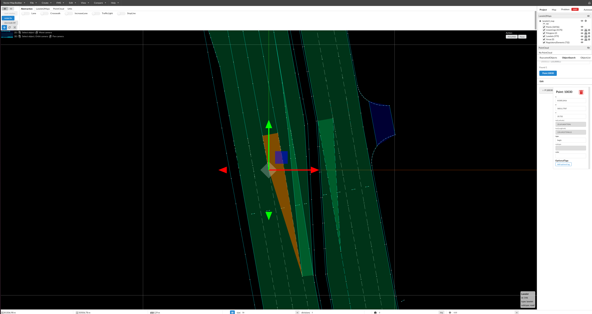

**After (aligned boundaries with MovePointOperation):**

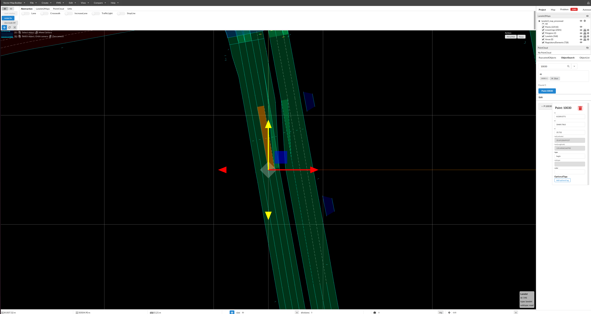

**B. Delete Point Operations** ([geometry.py:208-308](https://github.com/tier4/autoware_lanelet2_to_opendrive/blob/master/src/autoware_lanelet2_to_opendrive/geometry.py#L208-L308))
```yaml
delete_point_operations:
  - point_ids: [12345, 12346, 12347]
```
- Removes points from linestrings
- Validates minimum 2 points remain per linestring
- Reports missing points

**Use case**: Use this operation to remove unnecessary points from lanelet boundaries, simplifying the geometry while maintaining the shape.

**Before (with unnecessary points):**

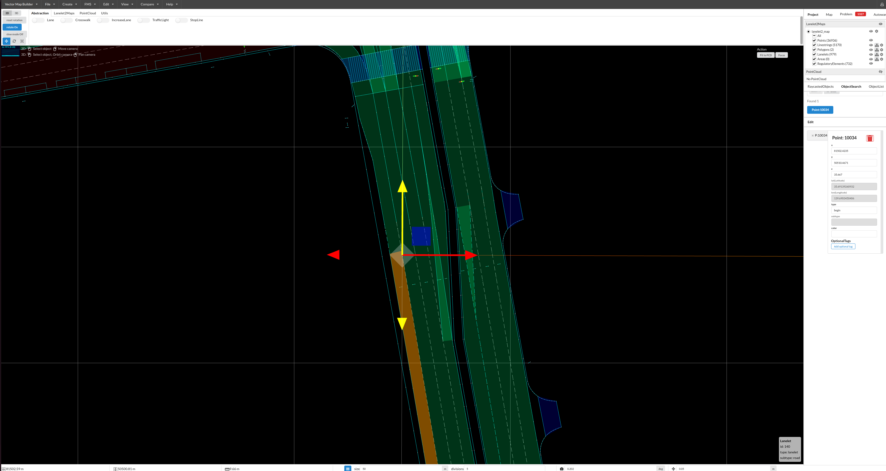

**After (points removed):**

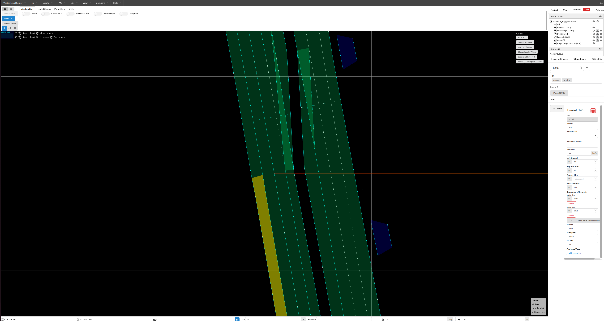

**C. Validate Operations** ([lanelet.py:93-131](https://github.com/tier4/autoware_lanelet2_to_opendrive/blob/master/src/autoware_lanelet2_to_opendrive/lanelet.py#L93-L131))
```yaml
validate_operations:
  - first_lanelet_id: 100
    second_lanelet_id: 101
    tolerance: 0.001  # meters
```
- Checks boundary continuity between two lanelets
- Reports pass/fail, does **not** modify map
- Useful for debugging connectivity issues

**D. Replace Operations** ([lanelet.py:318-401](https://github.com/tier4/autoware_lanelet2_to_opendrive/blob/master/src/autoware_lanelet2_to_opendrive/lanelet.py#L318-L401))
```yaml
replace_operations:
  - lanelet_ids: [100, 101, 102]
    validate: true
    tolerance: 0.001  # meters (default: 1e-3)
```
- Merges lanelets into one, removes originals
- Optional validation before merging
- Creates new lanelet with auto-generated ID
- Copies attributes from first lanelet

**E. Merge Operations** ([lanelet.py:8-200](https://github.com/tier4/autoware_lanelet2_to_opendrive/blob/master/src/autoware_lanelet2_to_opendrive/lanelet.py#L8-L200))
```yaml
merge_operations:
  - lanelet_ids: [100, 101, 102]
    validate: true
    base_id: 1000  # Optional: base ID for merged lanelet
    tolerance: 0.001  # meters (default: 1e-3)
```
- Merges consecutive lanelets, **keeps originals**
- Optional validation checks boundary continuity
- Merged lanelet ID: `base_id + 3` (or auto-generated)
- Connects left/right boundaries sequentially

**Use case**: When consecutive lanelets are divided at diagonal boundaries, use MergeOperation to combine them into a single continuous lanelet.

**Before merge:**

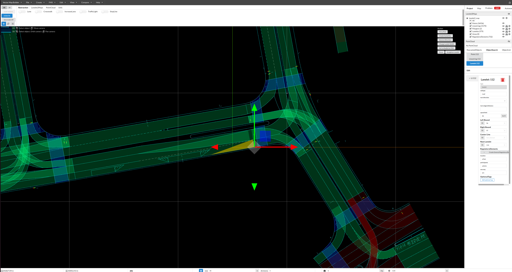
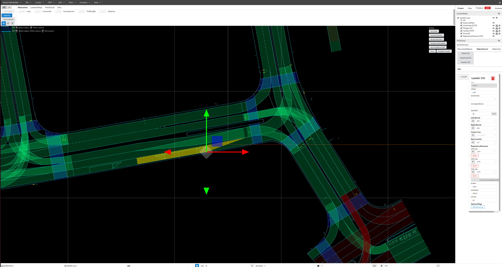

**After merge:**

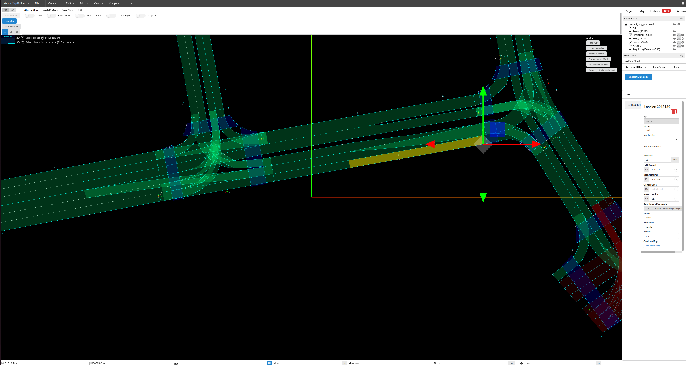


**F. Remove Operations (Old Style)** ([preprocess_lanelet.py:661-682](https://github.com/tier4/autoware_lanelet2_to_opendrive/blob/master/src/autoware_lanelet2_to_opendrive/preprocess_lanelet.py#L661-L682))
```yaml
remove_operations:
  - lanelet_ids: [300, 301]
```
- Legacy removal method
- Prefer `remove_lanelet_operations` for new code

**G. Remove Lanelet Operations** ([preprocess_lanelet.py:822-872](https://github.com/tier4/autoware_lanelet2_to_opendrive/blob/master/src/autoware_lanelet2_to_opendrive/preprocess_lanelet.py#L822-L872))
```yaml
remove_lanelet_operations:
  - lanelet_ids: [300, 301, 302]
```
- Completely removes lanelets from map
- Creates new map without specified lanelets

**Use case**: Remove lanelets that are not needed for conversion, such as isolated lanelets without predecessors or successors. In this case, the map was converted to OpenDRIVE for CARLA simulation purposes, where isolated lanelets without connectivity are unnecessary and can be removed.

**Before (with isolated lanelet):**

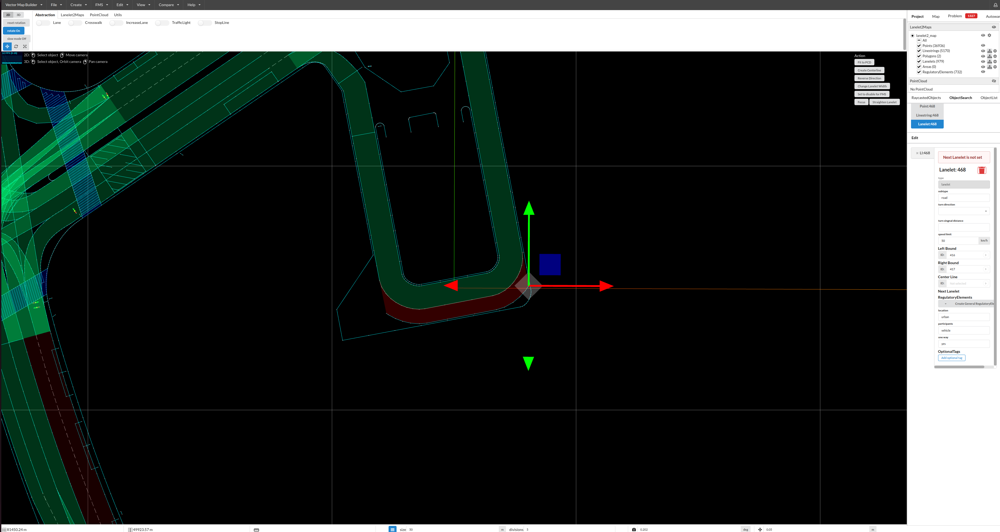

**After (isolated lanelet removed):**

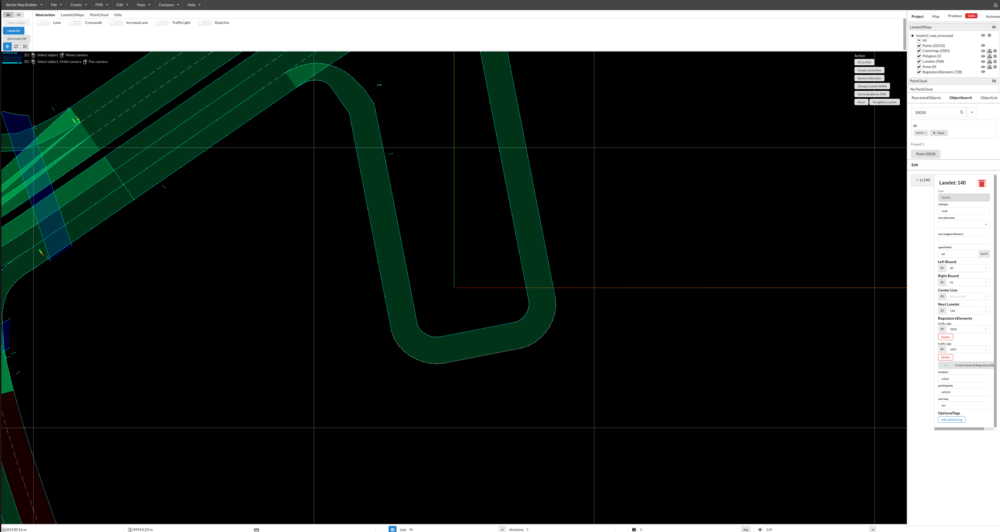
- Reports successful and missing lanelet IDs

**H. Remove Turn Direction Operations** ([preprocess_lanelet.py:874-929](https://github.com/tier4/autoware_lanelet2_to_opendrive/blob/master/src/autoware_lanelet2_to_opendrive/preprocess_lanelet.py#L874-L929))
```yaml
remove_turn_direction_operations:
  - lanelet_ids: []  # Empty list = all lanelets
  # OR
  - lanelet_ids: [100, 101]  # Specific lanelets
```
- Removes `turn_direction` attribute from lanelets
- Empty list applies to **all** lanelets
- Converts junction lanelets to regular road lanelets

**Use case**: This operation removes the Lanelet2 turn_direction attribute, which is the flag that determines whether a lanelet is classified as a Junction in OpenDRIVE. Use this when you need to convert junction lanelets to regular road lanelets.

**Before (with turn_direction attribute):**

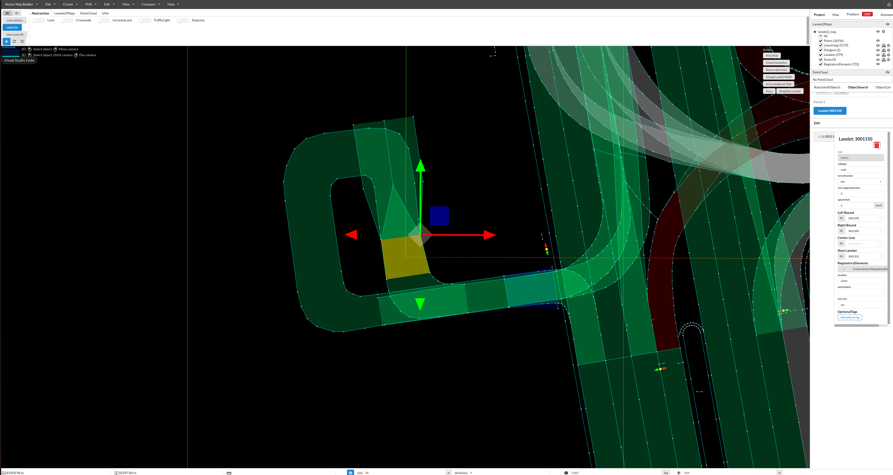

**After (turn_direction attribute removed):**

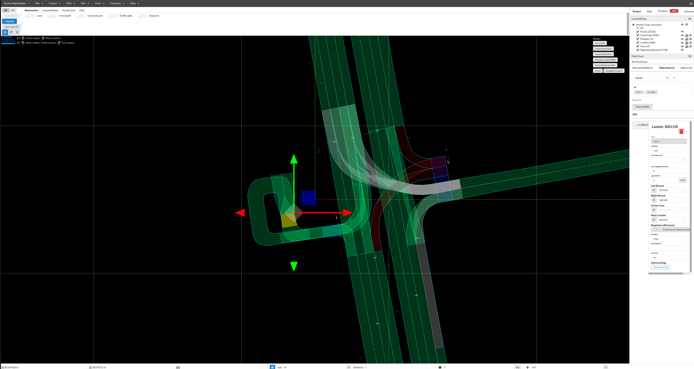

---

#### **1.5: Merge Operation Details**

**Process** ([lanelet.py:8-200](https://github.com/tier4/autoware_lanelet2_to_opendrive/blob/master/src/autoware_lanelet2_to_opendrive/lanelet.py#L8-L200)):

1. **Validation** (if enabled):
   - Check left boundary endpoint of lanelet N matches start point of lanelet N+1
   - Check right boundary endpoint of lanelet N matches start point of lanelet N+1
   - Calculate 3D distance: `sqrt((x1-x2)² + (y1-y2)² + (z1-z2)²)`
   - Pass if both distances ≤ tolerance (default: 0.001m)

2. **Boundary Connection**:
   - **Left boundary**: All points from first lanelet + remaining points from second (skip duplicate junction point)
   - **Right boundary**: Same logic as left boundary
   - Result: Continuous linestrings spanning both lanelets

3. **New Lanelet Creation**:
   - ID: `base_id + 3` (offset avoids conflicts with boundaries)
   - Attributes copied from first lanelet
   - References to regulatory elements preserved

4. **Multi-Lanelet Merging**:
   - For N lanelets: iteratively merge pairs
   - Base IDs incremented by 10 for each operation

---

#### **1.6: Validation and Error Handling**

**Origin Validation** ([preprocess_lanelet.py:243-265](https://github.com/tier4/autoware_lanelet2_to_opendrive/blob/master/src/autoware_lanelet2_to_opendrive/preprocess_lanelet.py#L243-L265)):
- Ensures exactly one of: `mgrs_code` OR `origin` (lat/lon)
- Validates `offset` only used with `mgrs_code`
- Raises `ValueError` for invalid combinations

**Coordinate Range Validation** ([preprocess_lanelet.py:157-162](https://github.com/tier4/autoware_lanelet2_to_opendrive/blob/master/src/autoware_lanelet2_to_opendrive/preprocess_lanelet.py#L157-L162)):
- Latitude: must be in range [-90, 90]
- Longitude: must be in range [-180, 180]
- Raises `ValueError` if out of range

**Continuity Validation** ([lanelet.py:93-131](https://github.com/tier4/autoware_lanelet2_to_opendrive/blob/master/src/autoware_lanelet2_to_opendrive/lanelet.py#L93-L131)):
- Checks 3D distance between consecutive lanelet boundaries
- Used in merge and replace operations
- Reports specific distance values when validation fails

**Point Deletion Validation** ([geometry.py:208-308](https://github.com/tier4/autoware_lanelet2_to_opendrive/blob/master/src/autoware_lanelet2_to_opendrive/geometry.py#L208-L308)):
- Ensures linestrings retain minimum 2 points
- Prevents creation of invalid geometry
- Skips linestrings that would become invalid

---

#### **1.7: Configuration Flow**

**Main Entry Point:** `preprocess_and_convert_with_hydra()` ([main.py:741-852](https://github.com/tier4/autoware_lanelet2_to_opendrive/blob/master/src/autoware_lanelet2_to_opendrive/main.py#L741-L852))

**Execution Sequence:**
1. **Parse Hydra Config**: Load YAML configuration
2. **Parse Origin**: Determine origin method (MGRS vs. lat/lon)
3. **Set Coordinate Offset**: If offset specified, activate global offset
4. **Run Preprocessing**: If operations configured, execute preprocessing
5. **Load Map**: Load preprocessed (or original) Lanelet2 map
6. **Convert to OpenDRIVE**: Execute conversion pipeline
7. **Write Output**: Save OpenDRIVE XML file

**Code Locations:**

- Main flow: [main.py:741-852](https://github.com/tier4/autoware_lanelet2_to_opendrive/blob/master/src/autoware_lanelet2_to_opendrive/main.py#L741-L852)
- Origin parsing: [main.py:597-738](https://github.com/tier4/autoware_lanelet2_to_opendrive/blob/master/src/autoware_lanelet2_to_opendrive/main.py#L597-L738)
- Preprocessing execution: [preprocess_lanelet.py:931-987](https://github.com/tier4/autoware_lanelet2_to_opendrive/blob/master/src/autoware_lanelet2_to_opendrive/preprocess_lanelet.py#L931-L987)
- Coordinate transformations: [util.py:595-897](https://github.com/tier4/autoware_lanelet2_to_opendrive/blob/master/src/autoware_lanelet2_to_opendrive/util.py#L595-L897)

---

**Output:** Preprocessed Lanelet2 map with:
- Coordinate system aligned to specified origin
- Optional coordinate offset applied
- Structural modifications from preprocessing operations
- Validated geometry and topology

---

### Stage 2: Lanelet Classification

**Purpose:** Separate lanelets into junction lanelets and regular road lanelets.

**Criteria:**

- **Junction lanelet:** Has `turn_direction` attribute (present in intersection lanelets)
- **Regular road lanelet:** Does NOT have `turn_direction` attribute

**Processing:**
```python
junction_lanelets = filter_lanelets_inside_junction(lanelet_map)
road_lanelets = filter_lanelets_outside_junction(lanelet_map)
```

**Output:**

- List of junction lanelets
- List of regular road lanelets

**Code Location:** [`junction.py:8-52`](https://github.com/tier4/autoware_lanelet2_to_opendrive/blob/master/src/autoware_lanelet2_to_opendrive/junction.py#L8-L52)

---

### Stage 3: Road Grouping

**Purpose:** Group adjacent road lanelets into roads based on connectivity.

**Processing:**
1. Filter lanelets by subtype (e.g., only "road" lanelets)
2. Build connectivity graph using successor/predecessor relationships
3. Group connected lanelets into road segments

**Output:** List of road groups (each group = list of lanelets)

**Code Location:** [`main.py`](https://github.com/tier4/autoware_lanelet2_to_opendrive/blob/master/src/autoware_lanelet2_to_opendrive/main.py)

---

### Stage 4: Road Metadata Extraction

**Purpose:** Extract road-level metadata from lanelet tags.

**Tags Used:**

| Tag | Purpose | Mapping |
|-----|---------|---------|
| `location` | Road type classification | `"urban"` → `TOWN`<br/>`"highway"` → `MOTORWAY`<br/>`"rural"` → `RURAL`<br/>`"private"` (≤10 km/h) → `LOW_SPEED` |
| `speed_limit` | Speed restrictions | Parsed as float → `RoadTypeSpeed.max` |

**Fallback Logic:**
If `location` tag is not present, road type is inferred from speed:
- `speed ≤ 10` → `LOW_SPEED`
- `10 < speed ≤ 40` → `TOWN`
- `40 < speed ≤ 90` → `RURAL`
- `speed > 90` → `MOTORWAY`

**Processing:**
```python
road_type_definitions = Road._extract_road_types_from_lanelets(lanelets)
```

**Output:** `RoadTypeDefinition` objects with speed and road type

**Code Location:** [`road.py:453-513`](https://github.com/tier4/autoware_lanelet2_to_opendrive/blob/master/src/autoware_lanelet2_to_opendrive/opendrive/road.py#L453-L513)

---

### Stage 5: Lane Construction

**Purpose:** Construct OpenDRIVE Lane objects from Lanelet2 lanelets.

**Tags Used:**

| Tag | Purpose | Mapping |
|-----|---------|---------|
| `subtype` | Lane type classification | `"road"` or `"highway"` → `DRIVING`<br/>`"walkway"` → `SIDEWALK`<br/>`"bicycle_lane"` → `BIKING`<br/>Default → `DRIVING` |
| `speed_limit` | Lane-level speed limit | Added as `LaneSpeed` at s=0.0 |

**Processing:**
```python
lane = Lane.construct_from_lanelet(lanelet, lanelet_map, lane_id, direction)
```

**Output:** `Lane` objects with proper type and speed attributes

**Code Location:** [`lane.py:150-216`](https://github.com/tier4/autoware_lanelet2_to_opendrive/blob/master/src/autoware_lanelet2_to_opendrive/opendrive/lane.py#L150-L216)

---

### Stage 6: Traffic Signal Extraction

**Purpose:** Extract traffic lights and controllers from Lanelet2 regulatory elements.

**Tags Used:**

| Tag | Source | Purpose | Mapping |
|-----|--------|---------|---------|
| `type` or `subtype` | Traffic light regulatory element | Signal type | `"red_yellow_green"` or `"3_lights"` → `TRAFFIC_LIGHT_3_LIGHTS`<br/>`"pedestrian"` → `TRAFFIC_LIGHT_PEDESTRIAN`<br/>`"arrow"` → `TRAFFIC_LIGHT_ARROW` |
| `trafficLights` | Regulatory element | Signal geometry | LineString3d → Signal position |

**Processing:**
1. Filter all traffic light regulatory elements
2. Extract signal positions from LineString geometries
3. Map signals to affected roads via lanelet references
4. Create `Signal` and `Controller` objects

**Output:**

- List of `Signal` objects with positions (s, t coordinates)
- List of `Controller` objects grouping related signals

**Code Location:**

- Signal extraction: [`signals_and_controllers.py:75-249`](https://github.com/tier4/autoware_lanelet2_to_opendrive/blob/master/src/autoware_lanelet2_to_opendrive/opendrive/signals_and_controllers.py#L75-L249)
- Type mapping: [`signal.py:281-304`](https://github.com/tier4/autoware_lanelet2_to_opendrive/blob/master/src/autoware_lanelet2_to_opendrive/opendrive/signal.py#L281-L304)

---

### Stage 7: Junction Processing

**Purpose:** Group intersection lanelets into junction objects and create connecting roads.

**Processing:**
1. Group junction lanelets by spatial overlap
2. Create `Junction` objects for each group
3. Build `ConnectingRoad` objects for junction lanes
4. Link connecting roads to incoming/outgoing roads

**Output:** List of `Junction` objects with connections

**Code Location:** [`junction.py:54-107`](https://github.com/tier4/autoware_lanelet2_to_opendrive/blob/master/src/autoware_lanelet2_to_opendrive/junction.py#L54-L107)

---

### Stage 8: Road-Lane Linking

**Purpose:** Establish predecessor/successor relationships between roads and lanes.

**Processing:**
1. Map lanelet successor/predecessor relationships
2. Convert to road-level and lane-level links
3. Set `Link` objects on `Road` and `Lane` instances

**Output:** Complete connectivity graph

---

### Stage 8.5: Crosswalk Object Extraction

**Purpose:** Convert Lanelet2 crosswalk lanelets (`subtype="crosswalk"`) into OpenDRIVE `<object type="crosswalk">` elements and assign them to the nearest roads.

**Tags Used:**

| Tag | Purpose |
|-----|---------|
| `subtype="crosswalk"` | Identifies pedestrian crossing lanelets |

**Processing:**

1. Filter all lanelets with `subtype="crosswalk"`
2. For each crosswalk lanelet:
   a. Extract four boundary vertices (`leftBound[0]`, `leftBound[-1]`, `rightBound[-1]`, `rightBound[0]`)
   b. Compute centroid of the four vertices
   c. Sample reference line of all roads (10 points per geometry segment)
   d. Find the nearest road within 50 m threshold
   e. Project centroid onto road reference line → `(s, t, road_hdg)`
   f. Compute crosswalk heading relative to road direction → `hdg`
   g. Compute `width` (entry span) and `length` (crossing distance)
   h. Transform polygon vertices to object-local coordinates → `<cornerLocal>` points
3. Assign `CrosswalkObject` instances to their nearest road's `objects` list

**Output:** `Road.objects` populated with `CrosswalkObject` instances

**Code Location:** [`opendrive/objects.py`](https://github.com/tier4/autoware_lanelet2_to_opendrive/blob/master/src/autoware_lanelet2_to_opendrive/opendrive/objects.py), [`main.py` – `_extract_and_assign_crosswalks()`](https://github.com/tier4/autoware_lanelet2_to_opendrive/blob/master/src/autoware_lanelet2_to_opendrive/main.py)

!!! info "Detailed Documentation"
    For full details on the crosswalk conversion algorithm, coordinate systems, and CARLA behavior, see [Crosswalk Objects](crosswalk_objects.md).

---

### Stage 8.6: Stop Line Object Extraction

**Purpose:** Convert Lanelet2 linestrings with `type="stop_line"` into OpenDRIVE `<object type="stopLine">` elements and assign them to the nearest roads.

**Tags Used:**

| Tag | Purpose |
|-----|---------|
| `type="stop_line"` | Identifies stop line linestrings |

**Processing:**

1. Iterate over all linestrings in `lineStringLayer`; select those with `type="stop_line"`
2. For each stop line linestring:
   a. Compute the centroid of all 2D points
   b. Sample reference lines of all roads (10 points per geometry segment)
   c. Find the nearest road within 50 m threshold
   d. Project centroid onto the road reference line → `(s, t, road_hdg)`
   e. Compute `z_offset` as average 3D elevation minus road elevation at `s`
   f. Compute stop line heading relative to road direction → `hdg`
   g. Set `width` = distance from first to last point; `length` = 0 (zero thickness)
3. Assign `StopLineObject` instances to their nearest road's `objects` list

**Output:** `Road.objects` populated with `StopLineObject` instances alongside any existing `CrosswalkObject` instances

**Code Location:** [`opendrive/objects.py`](https://github.com/tier4/autoware_lanelet2_to_opendrive/blob/master/src/autoware_lanelet2_to_opendrive/opendrive/objects.py), [`main.py` – `_extract_and_assign_stop_lines()`](https://github.com/tier4/autoware_lanelet2_to_opendrive/blob/master/src/autoware_lanelet2_to_opendrive/main.py)

!!! info "Detailed Documentation"
    For full details on the stop line conversion algorithm, see [Stop Line Objects](stop_line_objects.md).

---

### Stage 9: OpenDRIVE XML Generation

**Purpose:** Serialize the constructed OpenDRIVE objects to XML format.

**Processing:**
1. Create `OpenDRIVE` root object
2. Add all roads, junctions, and signals
3. Serialize to XML using `xsdata` library
4. Write to output file

**Output:** OpenDRIVE XML file

**Code Location:** [`main.py`](https://github.com/tier4/autoware_lanelet2_to_opendrive/blob/master/src/autoware_lanelet2_to_opendrive/main.py)

---

## Configuration System and YAML Files

This section explains the relationship between YAML configuration files and converter behavior, covering Hydra's configuration system and how settings control the conversion process.

---

### Configuration Architecture

The converter uses **Hydra** for hierarchical configuration management, allowing flexible, modular configuration through YAML files and command-line overrides.

**Configuration Directory Structure:**
```
src/autoware_lanelet2_to_opendrive/conf/
├── config.yaml              # Main configuration file
├── map/                     # Map-specific configurations
│   ├── example.yaml
│   ├── example_mgrs_offset.yaml
│   ├── example_latlon.yaml
│   └── nishishinjuku.yaml
└── target/                  # Target simulator configurations
    ├── default.yaml
    └── carla.yaml
```

---

### Configuration File Hierarchy

#### **1. Main Configuration** (`conf/config.yaml`)

**Purpose:** Defines global settings and default configuration groups.

**Key Sections:**
```yaml
defaults:
  - _self_               # Load this file first
  - map: example         # Default map config
  - target: default      # Default target config

input_map_path: ???      # Required: must be specified
output_map_path: null    # Optional: auto-generated if not set
dry_run: false           # Validation only (no output file)
verbose: false           # Enable debug logging
```

**Behavior:**

- `???` indicates **required** field - must be set via CLI or config file
- `null` indicates **optional** field - has fallback behavior
- `defaults` section specifies config group defaults

---

#### **2. Map Configurations** (`conf/map/*.yaml`)

**Purpose:** Map-specific settings including origin, preprocessing operations, and special handling rules.

**Example: `conf/map/example.yaml`**
```yaml
# Origin specification (choose ONE method):
mgrs_grid: "54SUE815501"

# Preprocessing operations
merge_operations:
  - lanelet_ids: [100, 101, 102]
    validate: true
    tolerance: 0.001

remove_lanelet_operations:
  - lanelet_ids: [300, 301]
```

**Behavior Impact:**

| Setting | Effect | Default |
|---------|--------|---------|
| `mgrs_grid` | Sets coordinate system origin | Required (one of 3 methods) |
| `merge_operations` | Combines lanelets before conversion | Empty (no merging) |
| `remove_lanelet_operations` | Removes lanelets from map | Empty (no removal) |

**Alternative Origin Methods:**

**Method A: MGRS Grid + Offset**
```yaml
# conf/map/example_mgrs_offset.yaml
mgrs_grid: "54SUE"
offset:
  x: 81655.73      # Easting in meters
  y: 50137.43      # Northing in meters
  z: 42.49998      # Altitude in meters
```
**Behavior:** Output coordinates = Lanelet2 coordinates - offset

**Method B: Latitude/Longitude**
```yaml
# conf/map/example_latlon.yaml
lat_lon:
  latitude: -33.123456   # Decimal degrees
  longitude: 151.234567  # Decimal degrees
  altitude: 42.5         # Meters above sea level
```
**Behavior:** Direct lat/lon origin, MGRS grid auto-derived for PROJ string

---

#### **3. Target Configurations** (`conf/target/*.yaml`)

**Purpose:** Simulator-specific or use-case-specific settings.

**Example: `conf/target/default.yaml`**
```yaml
exclude_non_junction_signals: false  # Include all traffic signals
traffic_rule: "RHT"                  # Right-Hand Traffic
```

**Example: `conf/target/carla.yaml`**
```yaml
exclude_non_junction_signals: true   # CARLA compatibility
traffic_rule: "RHT"                  # Can be overridden
```

!!! info "CARLA-Specific Information"
    For detailed information about how OpenDRIVE tags are used in CARLA and how Lanelet2 tags map to them, see [CARLA OpenDRIVE and Lanelet2 Tag Mapping](carla_opendrive_lanelet2_mapping.md).

**Behavior Impact:**

| Setting | `false` Behavior | `true` Behavior |
|---------|------------------|-----------------|
| `exclude_non_junction_signals` | Export all traffic signals | Only export signals in junctions |

| Traffic Rule | Lane ID Ordering | Use Case |
|--------------|------------------|----------|
| `"RHT"` | Right-hand traffic (negative IDs) | US, Europe, China |
| `"LHT"` | Left-hand traffic (negative IDs, same structure as RHT) | UK, Japan, Australia |

#### OpenDRIVE Coordinate System and Lane Placement

**Road Coordinate System (s-t coordinate system)**:
- **s-axis**: Along the reference line (travel direction, always increasing)
- **t-axis**: Lateral to the reference line (right is positive, left is negative)

**Lane Coordinate System**:
- Each lane's s-coordinate corresponds to the road coordinate system's s-coordinate
- Lane width is defined as the lateral distance from the reference line

**Implementation Details**:

| Traffic Rule | Reference Line Position | Lane Position | Lane ID | Lane Group | Lane Coordinate Direction | t-coordinate Sign | Compliant |
|--------------|------------------------|---------------|---------|------------|---------------------------|-------------------|-----------|
| RHT | Left edge (leftBound) | Right side | Negative (-1, -2, -3) | Right lanes | **Same as road coordinate (forward)** | t > 0 | ✓ |
| LHT | Left edge (leftBound) | Right side | Negative (-1, -2, -3) | Right lanes | **Same as road coordinate (forward)** | t > 0 | ✓ |

**Key Points**:

1. **Unified reference line placement**
   - Both RHT and LHT use the left edge (leftBound) as the reference line
   - This creates a consistent OpenDRIVE structure regardless of traffic rule

2. **All lanes have s-axis aligned with road coordinate system**
   - For both RHT and LHT, s-coordinate increases in the travel direction
   - No need to reverse lane coordinate systems

3. **Lane ID sign determines width definition direction**
   - Both RHT and LHT use negative IDs (right lanes): from reference line to the right (t > 0)

4. **Traffic rule indication**
   - The `road@rule` attribute ("RHT" or "LHT") indicates the traffic direction
   - This is the authoritative source for determining left-hand vs right-hand traffic

**Visual Representation**:

RHT (Right-Hand Traffic):
```
Reference Line (s-axis →, left edge)
[s=0] ━━━━━━━━━━━━━━━━━━━━━━━━━━━→ [s=L]
         ↓ (t > 0, right direction)
    [Lane -1]  s-axis → (same as road coordinate)
    [Lane -2]  s-axis → (same as road coordinate)
    [Lane -3]  s-axis → (same as road coordinate)

    road@rule="RHT"
```

LHT (Left-Hand Traffic):
```
Reference Line (s-axis →, left edge)
[s=0] ━━━━━━━━━━━━━━━━━━━━━━━━━━━→ [s=L]
         ↓ (t > 0, right direction)
    [Lane -1]  s-axis → (same as road coordinate)
    [Lane -2]  s-axis → (same as road coordinate)
    [Lane -3]  s-axis → (same as road coordinate)

    road@rule="LHT" (indicates left-hand traffic direction)
```

**Note**: Both RHT and LHT use the same geometric structure. The `road@rule` attribute is the only difference, which CARLA uses to determine the correct vehicle driving direction.

---

### Configuration Composition and Merging

**Hydra Configuration Resolution Order:**

1. **Load `config.yaml`** (base configuration)
2. **Merge `map/<name>.yaml`** (selected via `map=<name>`)
3. **Merge `target/<name>.yaml`** (selected via `target=<name>`)
4. **Apply command-line overrides** (highest priority)

**Example Merge Process:**

```bash
uv run python -m autoware_lanelet2_to_opendrive.main \
    map=nishishinjuku \
    target=carla \
    input_map_path=/path/to/map.osm \
    verbose=true
```

**Resolution Steps:**

| Step | File | Settings Loaded |
|------|------|-----------------|
| 1 | `config.yaml` | `defaults`, `dry_run=false`, `verbose=false` |
| 2 | `map/nishishinjuku.yaml` | `mgrs_grid`, `merge_operations`, etc. |
| 3 | `target/carla.yaml` | `exclude_non_junction_signals=true` |
| 4 | CLI override | `input_map_path=/path/to/map.osm`, `verbose=true` |

**Final Configuration:**
```yaml
input_map_path: /path/to/map.osm  # From CLI
mgrs_grid: <from nishishinjuku>    # From map config
exclude_non_junction_signals: true # From target config
verbose: true                      # From CLI override
dry_run: false                     # From config.yaml
```

---

### Command-Line Override Syntax

**Basic Syntax:**
```bash
uv run python -m autoware_lanelet2_to_opendrive.main <key>=<value>
```

**Common Overrides:**

**1. Change Configuration Groups:**
```bash
map=my_custom_map target=carla
```

**2. Override Simple Values:**
```bash
verbose=true dry_run=false traffic_rule=LHT
```

**3. Override Nested Values:**
```bash
offset.x=100.5 offset.y=200.3 offset.z=10.0
```

**4. Add Preprocessing Operations:**
```bash
+merge_operations='[{lanelet_ids: [100,101], validate: true}]'
```

**5. Null Out Optional Values:**
```bash
output_map_path=null
```

---

### Configuration Examples and Behaviors

#### **Example 1: Basic Conversion**

**Command:**
```bash
uv run python -m autoware_lanelet2_to_opendrive.main \
    map=example \
    input_map_path=input.osm \
    output_map_path=output.xodr
```

**Configuration Result:**

- Origin: MGRS `54SUE815501`
- No preprocessing operations
- Include all signals
- Right-hand traffic
- Output: `output.xodr`

**Behavior:**
1. Load `input.osm` with MGRS origin
2. Convert all lanelets to OpenDRIVE
3. Include all traffic signals
4. Write to `output.xodr`

---

#### **Example 2: CARLA-Compatible Conversion**

**Command:**
```bash
uv run python -m autoware_lanelet2_to_opendrive.main \
    map=my_map \
    target=carla \
    input_map_path=input.osm
```

**Configuration Result:**

- Origin: From `map/my_map.yaml`
- `exclude_non_junction_signals=true` (CARLA requirement)
- Auto-generated output path
- Right-hand traffic

**Behavior:**
1. Load map with specified origin
2. Convert lanelets to OpenDRIVE
3. **Filter out** traffic signals NOT in junctions
4. Write to auto-generated path: `input.xodr`

---

#### **Example 3: Preprocessing + Custom Origin**

**Command:**
```bash
uv run python -m autoware_lanelet2_to_opendrive.main \
    map=example \
    input_map_path=input.osm \
    mgrs_grid=54SUE \
    offset.x=81655.73 \
    offset.y=50137.43 \
    offset.z=42.5 \
    +merge_operations='[{lanelet_ids: [100,101,102], validate: true}]'
```

**Configuration Result:**

- Origin: MGRS `54SUE` with offset
- Merge operations: Combine lanelets 100, 101, 102
- Coordinate offset applied: x=81655.73, y=50137.43, z=42.5

**Behavior:**
1. Load map with MGRS+offset origin
2. **Preprocess:** Merge lanelets 100, 101, 102 (validates continuity first)
3. Convert to OpenDRIVE
4. **Apply offset:** Output coords = Lanelet2 coords - offset
5. Write to auto-generated path

---

#### **Example 4: Validation Only (Dry Run)**

**Command:**
```bash
uv run python -m autoware_lanelet2_to_opendrive.main \
    map=example \
    input_map_path=input.osm \
    dry_run=true \
    verbose=true
```

**Configuration Result:**

- `dry_run=true`: No output file written
- `verbose=true`: Detailed logging enabled

**Behavior:**
1. Load and parse map
2. Execute all conversion steps
3. **Validate** geometry and topology
4. Log detailed information
5. **Skip** writing output file
6. Report validation results

### Configuration Validation

**Runtime Validation Checks:**

1. **Origin Mutual Exclusivity** ([preprocess_lanelet.py:243-265](https://github.com/tier4/autoware_lanelet2_to_opendrive/blob/master/src/autoware_lanelet2_to_opendrive/preprocess_lanelet.py#L243-L265))
   - Error if both `mgrs_grid` and `lat_lon` specified
   - Error if `offset` used without `mgrs_grid`

2. **Required Fields** ([main.py:741-852](https://github.com/tier4/autoware_lanelet2_to_opendrive/blob/master/src/autoware_lanelet2_to_opendrive/main.py#L741-L852))
   - Error if `input_map_path` not specified (marked with `???`)

3. **Coordinate Ranges** ([preprocess_lanelet.py:157-162](https://github.com/tier4/autoware_lanelet2_to_opendrive/blob/master/src/autoware_lanelet2_to_opendrive/preprocess_lanelet.py#L157-L162))
   - Error if latitude not in [-90, 90]
   - Error if longitude not in [-180, 180]

4. **Traffic Rule** ([conversion_config.py:63-68](https://github.com/tier4/autoware_lanelet2_to_opendrive/blob/master/src/autoware_lanelet2_to_opendrive/conversion_config.py#L63-L68))
   - Error if `traffic_rule` not in ["RHT", "LHT", null]

**Validation Error Examples:**

```bash
# Error: Missing required field
$ uv run python -m autoware_lanelet2_to_opendrive.main map=example
# Error: Missing required field 'input_map_path'

# Error: Conflicting origin methods
$ uv run python -m autoware_lanelet2_to_opendrive.main \
    mgrs_grid=54SUE lat_lon.latitude=35.0
# Error: Cannot specify both mgrs_grid and lat_lon

# Error: Invalid coordinate range
$ uv run python -m autoware_lanelet2_to_opendrive.main \
    lat_lon.latitude=95.0
# Error: Latitude must be in range [-90, 90]
```

---

### Preprocessing Operation Execution Order

When multiple preprocessing operations are configured, they execute in this fixed order:

1. **Move Point Operations** (modify individual points)
2. **Delete Point Operations** (remove points from linestrings)
3. **Validate Operations** (reporting only, no modification)
4. **Replace Operations** (merge + remove originals)
5. **Merge Operations** (merge, keep originals)
6. **Remove Operations** (legacy removal method)
7. **Remove Lanelet Operations** (complete lanelet removal)
8. **Remove Turn Direction Operations** (attribute removal)

**Example Configuration with Multiple Operations:**

```yaml
# conf/map/complex_preprocessing.yaml
move_point_operations:
  - point_id: 12345
    new_x: 100.0
    new_y: 200.0

delete_point_operations:
  - point_ids: [12346, 12347]

validate_operations:
  - first_lanelet_id: 100
    second_lanelet_id: 101
    tolerance: 0.001

replace_operations:
  - lanelet_ids: [100, 101, 102]
    validate: true

remove_lanelet_operations:
  - lanelet_ids: [300, 301]
```

**Execution Sequence:**
1. Move point 12345 to (100.0, 200.0)
2. Delete points 12346, 12347
3. Validate continuity: 100 → 101 (report only)
4. Replace 100, 101, 102 with merged lanelet (originals removed)
5. Remove lanelets 300, 301

---

### Debugging Configuration Issues

**View Resolved Configuration:**

Hydra can print the final merged configuration:

```bash
uv run python -m autoware_lanelet2_to_opendrive.main \
    map=example \
    target=carla \
    --cfg job
```

**Enable Verbose Logging:**

```bash
uv run python -m autoware_lanelet2_to_opendrive.main \
    map=example \
    input_map_path=input.osm \
    verbose=true
```

**Output Shows:**

- Origin parsing details
- Coordinate offset activation
- Preprocessing operation execution
- Lanelet classification counts
- Road/junction construction progress

**Check Configuration File Syntax:**

Hydra will report YAML syntax errors at startup:
```bash
$ uv run python -m autoware_lanelet2_to_opendrive.main map=broken
# Error: Invalid YAML syntax in conf/map/broken.yaml
```

---

### Best Practices for Configuration

1. **Create Custom Map Configs:**
   - Copy `conf/map/example.yaml` as a template
   - Name files descriptively: `conf/map/my_project_area.yaml`
   - Include comments explaining special handling

2. **Use Version Control for Configs:**
   - Track map-specific configurations in git
   - Document why specific preprocessing operations are needed

3. **Validate Before Full Conversion:**
   - Use `dry_run=true` to test configuration
   - Use `validate_operations` to check lanelet continuity

4. **Test Configuration Composition:**
   - Use `--cfg job` to verify final merged configuration
   - Test with `verbose=true` to understand behavior

5. **Override Carefully:**
   - Prefer map configs over CLI overrides for repeatability
   - Use CLI overrides for one-off changes or testing

6. **Document Preprocessing Rationale:**
   - Add YAML comments explaining why operations are needed
   - Reference lanelet IDs and issue descriptions

---

## Lanelet2 Tag Usage Summary

This section summarizes which Lanelet2 tags are used by the converter and which are ignored.

### Tags Used by Converter

| Tag | Scope | Used In | Purpose | Required? |
|-----|-------|---------|---------|-----------|
| **`subtype`** | Lanelet | Lane construction | Determines lane type (DRIVING, SIDEWALK, BIKING) | No (defaults to DRIVING) |
| **`subtype="crosswalk"`** | Lanelet | Crosswalk object extraction | Identifies pedestrian crossing lanelets | Yes (for crosswalk objects) |
| **`type="stop_line"`** | LineString | Stop line object extraction | Identifies stop line linestrings | Yes (for stop line objects) |
| **`speed_limit`** | Lanelet | Road & Lane metadata | Sets speed restrictions | No (uses fallback values) |
| **`location`** | Lanelet | Road type classification | Determines road type (TOWN, MOTORWAY, etc.) | No (inferred from speed) |
| **`turn_direction`** | Lanelet | Junction detection | Identifies intersection lanelets | Yes (for junctions) |
| **`type`** / **`subtype`** | Traffic light | Signal type mapping | Maps to OpenDRIVE signal types | No (defaults available) |
| **`trafficLights`** | Regulatory element | Signal positioning | Provides signal geometry | Yes (for signals) |

!!! note "Tag Extraction Priority"
    - **Lane level:** `subtype`, `speed_limit` are read per-lanelet
    - **Road level:** `location`, `speed_limit` are aggregated across lanelets in a road
    - **Junction detection:** `turn_direction` presence/absence is binary classifier

---

### Tags NOT Used by Converter

The following Lanelet2 tags are commonly found in maps but are **not currently used** by this converter:

| Tag | Scope | Typical Use | Reason Not Used | Future Consideration |
|-----|-------|-------------|-----------------|----------------------|
| **`participant`** | Lanelet | Specifies allowed users (vehicle, pedestrian, bicycle) | Not mapped to OpenDRIVE lane access restrictions | Could enhance lane `<access>` elements |
| **`one_way`** | Lanelet | Indicates one-way streets | Lanelet2 directionality already encoded in geometry | Redundant with Lanelet2 semantics |
| **`vehicle`** | Lanelet | Vehicle type restrictions (car, bus, truck) | Not mapped to OpenDRIVE lane restrictions | Could enhance lane `<access>` rules |
| **`region`** | Lanelet | Administrative region or area type | Not relevant to OpenDRIVE geometry | Out of scope for geometric conversion |
| **`dynamic_speed_limit`** | Regulatory element | Variable speed limits | OpenDRIVE does not support dynamic attributes | Static conversion only |
| **`traffic_sign`** | Regulatory element | Traffic sign information | Partially supported (only traffic lights) | Future enhancement for general signs |
| **`right_of_way`** | Regulatory element | Priority rules at intersections | Not encoded in OpenDRIVE junctions | Complex to map without controller logic |
| **`surface`** | Lanelet | Road surface type (asphalt, gravel, etc.) | Not part of OpenDRIVE road specification | Could add as `<userData>` if needed |
| **`width`** | Lanelet boundary | Lane width information | Currently computed from geometry | Could improve width calculation accuracy |

!!! warning "Ignored Attributes"
    Tags not listed in "Tags Used by Converter" are silently ignored. No warnings are currently emitted for unused tags.

---

### Geometry Attributes

The following Point-level attributes are created during preprocessing but are not sourced from original Lanelet2 tags:

| Attribute | Source | Purpose |
|-----------|--------|---------|
| `local_x` | Calculated | Local X coordinate after coordinate transformation |
| `local_y` | Calculated | Local Y coordinate after coordinate transformation |
| `ele` | Lanelet2 Point.z | Elevation (passed through from original data) |

---

## Tag Reading Code Locations

For developers seeking to understand or modify tag handling:

| Operation | File | Code Link | Description |
|-----------|------|-----------|-------------|
| **Road type extraction** | `opendrive/road.py` | [Lines 453-513](https://github.com/tier4/autoware_lanelet2_to_opendrive/blob/master/src/autoware_lanelet2_to_opendrive/opendrive/road.py#L453-L513) | Reads `location` and `speed_limit` tags |
| **Lane type extraction** | `opendrive/lane.py` | [Lines 150-216](https://github.com/tier4/autoware_lanelet2_to_opendrive/blob/master/src/autoware_lanelet2_to_opendrive/opendrive/lane.py#L150-L216) | Reads `subtype` and `speed_limit` tags |
| **Junction filtering** | `junction.py` | [Lines 8-52](https://github.com/tier4/autoware_lanelet2_to_opendrive/blob/master/src/autoware_lanelet2_to_opendrive/junction.py#L8-L52) | Checks for `turn_direction` tag presence |
| **Signal type mapping** | `opendrive/signal.py` | [Lines 281-304](https://github.com/tier4/autoware_lanelet2_to_opendrive/blob/master/src/autoware_lanelet2_to_opendrive/opendrive/signal.py#L281-L304) | Reads `type`/`subtype` from traffic lights |
| **Signal extraction** | `opendrive/signals_and_controllers.py` | [Lines 75-249](https://github.com/tier4/autoware_lanelet2_to_opendrive/blob/master/src/autoware_lanelet2_to_opendrive/opendrive/signals_and_controllers.py#L75-L249) | Extracts regulatory elements |
| **Subtype filtering** | `util.py` | [Lines 456-503](https://github.com/tier4/autoware_lanelet2_to_opendrive/blob/master/src/autoware_lanelet2_to_opendrive/util.py#L456-L503) | Filters lanelets by `subtype` |
| **Stop line extraction** | `opendrive/objects.py` | [`StopLineObject`](https://github.com/tier4/autoware_lanelet2_to_opendrive/blob/master/src/autoware_lanelet2_to_opendrive/opendrive/objects.py), [`find_nearest_road_for_linestring()`](https://github.com/tier4/autoware_lanelet2_to_opendrive/blob/master/src/autoware_lanelet2_to_opendrive/opendrive/objects.py) | Reads `type` tag from linestrings, detects `stop_line` |

---

## Best Practices for Input Maps

To ensure optimal conversion results:

1. **Tag Required Attributes:**
   - Add `location` tag to lanelets for proper road type classification
   - Add `speed_limit` tag for accurate speed restrictions
   - Add `turn_direction` to intersection lanelets for junction detection

2. **Consistent Subtype Usage:**
   - Use standard subtypes: `"road"`, `"highway"`, `"walkway"`, `"bicycle_lane"`
   - Avoid custom subtypes that won't be recognized

3. **Traffic Light Setup:**
   - Ensure traffic lights have `type` or `subtype` attributes
   - Link traffic lights to appropriate lanelets via regulatory elements

4. **Geometry Quality:**
   - Ensure lanelet boundaries are properly connected
   - Verify successor/predecessor relationships are correct
   - Check for gaps or overlaps in the lanelet network

---

## Troubleshooting Tag Issues

### Missing Road Types

**Symptom:** Roads classified incorrectly or as generic type

**Cause:** Missing `location` tag

**Solution:** Add `location` attribute to lanelets with values: `"urban"`, `"highway"`, `"rural"`, or `"private"`

---

### Missing Speed Limits

**Symptom:** No speed limits in output OpenDRIVE

**Cause:** Missing `speed_limit` tag

**Solution:** Add `speed_limit` attribute to lanelets with numeric values in km/h

---

### Incorrect Lane Types

**Symptom:** Sidewalks or bike lanes classified as driving lanes

**Cause:** Missing or incorrect `subtype` tag

**Solution:** Ensure `subtype` is set correctly:
- Driving lanes: `"road"` or `"highway"`
- Sidewalks: `"walkway"`
- Bike lanes: `"bicycle_lane"`

---

### Junctions Not Detected

**Symptom:** Intersection lanelets treated as regular roads

**Cause:** Missing `turn_direction` tag on junction lanelets

**Solution:** Add `turn_direction` attribute to all lanelets within intersections (value can be `"straight"`, `"left"`, `"right"`, etc.)

---

### Traffic Lights Not Exported

**Symptom:** Traffic signals missing from OpenDRIVE output

**Cause:**

- Regulatory elements not properly defined
- Missing `type` or `subtype` on traffic light

**Solution:**

- Ensure traffic lights are added as regulatory elements
- Add `type` or `subtype` attribute with standard values
- Verify traffic lights reference the correct lanelets

---

## Future Enhancements

Potential improvements to tag handling:

1. **Extended Tag Support:**
   - Support `participant` tag for lane access restrictions
   - Support `vehicle` tag for vehicle type restrictions
   - Support general `traffic_sign` regulatory elements

2. **Tag Validation:**
   - Emit warnings for unknown tags
   - Validate tag values against known schemas
   - Report missing recommended tags

3. **Dynamic Attributes:**
   - Support time-based speed limits
   - Support conditional lane restrictions

4. **Surface and Material:**
   - Map `surface` tag to OpenDRIVE surface properties
   - Support lane material specifications

---

## See Also

- [API Reference](api.md) - Detailed API documentation for all classes
- [Usage Guide](usage.md) - Command-line usage and examples
- [Signals](signals.md) - Detailed signal conversion documentation
- [Known Limitations](limitations/index.md) - Current converter limitations
- [CARLA OpenDRIVE and Lanelet2 Tag Mapping](carla_opendrive_lanelet2_mapping.md) - CARLA-specific tag usage and mapping details
